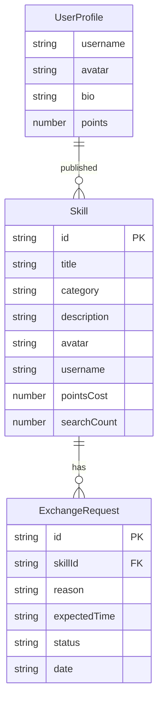

## 1. 架构设计

```mermaid
flowchart TB
    subgraph "前端层"
        "React + TypeScript"
        "Vite 开发/构建"
        "Zustand 状态管理"
        "React Router 路由"
    end
    subgraph "数据层"
        "mockSkills.ts 模拟数据"
        "Zustand Store 内存状态"
    end
    "React + TypeScript" --> "Zustand 状态管理"
    "Zustand 状态管理" --> "mockSkills.ts 模拟数据"
    "React + TypeScript" --> "React Router 路由"
```

纯前端项目，无后端服务，所有数据通过 Zustand Store + 模拟数据在内存中管理。

## 2. 技术说明

- 前端：React@18 + TypeScript + Vite + TailwindCSS
- 初始化工具：vite-init（react-ts 模板）
- 状态管理：Zustand
- 路由：React Router DOM
- 后端：无
- 数据库：无（使用本地模拟数据 mockSkills.ts）
- 包管理：npm

## 3. 路由定义

| 路由 | 用途 |
|------|------|
| / | 技能发现页面（默认首页） |
| /profile | 个人主页 |
| /exchange | 交换记录页面 |
| /settings | 设置页面 |

## 4. API 定义

无后端 API，所有数据通过 Zustand Store 本地管理。

## 5. 数据模型

### 5.1 数据模型定义



### 5.2 核心类型定义

```typescript
interface Skill {
  id: string;
  title: string;
  category: 'programming' | 'art' | 'life' | 'sports';
  description: string;
  avatar: string;
  username: string;
  pointsCost: number;
  searchCount: number;
}

interface ExchangeRequest {
  id: string;
  skillId: string;
  reason: string;
  expectedTime: string;
  status: 'pending' | 'accepted' | 'rejected';
  date: string;
}

interface UserProfile {
  username: string;
  avatar: string;
  bio: string;
  points: number;
}
```

## 6. 文件结构

```
├── package.json
├── index.html
├── vite.config.js
├── tsconfig.json
├── src/
│   ├── main.tsx
│   ├── App.tsx
│   ├── index.css
│   ├── modules/
│   │   ├── skills/
│   │   │   ├── SkillCard.tsx
│   │   │   └── SkillList.tsx
│   │   ├── profile/
│   │   │   └── ProfilePage.tsx
│   │   ├── exchange/
│   │   │   └── ExchangeRequest.tsx
│   │   └── settings/
│   │       └── SettingsPage.tsx
│   ├── store/
│   │   └── skillsStore.ts
│   └── data/
│       └── mockSkills.ts
```
