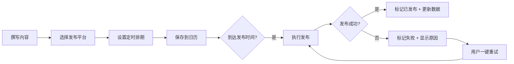

## 1. 产品概述

ContentCal 是一款面向个人开发者和小团队的轻量级内容日历应用，解决多平台内容发布管理分散、排期混乱、数据不统一的痛点。用户可在一处完成内容撰写、多平台适配、定时排期和数据复盘，提升社媒运营效率。

## 2. 核心功能

### 2.1 功能模块

1. **内容编辑器**：富文本编辑、图片上传压缩、多平台字数适配、话题标签与@提醒
2. **日历排期**：月/周/列表三视图切换、卡片拖拽排期、平台徽章标记
3. **发布追踪**：发布状态显示、失败重试机制、状态实时同步
4. **数据分析看板**：发帖统计、互动量汇总、平台占比饼图、趋势折线图

### 2.3 页面详情

| 页面名称 | 模块名称 | 功能描述 |
|---------|---------|---------|
| 主应用 | 数据分析看板 | 顶部展示昨日发帖数、本周互动量、平台占比饼图、7天发帖趋势 |
| 主应用 | 内容编辑器 | 中部富文本编辑器，支持图片上传、多平台切换、字数统计 |
| 主应用 | 日历视图 | 底部月/周/列表三视图，支持卡片拖拽排期、状态展示 |

## 3. 核心流程

## 4. 用户界面设计

### 4.1 设计风格
- **主色调**：深蓝紫渐变背景（#1a1040 → #2d1b69），辅以亮青色（#00e5ff）和珊瑚红（#ff6b6b）高亮
- **视觉风格**：毛玻璃（backdrop-filter: blur(12px)）+ 1px 亮色描边 + 微细网格纹理
- **字体**：Google Fonts Inter 字体家族
- **动效**：200-300ms 缓入缓出过渡，模态框从底部滑入淡出
- **卡片**：半透明磨砂玻璃质感，悬停有微放大和阴影变化

### 4.2 页面设计概述

| 页面名称 | 模块名称 | UI 元素 |
|---------|---------|---------|
| 主应用 | 数据分析看板 | 数据卡片（毛玻璃）、饼图（canvas交互）、折线图（渐变填充） |
| 主应用 | 内容编辑器 | 富文本编辑区、图片上传波浪进度条、平台开关按钮（按压动画）、字数统计条 |
| 主应用 | 日历视图 | 月视图网格、缩略卡片（平台徽章）、拖拽弹性动画、粒子特效 |

### 4.3 响应式
- 桌面优先，适配 1024px 及以上视口宽度
- 使用 flex 布局自适应高度
- 日历视图在小屏可横向滚动

### 4.4 性能指标
- 日历视图切换响应 ≤ 500ms
- 图表渲染（数据 < 100条）≤ 200ms
- 图片压缩至 500KB 以内
