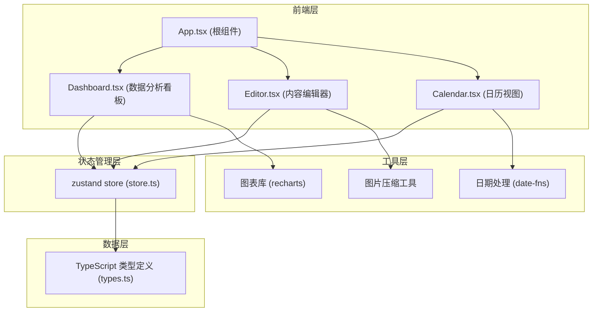
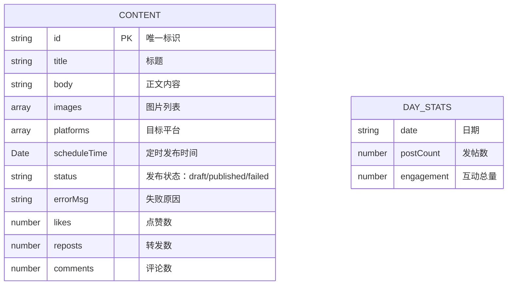

## 1. 架构设计



## 2. 技术说明

- **前端框架**：React 18 + TypeScript
- **构建工具**：Vite（含路径别名配置）
- **状态管理**：zustand（全局状态统一管理）
- **路由**：react-router-dom（单页应用，预留扩展）
- **日期处理**：date-fns
- **图表库**：recharts（折线图、饼图）
- **唯一 ID**：uuid
- **字体**：Google Fonts Inter

## 3. 路由定义

| 路由 | 用途 |
|------|------|
| / | 主应用页面（包含 Dashboard、Editor、Calendar） |

## 4. 数据模型

### 4.1 数据模型定义



### 4.2 TypeScript 类型定义

```typescript
export interface Content {
  id: string;
  title: string;
  body: string;
  images: string[];
  platforms: Platform[];
  scheduleTime: string;
  status: 'draft' | 'scheduled' | 'published' | 'failed';
  errorMsg?: string;
  likes?: number;
  reposts?: number;
  comments?: number;
}

export type Platform = 'weibo' | 'zhihu' | 'bilibili';

export interface DayStats {
  date: string;
  postCount: number;
  engagement: number;
}
```

## 5. 项目文件结构

```
.
├── index.html
├── package.json
├── vite.config.js
├── tsconfig.json
└── src/
    ├── types.ts       # 类型定义
    ├── store.ts       # zustand 全局状态
    ├── Editor.tsx     # 编辑器组件
    ├── Calendar.tsx   # 日历组件
    ├── Dashboard.tsx  # 数据分析看板
    └── App.tsx        # 根组件
```

## 6. 核心技术要点

### 6.1 状态管理
- 使用 zustand 创建单一 store
- 所有组件通过 hook 订阅状态
- 修改操作通过 store 方法触发，自动通知所有订阅组件

### 6.2 图片处理
- 使用 Canvas API 压缩图片至 500KB 以内
- 生成缩略图预览
- 上传时显示波浪形进度条（CSS 动画模拟）

### 6.3 日历拖拽
- 使用原生 HTML5 Drag and Drop API
- 拖拽时卡片跟随鼠标，带弹性过渡动画
- 释放后弹窗确认，确认后溅起粒子特效

### 6.4 图表渲染
- 使用 recharts 绘制折线图和饼图
- 饼图支持悬停弹出动画
- 折线图带渐变填充区域
- 数据更新时有平滑过渡动画

### 6.5 视觉设计
- 毛玻璃效果：`backdrop-filter: blur(12px)`
- 卡片 1px 亮色描边
- 背景：深蓝紫渐变 + 微细网格纹理
- 全局 CSS 变量管理颜色和间距
