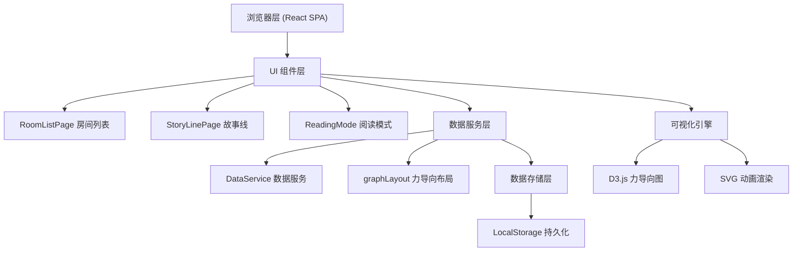
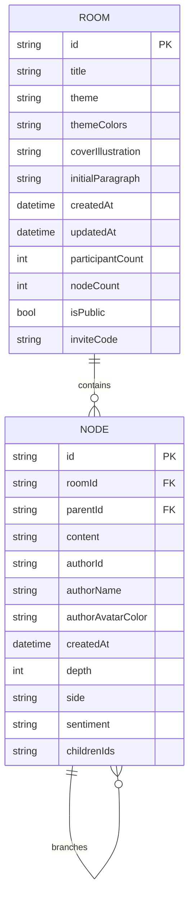

## 1. 架构设计



## 2. 技术描述

- **前端框架**: React@18 + TypeScript@5
- **构建工具**: Vite@5（路径别名@ -> src）
- **可视化**: D3@7（forceSimulation 力导向布局、path 藤蔓连接线、transition 动画）
- **工具库**: uuid（房间/节点ID）、date-fns（相对时间格式化）
- **状态管理**: React Hooks (useState/useEffect/useCallback/useRef) + Context API
- **持久化**: LocalStorage（浏览器本地存储，无后端依赖）
- **字体**: Google Fonts - Merriweather（衬线体标题）

## 3. 路由定义

| 路由 | 用途 |
|------|------|
| / | 房间列表页（首页），瀑布流展示所有公开房间 |
| /story/:id | 故事线页面，展示单个故事的分支树与续写区 |
| /story/:id/read | 阅读模式，选择路径逐段阅读完整故事 |

说明：采用 react-router-dom 管理路由，首页与故事页之间带翻页过渡动画。

## 4. 核心类型定义

```typescript
// ============ 房间元数据 ============
interface RoomMeta {
  id: string;
  title: string;
  theme: string;
  themeColors: [string, string];
  coverIllustration: string;
  initialParagraph: string;
  createdAt: number;
  updatedAt: number;
  participantCount: number;
  nodeCount: number;
  isPublic: boolean;
  inviteCode: string;
}

// ============ 故事节点 ============
interface StoryNode {
  id: string;
  roomId: string;
  parentId: string | null;
  content: string;
  author: Author;
  createdAt: number;
  depth: number;
  side: 'root' | 'left' | 'right';
  sentiment: 'positive' | 'neutral' | 'conflict';
  childrenIds: string[];
}

// ============ 作者信息 ============
interface Author {
  id: string;
  name: string;
  avatarColor: string;
}

// ============ 渲染节点(含坐标) ============
interface RenderNode extends StoryNode {
  x: number;
  y: number;
  vx: number;
  vy: number;
  fx?: number | null;
  fy?: number | null;
}

// ============ 连接线 ============
interface GraphLink {
  source: string;
  target: string;
}
```

## 5. 数据模型关系



## 6. 文件结构与职责

```
auto69/
├── index.html                    # 入口HTML，引入Merriweather字体
├── package.json                  # 依赖与脚本
├── vite.config.js                # Vite配置(@别名)
├── tsconfig.json                 # TS严格模式配置
└── src/
    ├── main.tsx                  # React入口，路由配置
    ├── App.tsx                   # 根组件，翻页过渡动画容器
    ├── index.css                 # 全局样式：CSS变量、纸张纹理、翻页动画
    ├── DataService.ts            # LocalStorage数据读写：getRooms/addBranchNode...
    ├── RoomListPage.tsx          # 房间列表：瀑布流/创建弹窗/卡片交互
    ├── StoryLinePage.tsx         # 故事线：D3画布/节点气泡/续写表单/阅读入口
    ├── ReadingMode.tsx           # 阅读模式：书本翻页/自动播放/路径选择
    └── utils/
        ├── graphLayout.ts        # 力导向布局算法：碰撞检测/节点坐标计算
        ├── sentiment.ts          # 简易情感分析：关键词匹配判断积极/冲突
        ├── themes.ts             # 主题配色：根据关键词返回渐变数组
        └── illustrations.ts      # 手绘SVG插图集合：随机选择封面插图
```

## 7. 关键算法说明

### 7.1 力导向图布局 (graphLayout.ts)
- 基于 D3 forceSimulation 构建
- forces: 
  - forceLink: 父子节点间弹簧拉力 (distance: 120, strength: 0.6)
  - forceManyBody: 节点间电荷斥力 (-200)
  - forceCollide: 圆形碰撞检测 (radius: 42)
  - forceX / forceY: 向画布中心的弱引力 (strength: 0.04)
- 输出带 x/y 坐标的 RenderNode[]，每 tick 节流到 60fps

### 7.2 情感倾向判定 (sentiment.ts)
- 构建中文积极词库(温暖、希望、勇敢...)与冲突词库(战斗、危险、争吵...)
- 基于词频 + 加权评分，阈值以上分类为 positive / conflict
- 未命中关键词默认 neutral，主节点为 neutral（蓝色）

### 7.3 主题配色生成 (themes.ts)
- 关键词 -> HSL色轮映射：冒险(橙+紫)、爱情(粉+玫瑰)、奇幻(青+金)、悬疑(灰+靛蓝)、成长(绿+米黄)...
- 预设12组手绘风格渐变组，默认随机兜底

### 7.4 性能优化策略
- D3 simulation 使用 alphaDecay=0.022 提前收敛
- 节点 SVG 使用 memo + transform 而非重绘 path
- 50节点以上时降低 forceManyBody 强度到 -150
- 翻页动画使用 will-change: transform 开启 GPU 层
- IntersectionObserver 监听节点可见性，离屏节点降低动画精度
