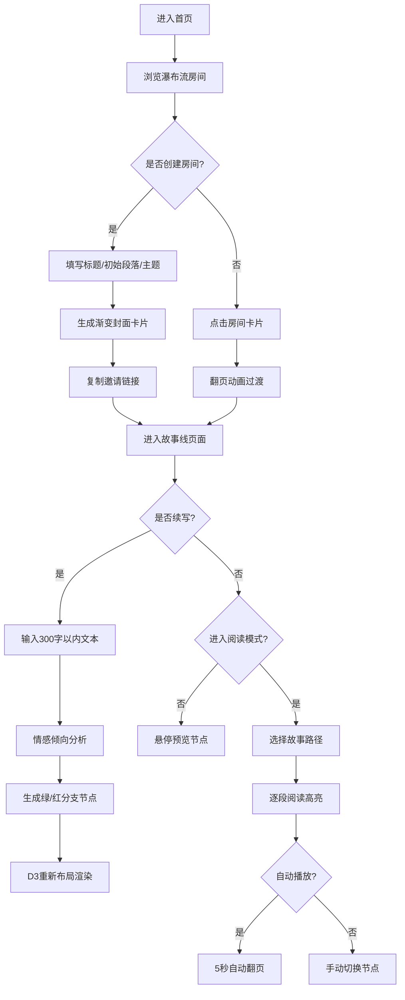

## 1. 产品概述

协作式网络故事接龙平台，让一群朋友或写作爱好者能在一个网页上轮流续写同一个故事，每段文字后自动分支，生成「选择你的冒险」式互动叙事作品。通过可视化的故事树展示，让创作过程如同藤蔓生长般充满生机与惊喜。

- 核心用途：多人协作创作、互动故事生成、写作社区交流
- 目标用户：写作爱好者、朋友社群、教育工作者、创意团队
- 产品价值：降低协作创作门槛，将线性叙事升级为交互式树状叙事，使每一次创作都成为独特的分支探索

## 2. 核心特性

### 2.1 用户角色

| 角色 | 注册方式 | 核心权限 |
|------|----------|----------|
| 创作者 | 无需注册（本地匿名用户） | 创建故事房间、续写故事节点、邀请他人协作 |
| 读者 | 无需注册 | 浏览公开房间、选择路径阅读完整故事、体验互动叙事 |

### 2.2 功能模块

1. **房间列表页**: 瀑布流卡片展示、创建房间入口、搜索与筛选
2. **故事线页面**: D3力导向图渲染、节点悬停预览、文本续写提交、情感色彩分支
3. **阅读模式**: 路径高亮导航、自动翻页播放、书本翻页动画、手动节点切换

### 2.3 页面详情

| 页面名称 | 模块名称 | 功能描述 |
|----------|----------|----------|
| 房间列表页 | 头部区域 | 品牌Logo、创建房间按钮、公开/私密筛选 |
| 房间列表页 | 瀑布流卡片 | 渐变封面（主题取色）、手绘插图、标题、参与人数、更新时间相对文本 |
| 房间列表页 | 创建弹窗 | 标题输入、初始段落、主题关键词、邀请链接生成与复制 |
| 故事线页面 | 力导向图画布 | SVG藤蔓状连接线、深蓝主节点、绿/红情感分支节点、碰撞检测布局 |
| 故事线页面 | 节点交互 | 悬停气泡预览（头像+时间+文字摘要）、点击放大高亮、淡入弹跳动画 |
| 故事线页面 | 续写表单 | 300字限制文本框、字数计数、提交后自动分叉左右支线 |
| 阅读模式 | 故事容器 | 当前段落展示、节点路径高亮、上下翻页按钮 |
| 阅读模式 | 播放控制 | 自动播放开关（5秒间隔）、进度指示、退出阅读按钮 |

## 3. 核心流程

用户进入首页浏览公开故事房间，被某张渐变卡片吸引后点击进入，平滑翻页过渡到故事线页面。在故事线页面中，用户可以看到藤蔓状的节点树，悬停查看各节点内容，或选择成为当前作者添加一段300字以内的续写。提交后系统自动分叉左右两个支线节点，根据文字情感倾向染上绿色或红色。其他用户通过邀请链接加入房间后继续创作。当故事树足够丰富时，读者可以切换到阅读模式，选择一条路径从头读到尾，体验自动播放的书本翻页效果，或手动选择分支探索不同结局。

## 4. 用户界面设计

### 4.1 设计风格

- **主色调**: 暖白色背景 (#FDFBF7)、深灰文字 (#2D2D2D)、深蓝主节点 (#1E3A5F)
- **分支色**: 积极情感用森林绿 (#2D6A4F)、冲突情感用赭红色 (#9B2335)
- **按钮风格**: 大圆角（16px）、微阴影、悬浮态背景加深、点击态轻微下沉
- **字体**: 标题用 Merriweather（衬线体，文学气质）、正文用系统无衬线体
- **布局风格**: 卡片式瀑布流、不对称留白、SVG线条连接的有机藤蔓感
- **视觉元素**: 手绘风格SVG插图、纸张纹理、柔和渐变背景、翻页阴影过渡

### 4.2 页面设计概览

| 页面名称 | 模块名称 | UI 元素 |
|----------|----------|---------|
| 房间列表页 | 头部区域 | 居中衬线大标题"藤蔓故事"、右侧创建按钮（暖黄渐变）、筛选标签 |
| 房间列表页 | 卡片 | 渐变背景（2-3色径向/线性）、左上角手绘SVG小插图、标题Merriweather粗体、左下角参与人数圆形头像叠层+时间戳、右下角主题标签、hover时上浮+阴影加深、点击时3D翻页 |
| 房间列表页 | 创建弹窗 | 半透明磨砂遮罩、居中白卡带圆角、输入框带浅边框、主题色预览条、链接复制按钮（勾选动画） |
| 故事线页面 | 画布区域 | 暖白纸张纹理背景、SVG藤蔓连接线（圆角折线、路径描边动画）、节点圆形（深蓝主/绿红分支、阴影光晕）、滚动触发逐节点淡入+弹性缩放 |
| 故事线页面 | 悬停气泡 | 指向节点的小三角、作者头像圆形、时间文字（小号浅灰）、文字摘要（2行省略）、柔和模糊阴影 |
| 故事线页面 | 续写区 | 贴底半透明卡、textarea高度自适应、右下计数字（超300变红）、提交按钮（深蓝渐变） |
| 阅读模式 | 段落区 | 大幅衬线字体、双倍行距、当前节点圆形放大高亮发光、边框轻微书本纹理 |
| 阅读模式 | 控制栏 | 贴底胶囊状控制条、播放按钮（三角变双杠）、左右翻页箭头、进度圆点指示器 |

### 4.3 响应式设计

桌面端优先布局（1280px+）：
- 瀑布流：3列等宽（minmax 280px），gap 24px
- 画布区域：min-height 80vh，支持鼠标滚轮缩放
- 续写区：最大宽度 720px 居中

平板适配（768px-1279px）：
- 瀑布流：2列布局
- 画布支持触屏双指缩放
- 气泡自动避开屏幕边缘

移动端（<768px）：
- 瀑布流：单列全宽
- 画布默认适配视口，支持双指平移
- 续写区贴底并适配软键盘弹出

### 4.4 性能与动画规范

- 50节点同时展开时滚动帧率 ≥ 45fps
- D3力导向图使用 requestAnimationFrame 节流更新
- SVG 连接线使用 CSS transition + transform 开启硬件加速
- 翻页动画使用 transform: perspective + rotateY，避免重排
- 节点淡入使用 IntersectionObserver，仅渲染视口附近元素
