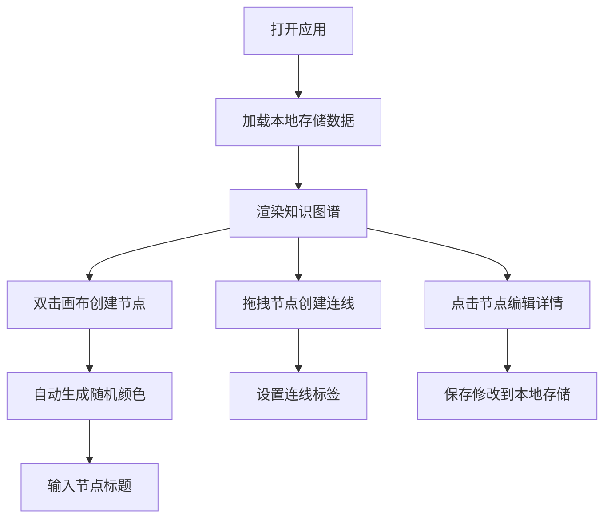
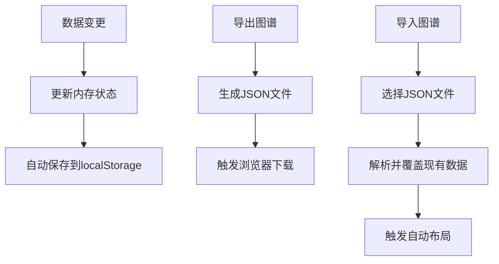

## 1. 产品概述

个人知识图谱构建工具是一款可视化知识管理应用，帮助用户以节点和连线的方式组织学习笔记、概念及其相互关系。通过直观的图可视化界面，用户可以轻松创建、编辑和探索知识网络，提升学习效率和知识关联性。

- 核心价值：将零散的知识点转化为结构化的知识网络，直观展示概念间的关联
- 目标用户：学生、研究人员、终身学习者等需要系统化知识管理的人群
- 市场定位：轻量级、本地化的个人知识可视化工具

## 2. 核心功能

### 2.1 功能模块

1. **图谱画布**：节点和连线的可视化渲染与交互
2. **节点编辑器**：节点详情的编辑面板
3. **数据管理**：图数据的CRUD、本地存储与导入导出
4. **搜索筛选**：按标题、标签、颜色进行节点过滤

### 2.2 页面详情

| 页面名称 | 模块名称 | 功能描述 |
|-----------|-------------|---------------------|
| 主应用页面 | 侧边工具栏 | 搜索框、颜色筛选、新建节点、布局切换、导入导出 |
| 主应用页面 | 图谱画布 | 节点拖拽、连线创建、缩放平移、网格背景 |
| 主应用页面 | 节点编辑器 | 编辑标题、内容、颜色、标签，支持Markdown |
| 主应用页面 | 右键菜单 | 节点和连线的删除操作 |

## 3. 核心流程

### 3.1 知识创建流程

### 3.2 数据管理流程

## 4. 用户界面设计

### 4.1 设计风格

- **主题**：暗色科技风格，营造沉浸式知识探索体验
- **主色调**：深灰背景 (#1a1a2e)，网格线 (#2d2d44)
- **强调色**：柔和渐变节点色，选中时蓝色发光边框 (rgba(100,200,255,0.6))
- **字体**：Google Fonts Roboto，清晰易读
- **按钮风格**：毛玻璃半透明效果，圆角设计，悬停时微缩放和颜色变化
- **动效**：平滑过渡动画 (0.2s ease)，面板展开高度过渡，删除淡出效果

### 4.2 页面设计概述

| 页面名称 | 模块名称 | UI元素 |
|-----------|-------------|-------------|
| 主应用页面 | 侧边工具栏 | 宽度280px，毛玻璃背景，垂直排列工具按钮 |
| 主应用页面 | 图谱画布 | 网格背景，节点可拖拽，连线曲线显示 |
| 主应用页面 | 节点编辑器 | 弹出面板，高度从0平滑过渡到auto |
| 主应用页面 | 响应式布局 | 小于768px时工具栏变为底部导航栏 (高度60px) |

### 4.3 响应式设计

- **桌面端** (≥768px)：左侧固定工具栏，主区域显示图谱画布
- **移动端** (<768px)：底部水平工具栏，画布占满剩余空间
- **触摸优化**：增大点击区域，支持触摸拖拽和双指缩放

### 4.4 视觉交互细节

- 节点拖拽时显示浅蓝色拖影效果
- 连线标签悬停时显示完整文本并加粗
- 未匹配搜索结果的节点半透明显示
- 右键菜单简洁优雅，删除操作带确认反馈
