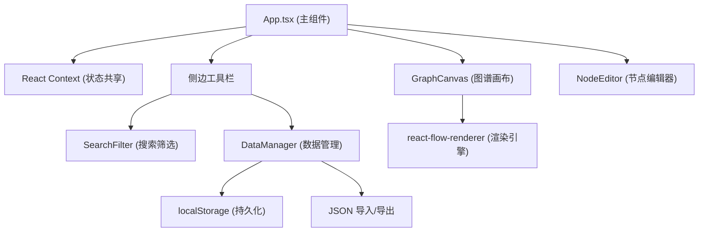
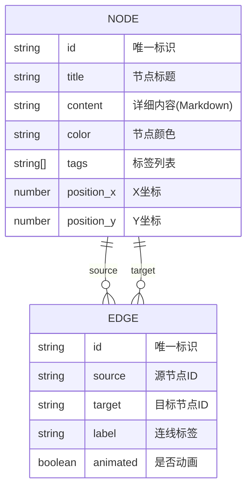

## 1. 架构设计



## 2. 技术描述

- **前端框架**：React 18 + TypeScript
- **构建工具**：Vite
- **图谱渲染**：react-flow-renderer (11.x)
- **状态管理**：React Context API
- **样式方案**：原生CSS + CSS变量
- **数据持久化**：localStorage
- **图标库**：lucide-react

### 2.1 核心依赖版本

- react: ^18.2.0
- react-dom: ^18.2.0
- react-flow-renderer: ^11.10.4
- typescript: ^5.0.0
- vite: ^5.0.0
- @types/react: ^18.2.0
- @types/react-dom: ^18.2.0
- lucide-react: ^0.294.0

## 3. 项目结构

```
d:\P\tasks\auto7/
├── package.json
├── index.html
├── vite.config.js
├── tsconfig.json
├── src/
│   ├── App.tsx
│   ├── main.tsx
│   ├── styles.css
│   └── modules/
│       ├── graph/
│       │   ├── GraphCanvas.tsx
│       │   └── NodeEditor.tsx
│       └── data/
│           ├── DataManager.ts
│           └── SearchFilter.tsx
```

## 4. 数据模型

### 4.1 实体关系图



### 4.2 TypeScript 类型定义

```typescript
interface GraphNode {
  id: string;
  title: string;
  content: string;
  color: string;
  tags: string[];
  position: { x: number; y: number };
}

interface GraphEdge {
  id: string;
  source: string;
  target: string;
  label: string;
  animated: boolean;
}

interface GraphData {
  nodes: GraphNode[];
  edges: GraphEdge[];
}

interface FilterState {
  searchQuery: string;
  selectedColors: string[];
}
```

## 5. 核心模块说明

### 5.1 DataManager.ts

- 负责图数据的CRUD操作
- 初始化时从localStorage加载数据
- 数据变更后自动保存到localStorage
- 提供JSON导入导出功能
- 支持力导向布局和分层布局算法

### 5.2 GraphCanvas.tsx

- 基于react-flow-renderer实现图谱渲染
- 处理节点拖拽、连线创建、缩放平移
- 处理节点/边点击事件和右键菜单
- 支持网格背景显示
- 应用筛选状态进行节点半透明处理

### 5.3 NodeEditor.tsx

- 点击节点时弹出编辑面板
- 支持编辑标题、内容(Markdown)、颜色、标签
- 面板展开平滑动画
- 内容区域支持滚动

### 5.4 SearchFilter.tsx

- 搜索框支持按标题或标签搜索 (300ms防抖)
- 颜色筛选按钮组支持多选
- 实时更新筛选状态
- 筛选结果传递给GraphCanvas

### 5.5 App.tsx

- 整体布局管理
- React Context提供全局状态
- 集成所有功能模块
- 响应式布局切换
