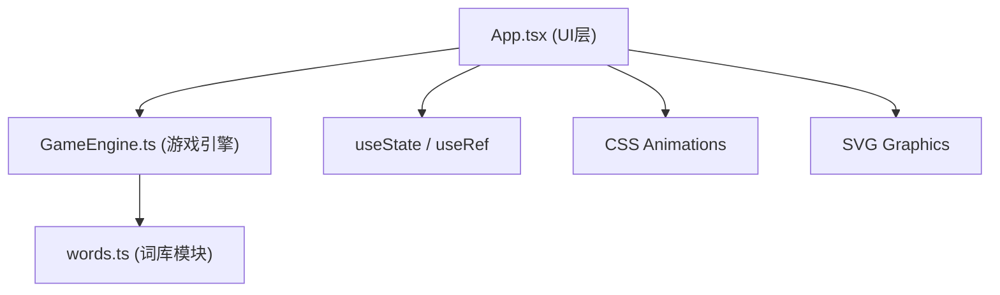

## 1. 架构设计



## 2. 技术描述

- **前端框架**：React@18 + TypeScript
- **构建工具**：Vite@5
- **状态管理**：React useState / useRef（轻量场景无需额外库）
- **样式方案**：原生CSS + CSS变量，不使用Tailwind（用户未指定）
- **图标/图形**：原生SVG绘制
- **依赖**：react, react-dom, typescript, vite, @types/react, @types/react-dom, uuid

## 3. 文件结构

```
d:\P\tasks\auto70\
├── package.json
├── index.html
├── vite.config.js
├── tsconfig.json
└── src/
    ├── words.ts          # 词库模块：成语/日常词语/英文单词数组 + 首尾字验证函数
    ├── GameEngine.ts     # 游戏引擎：玩家状态、倒计时、胜负判定、事件回调
    ├── main.tsx          # React入口
    ├── App.tsx           # 主界面组件：开始面板+游戏面板+结果弹窗
    └── App.css           # 样式文件（水墨风视觉设计）
```

## 4. 数据模型

### 4.1 词库主题

```typescript
type ThemeType = 'idiom' | 'daily' | 'english';
```

### 4.2 玩家信息

```typescript
interface Player {
  id: string;
  name: string;
  wordsCount: number;
}
```

### 4.3 游戏状态

```typescript
interface GameState {
  phase: 'start' | 'playing' | 'result';
  currentPlayerIndex: 0 | 1;
  timeLeft: number;
  wordHistory: string[];
  currentWord: string;
  theme: ThemeType;
  players: [Player, Player];
  winner: Player | null;
  loser: Player | null;
  loseReason: 'timeout' | 'duplicate' | null;
}
```

### 4.4 游戏引擎事件回调

```typescript
interface GameEngineCallbacks {
  onTimeUpdate: (timeLeft: number) => void;
  onTurnChange: (playerIndex: 0 | 1) => void;
  onWordAdded: (word: string) => void;
  onGameOver: (winner: Player, loser: Player, reason: 'timeout' | 'duplicate') => void;
  onError: (message: string) => void;
}
```

## 5. 核心逻辑流程

### 5.1 GameEngine 核心方法

```typescript
class GameEngine {
  startGame(theme: ThemeType, players: [Player, Player]): void;
  submitWord(word: string): boolean;
  destroy(): void;
}
```

### 5.2 words.ts 导出

```typescript
export const IDIOMS: string[];        // 成语词库
export const DAILY_WORDS: string[];   // 日常词语词库  
export const ENGLISH_WORDS: string[]; // 英文单词词库

export function getWordsByTheme(theme: ThemeType): string[];
export function getRandomStartWord(theme: ThemeType): string;
export function validateWordMatch(prevWord: string, nextWord: string): boolean;
export function normalizeChar(char: string): string; // 忽略大小写和空格
```
