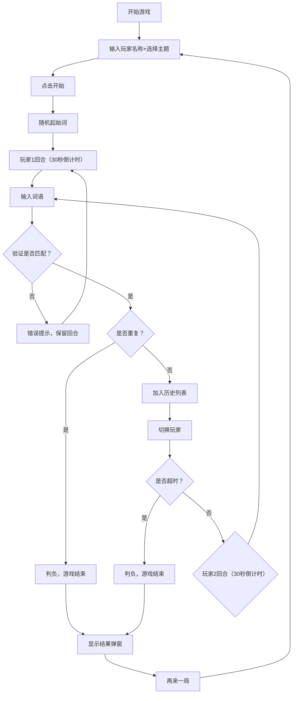

## 1. 产品概述

基于时间压力的双人词语接龙对战游戏，让两名玩家在30秒限时内轮流说出词语，后一个词的首字必须与前一个词的尾字相同，超时或重复则判负。

- 核心玩法：双人对战 + 时间压力 + 词语接龙
- 目标用户：喜欢文字游戏和竞技对战的玩家

## 2. 核心功能

### 2.1 功能模块

1. **开始面板**：玩家名称输入、词库主题选择、毛笔蘸墨动画
2. **游戏面板**：环形倒计时进度条、当前玩家高亮、词语输入框、历史词语滚动列表
3. **结果弹窗**：胜负展示、词语数量对比柱状图、再来一局按钮

### 2.2 页面详情

| 页面名称 | 模块名称 | 功能描述 |
|-----------|-------------|---------------------|
| 开始面板 | 玩家信息输入 | 输入玩家1和玩家2的名称 |
| 开始面板 | 主题选择 | 下拉选择"成语"、"日常词语"、"英文单词"三个主题 |
| 开始面板 | 毛笔动画 | SVG毛笔蘸墨动画，墨滴扩散效果 |
| 游戏面板 | 主题丝带横幅 | 顶部平滑过渡显示当前主题 |
| 游戏面板 | 倒计时进度条 | SVG圆形进度条，绿到红渐变，最后5秒闪烁+滴答音效 |
| 游戏面板 | 玩家状态 | 高亮当前回合玩家 |
| 游戏面板 | 词语输入 | 输入框+提交按钮，支持回车提交 |
| 游戏面板 | 历史词语列表 | 左侧卡片列表，渐变圆角背景，淡入动画，自动滚动 |
| 结果弹窗 | 胜负展示 | 磨砂玻璃蒙版，双方头像（首字母+随机背景色） |
| 结果弹窗 | 数据对比 | CSS柱状图显示双方词语总数 |
| 结果弹窗 | 再来一局 | 重置所有状态，回到开始面板 |

## 3. 核心流程

## 4. 用户界面设计

### 4.1 设计风格

- **主色调**：灰白黑水墨风，点缀朱红（#C8102E）和青色（#008B8B）
- **按钮风格**：圆角按钮，悬停放大+背景加深，点击回弹效果
- **字体**：Ma Shan Zheng 毛笔手写字体用于词语展示
- **布局**：桌面端左右布局，移动端自适应
- **视觉元素**：宣纸纹理背景、墨迹边缘效果、墨点粒子动画

### 4.2 页面设计概述

| 页面名称 | 模块名称 | UI 元素 |
|-----------|-------------|-------------|
| 开始面板 | 毛笔动画 | SVG绘制，蘸墨时墨滴扩散动画 |
| 开始面板 | 输入区域 | 水墨风格输入框，淡入动画 |
| 游戏面板 | 倒计时进度条 | SVG圆形，朱红描边，内部渐变填充 |
| 游戏面板 | 词语卡片 | 渐变圆角背景，毛笔字体，墨迹边缘 |
| 游戏面板 | 历史列表 | 垂直滚动，新卡片从底部淡入 |
| 结果弹窗 | 蒙版 | 半透明磨砂玻璃，墨点粒子飘落 |
| 结果弹窗 | 头像 | 圆形，首字母+随机背景色 |
| 结果弹窗 | 柱状图 | CSS绘制，高度动态变化 |

### 4.3 响应式设计

- **桌面端（≥768px）**：历史词语列表在左侧垂直滚动，倒计时在中央顶部
- **移动端（<768px）**：倒计时缩小至左上角圆形，词语列表变为底部水平滚动窄条
- 触控优化：按钮足够大，输入框自适应

## 5. 性能要求

- 动画帧率：稳定30FPS以上
- 倒计时更新间隔：≤50ms
- 输入响应延迟：<100ms
