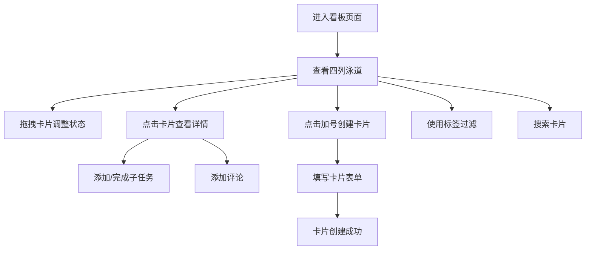

## 1. 产品概述

数字看板应用是一款轻量级团队协作工具，帮助团队在项目冲刺中快速可视化工作进展、发现瓶颈并调整优先级。解决传统物理看板无法远程协作、任务卡片信息零散、缺乏自动化进度统计和提醒的问题。

- 核心目标：提供直观、流畅的看板体验，支持远程团队高效协作
- 目标用户：敏捷开发团队、项目管理团队、创意工作团队
- 产品价值：通过拖拽式交互、实时状态更新、自动化进度统计，提升团队协作效率

## 2. 核心功能

### 2.1 用户角色

| 角色 | 注册方式 | 核心权限 |
|------|----------|----------|
| 团队成员 | 无需注册（本地演示版） | 创建/编辑看板、拖拽任务卡片、添加评论和子任务 |

### 2.2 功能模块

1. **看板主界面**：四列泳道布局、项目标签过滤、搜索功能、列标题编辑
2. **任务卡片管理**：创建卡片、卡片拖拽、优先级标识、截止日期倒计时
3. **卡片详情面板**：子任务清单、评论系统、完整信息展示

### 2.3 页面详情

| 页面名称 | 模块名称 | 功能描述 |
|----------|----------|----------|
| 看板主页 | 看板头部 | 项目名称、标签胶囊列表、搜索框、项目描述 |
| 看板主页 | 泳道列 | 四列默认泳道（待办/进行中/审查/已完成）、卡片计数徽章、列拖拽排序 |
| 看板主页 | 任务卡片 | 优先级圆点、标题、标签、截止日期倒计时、拖拽交互 |
| 卡片详情 | 详情面板 | 从右侧滑入、子任务清单、评论列表、完整信息 |
| 创建卡片 | 表单弹窗 | 毛玻璃背景、标题/描述/优先级/标签/截止日期输入 |

## 3. 核心流程

### 3.1 主流程描述
用户进入看板页面 → 查看四列泳道中的任务卡片 → 通过拖拽调整任务状态 → 点击卡片查看详情并添加子任务/评论 → 点击加号创建新任务卡片 → 使用标签或搜索过滤卡片

### 3.2 流程图

## 4. 用户界面设计

### 4.1 设计风格
- **主色调**：深蓝灰 (#1A1A2E) 搭配渐变紫 (#6C63FF → #A29BFE)
- **文字颜色**：白色
- **设计语言**：毛玻璃效果、微圆角设计
- **按钮风格**：紫渐变背景配合白色文字，圆角按钮
- **字体**：Inter (Google Fonts)
- **布局风格**：卡片式布局，四列泳道横向排列
- **视觉元素**：优先级圆点（高-红/中-橙/低-绿）、标签胶囊、倒计时数字

### 4.2 页面设计概览

| 页面名称 | 模块名称 | UI元素 |
|----------|----------|--------|
| 看板主页 | 头部区域 | 项目名称、标签胶囊、搜索框、渐变背景 |
| 看板主页 | 泳道列 | 列标题、卡片计数徽章、渐变分隔线、Droppable区域 |
| 看板主页 | 任务卡片 | 优先级圆点、标题文字、标签、倒计时、拖拽阴影 |
| 卡片详情 | 侧滑面板 | 遮罩背景、标题、描述、子任务清单、评论列表 |
| 创建表单 | 弹窗 | 毛玻璃背景、表单输入、渐变按钮 |

### 4.3 响应式设计
- **桌面端**（1050px以上）：四列横向排列，标准看板布局
- **平板/移动端**（1050px以下）：垂直堆叠布局，列从上到下排列，每列自适应宽度
- **触摸支持**：移动端支持触摸拖拽操作

### 4.4 动效设计
- **卡片入场**：从上方掉落的弹性动画
- **拖拽效果**：卡片缩小阴影跟随，目标列顶部高亮边框微扩展
- **归位动画**：松手后弹性动画归位
- **过滤效果**：非匹配卡片逐渐半透明且缩小，0.3秒 ease-out
- **倒计时警告**：剩余天数小于3天时数字跳动变为红色
- **详情面板**：从右侧滑入，带半透明遮罩

## 5. 性能要求

- 拖拽操作响应延迟：不超过 50ms
- 卡片列表初次加载（100张以内）：小于 800ms
- 动画流畅度：60fps
