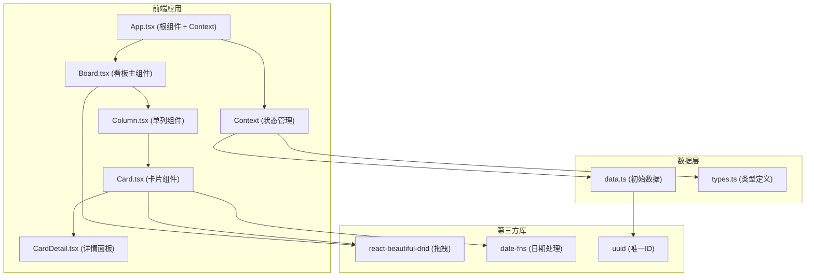

## 1. 架构设计



## 2. 技术栈描述

- **前端框架**：React 18 + TypeScript
- **构建工具**：Vite
- **状态管理**：React Context API
- **拖拽库**：react-beautiful-dnd
- **日期处理**：date-fns
- **唯一ID生成**：uuid
- **样式方案**：CSS Modules / 内联样式（使用CSS变量）
- **字体**：Google Fonts - Inter

## 3. 核心组件结构

| 文件路径 | 组件名称 | 职责描述 |
|----------|----------|----------|
| src/App.tsx | App | 根组件，初始化看板状态，整体布局，Context Provider |
| src/Board.tsx | Board | 看板主组件，渲染四列泳道，管理拖拽事件，DragDropContext |
| src/Column.tsx | Column | 单列组件，渲染列标题和卡片列表，Droppable区域 |
| src/Card.tsx | Card | 单张卡片组件，渲染优先级、标题、标签、倒计时，Draggable |
| src/CardDetail.tsx | CardDetail | 卡片详情弹窗，子任务和评论，右侧滑入 |
| src/types.ts | - | TypeScript类型定义（Card, Column, Label等接口） |
| src/data.ts | - | 初始数据模块，创建默认看板和工具函数 |

## 4. 数据模型定义

### 4.1 类型定义

```typescript
// 优先级类型
type Priority = 'high' | 'medium' | 'low';

// 标签接口
interface Label {
  id: string;
  name: string;
  color: string;
}

// 子任务接口
interface Subtask {
  id: string;
  title: string;
  completed: boolean;
}

// 评论接口
interface Comment {
  id: string;
  author: string;
  content: string;
  createdAt: Date;
}

// 卡片接口
interface Card {
  id: string;
  title: string;
  description: string;
  priority: Priority;
  labels: string[];
  dueDate: Date | null;
  subtasks: Subtask[];
  comments: Comment[];
  columnId: string;
}

// 列接口
interface Column {
  id: string;
  title: string;
  cardIds: string[];
}

// 看板状态接口
interface BoardState {
  columns: Column[];
  cards: Record<string, Card>;
  labels: Label[];
  projectName: string;
  projectDescription: string;
}
```

### 4.2 状态管理
使用 React Context API 进行状态管理：
- BoardContext：提供看板数据和操作方法
- 包含方法：添加卡片、移动卡片、更新卡片、添加子任务、切换子任务完成状态、添加评论、更新列标题

## 5. 关键技术实现点

### 5.1 拖拽实现
- 使用 `react-beautiful-dnd` 库
- `DragDropContext` 包裹整个看板
- 每个 `Column` 作为 `Droppable` 区域
- 每个 `Card` 作为 `Draggable` 元素
- `onDragEnd` 回调中处理卡片移动逻辑

### 5.2 性能优化
- 卡片组件使用 `React.memo` 避免不必要重渲染
- 使用虚拟滚动处理大量卡片（如需要）
- 动画使用 CSS transform 和 opacity 保证硬件加速

### 5.3 响应式实现
- 使用 CSS Media Queries
- 1050px 断点切换布局模式
- 移动端触摸事件支持

### 5.4 动画实现
- CSS transitions 实现基础动画
- 弹性动画使用 cubic-bezier 缓动函数
- 入场动画使用 animation-delay 实现错峰效果

## 6. 项目配置

### 6.1 依赖列表
- react
- react-dom
- typescript
- vite
- @types/react
- @types/react-dom
- uuid
- @types/uuid
- react-beautiful-dnd
- @types/react-beautiful-dnd
- date-fns

### 6.2 脚本命令
- `npm run dev`：启动开发服务器
- `npm run build`：构建生产版本
- `npm run preview`：预览生产构建

### 6.3 TypeScript配置
- strict 模式开启
- 严格类型检查
- JSX 支持
