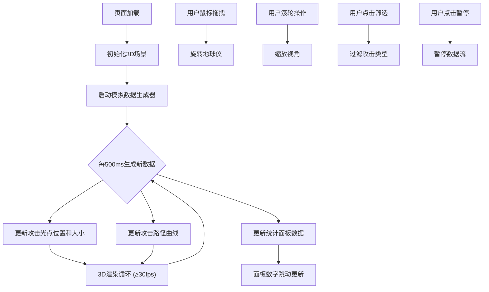

## 1. 产品概述

全球DDoS攻击热力图3D可视化平台，基于实时模拟网络流量数据，将攻击源与攻击目标的地理分布和动态变化映射到3D地球仪上，以赛博朋克风格的视觉语言为安全分析师和爱好者提供直观的全球攻击态势感知体验。

- 解决安全分析中攻击地理趋势难以直观感知的问题，目标用户为网络安全分析师、安全爱好者及教育场景
- 产品价值在于将抽象的网络流量数据转化为沉浸式3D可视化，降低认知门槛，提升态势感知效率

## 2. 核心功能

### 2.1 功能模块

1. **3D地球可视化页面**: 3D地球仪、攻击光点、攻击路径曲线、星空背景粒子、鼠标交互（拖拽旋转/滚轮缩放）
2. **实时统计面板**: 总攻击次数、被攻击最多前5国家、峰值流量、攻击类型筛选、播放/暂停控制

### 2.2 页面详情

| 页面名称 | 模块名称 | 功能描述 |
|---------|---------|---------|
| 主页面 | 3D地球仪 | 高分辨率纹理贴图显示大陆轮廓和国界线，悬浮在深空渐变背景中（墨蓝到暗紫），支持鼠标拖拽旋转和滚轮缩放 |
| 主页面 | 攻击光点层 | 红色脉冲光点表示攻击源（大小对应流量），蓝色光点表示攻击目标，光点之间用半透明发光曲线连接展示攻击路径 |
| 主页面 | 星空粒子背景 | 星光粒子随地球旋转缓慢相对移动产生景深感 |
| 主页面 | 实时统计面板 | 半透明毛玻璃效果底部面板，显示总攻击次数、被攻击最多前5国家、峰值流量(Gbps)，等宽字体每秒动态跳动更新，数据行左右交替淡入动效 |
| 主页面 | 控制组件 | 攻击类型筛选（DDoS/DoS/扫描）、播放/暂停按钮 |

## 3. 核心流程

用户打开页面后，3D地球仪在深空背景中自动缓慢旋转，模拟数据源每500ms生成一组新的攻击事件数据，数据驱动地球表面攻击光点和路径曲线的实时更新。用户可通过鼠标拖拽旋转地球、滚轮缩放观察细节，底部面板实时展示统计数据。用户可筛选攻击类型或暂停/恢复数据流。

## 4. 用户界面设计

### 4.1 设计风格

- **主色调**: 赛博朋克风格——霓虹红(#ff0040)配冰蓝(#00d4ff)，暗色调为主(#0a0a1a)
- **辅助色**: 暗紫(#1a0030)用于背景渐变，辉光线条边缘色(#ff004080)
- **按钮风格**: 圆角矩形，霓虹边框，hover时发光增强
- **字体**: Share Tech Mono（等宽字体，用于数据面板数字），Orbitron（用于标题和标签）
- **布局**: 全屏3D Canvas为主，底部叠加半透明毛玻璃控制面板
- **视觉特效**: 边缘辉光线条、脉冲动画、半透明发光曲线、粒子星空

### 4.2 页面设计概览

| 页面名称 | 模块名称 | UI元素 |
|---------|---------|--------|
| 主页面 | 3D地球仪 | 深空渐变背景(墨蓝→暗紫)、地球球体(高分辨率纹理)、环境光照、星光粒子 |
| 主页面 | 攻击光点 | 红色脉冲光点(攻击源，大小映射流量)、蓝色光点(攻击目标)、半透明发光曲线(攻击路径)、脉冲动画 |
| 主页面 | 统计面板 | 毛玻璃背景面板、等宽字体数字(每秒跳动更新)、左右交替淡入数据行、霓虹边框 |
| 主页面 | 控制组件 | 攻击类型筛选按钮组(DDoS/DoS/扫描)、播放/暂停按钮、霓虹风格交互 |

### 4.3 响应式设计

- 桌面优先设计，3D Canvas自动填充视口
- 面板在窄屏时收窄但保持可读性
- 鼠标交互为首要输入方式

### 4.4 3D场景指导

- **环境/HDRI**: 无需HDRI，使用程序化深空渐变背景（墨蓝#0a1628到暗紫#1a0030）
- **光照设置**: 微弱环境光(AmbientLight) + 方向光模拟太阳光侧面照射地球
- **相机设置**: 透视相机，初始距离约3个地球半径，视角45°，近裁面0.1远裁面1000
- **构图与焦点**: 地球居中，攻击光点和曲线形成视觉焦点，底部面板不遮挡地球主体
- **交互与动画**: OrbitControls鼠标拖拽旋转/缩放，攻击光点脉冲动画(1-2秒周期)，路径曲线流光效果，星空粒子缓动
- **后处理效果**: 辉光(Bloom)效果增强霓虹感，边缘发光
- **性能预算**: 常规笔记本≥30fps，攻击光点上限50个，路径曲线上限30条，粒子数量500-1000
