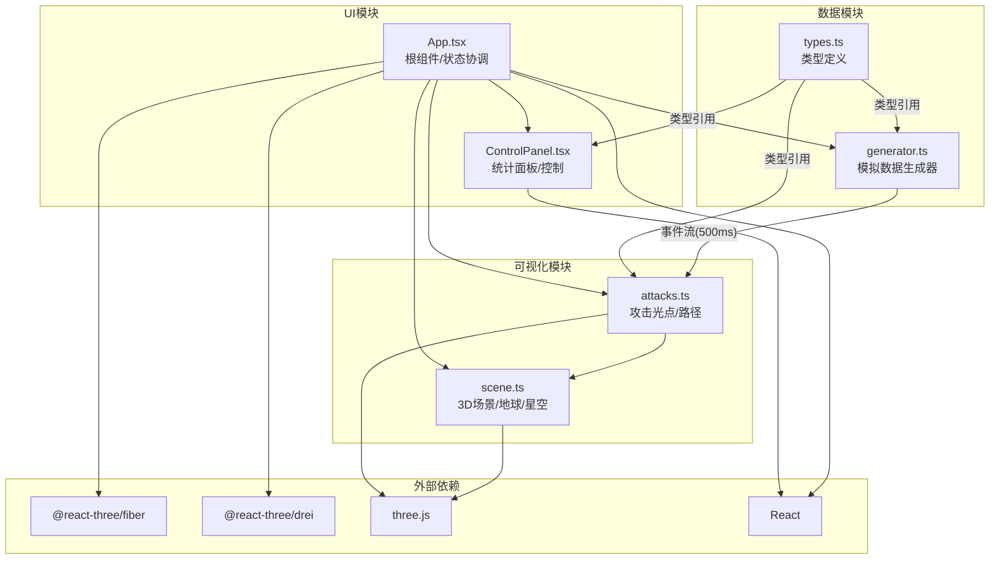

## 1. 架构设计



## 2. 技术说明

- **前端**: React@18 + TypeScript + Vite
- **3D渲染**: Three.js + @react-three/fiber + @react-three/drei + @react-three/postprocessing
- **初始化工具**: Vite
- **后端**: 无（纯前端项目，使用模拟数据）
- **数据库**: 无（内存中运行时状态）
- **状态管理**: Zustand（用于数据模块与UI模块间的状态共享）

## 3. 路由定义

| 路由 | 用途 |
|------|------|
| / | 主页面，包含3D地球可视化和控制面板 |

## 4. 数据模型

### 4.1 核心类型定义

```typescript
interface GeoCoordinate {
  lat: number;
  lng: number;
}

interface AttackEvent {
  id: string;
  source: GeoCoordinate;
  target: GeoCoordinate;
  sourceCountry: string;
  targetCountry: string;
  bandwidth: number;
  type: 'DDoS' | 'DoS' | 'Scan';
  timestamp: number;
}

interface AttackStats {
  totalAttacks: number;
  topTargetCountries: Array<{ country: string; count: number }>;
  peakBandwidth: number;
}

interface SimState {
  isRunning: boolean;
  filterType: 'ALL' | 'DDoS' | 'DoS' | 'Scan';
  events: AttackEvent[];
  stats: AttackStats;
}
```

### 4.2 模拟数据规范

- 数据生成频率：每500ms一组
- 攻击源国家池：中国、美国、俄罗斯、巴西、印度、越南等20+国家
- 攻击目标国家池：美国、英国、德国、日本、韩国等10+国家
- 流量范围：1-500 Gbps
- 攻击类型分布：DDoS 60%、DoS 25%、Scan 15%
- 历史事件保留：最近100条

## 5. 文件结构

```
src/
├── data/
│   ├── generator.ts    # 模拟DDoS攻击事件流生成器
│   └── types.ts        # TypeScript类型接口定义
├── visualization/
│   ├── scene.ts        # 3D场景创建(地球/光照/星空)
│   └── attacks.ts      # 攻击光点和路径曲线管理
├── ui/
│   ├── App.tsx         # React根组件
│   └── ControlPanel.tsx # 底部控制面板
├── main.tsx            # 入口文件
└── index.css           # 全局样式
```

## 6. 性能策略

- 攻击光点使用InstancedMesh或点精灵批量渲染
- 路径曲线使用QuadraticBezierCurve3，曲线顶点数控制在20-30个
- 星空粒子使用Points几何体，数量控制在800个
- Bloom后处理使用UnrealBloomPass，分辨率缩放0.5
- 数据更新使用requestAnimationFrame节流
- 组件卸载时清理Three.js资源（几何体、材质、纹理）
