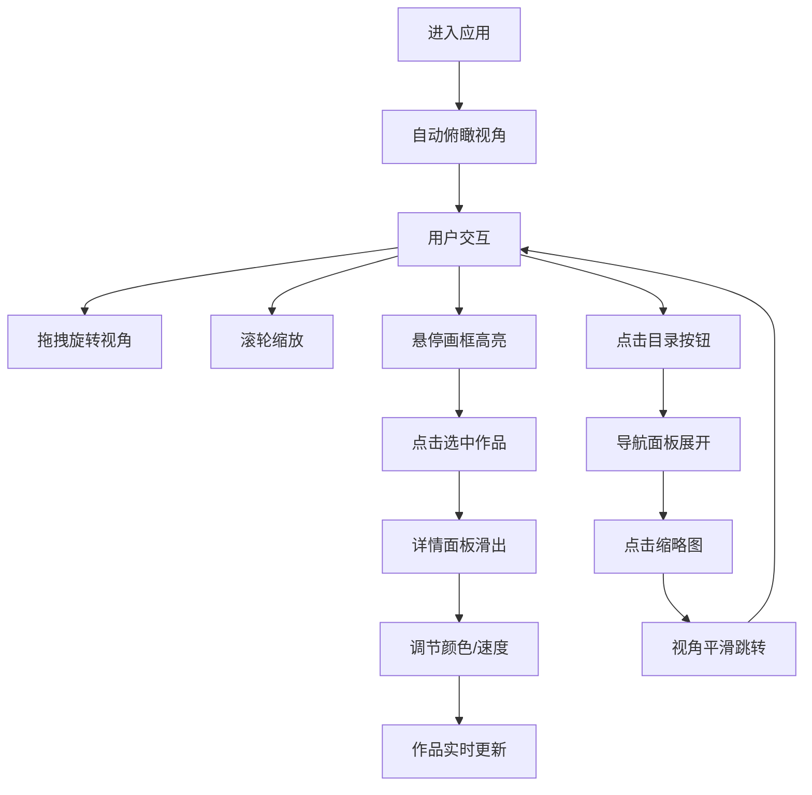

## 1. 产品概述

灵感画廊是一个沉浸式的交互式数字艺术展示应用，用户可以在虚拟3D展厅中浏览程序生成的动态艺术作品，与作品进行实时交互，体验科技与艺术的融合。

- 核心价值：打造沉浸式数字艺术观赏体验，让用户能够以第一人称视角探索虚拟画廊，并与艺术作品深度互动
- 目标用户：数字艺术爱好者、创意设计师、科技文化体验者
- 产品定位：高端沉浸式Web3D数字艺术展示平台

## 2. 核心功能

### 2.1 功能模块

1. **虚拟画廊场景**：环形3D画廊空间，渐变色彩墙壁，镜面地面，悬浮聚光灯
2. **动态艺术作品**：6幅程序生成的动态艺术画，粒子轨迹、几何变换、循环渐变
3. **作品交互定制**：颜色拾取器、粒子速度滑块、重置功能
4. **画廊导航目录**：汉堡菜单、缩略图网格、快速跳转
5. **沉浸式环境**：星光粒子系统、环境音效视觉辅助

### 2.2 页面详情

| 页面名称 | 模块名称 | 功能描述 |
|----------|----------|----------|
| 主场景 | 3D画廊 | 环形虚拟展厅，可360度旋转浏览，滚轮缩放，自动归位 |
| 主场景 | 艺术画框 | 6个悬浮画框，悬停放大发光，点击选中，旋转光环 |
| 详情面板 | 作品详情 | 右侧滑出面板，显示作品信息，颜色拾取，速度调节，重置按钮 |
| 导航面板 | 画廊目录 | 全屏毛玻璃面板，缩略图网格，点击快速跳转 |
| 环境系统 | 粒子效果 | 星光粒子飘浮，颜色随选中作品变化 |

## 3. 核心流程

用户进入应用 → 自动俯瞰视角展示画廊全貌 → 鼠标拖拽旋转视角/滚轮缩放 → 悬停画框查看高亮效果 → 点击画框选中作品 → 右侧滑出详情面板 → 调节颜色/速度参数 → 作品实时反馈变化 → 点击目录按钮展开导航 → 点击缩略图快速跳转 → 继续探索其他作品

## 4. 用户界面设计

### 4.1 设计风格

- **主色调**：深紫色 (#1a0a2e)、冰蓝色 (#00d4ff)
- **强调色**：金色 (#ffd700)、品红 (#ff00ff)
- **背景**：深黑色渐变，营造星空沉浸感
- **UI元素**：毛玻璃效果（背景模糊15px），半透明边框，柔和发光阴影
- **字体**：Orbitron（科技感字体）
- **动效**：ease-in-out缓动，0.3-0.5秒过渡

### 4.2 页面设计概览

| 页面元素 | 模块名称 | UI元素 |
|----------|----------|--------|
| 3D场景 | 画廊墙壁 | 半透明渐变，紫蓝循环，30秒周期 |
| 3D场景 | 地面 | 高光反射镜面，略带模糊 |
| 3D场景 | 聚光灯 | 暖白色，跟随相机旋转 |
| 艺术画框 | 画框 | 金属质感边框，蓝色辉光，悬停金色放大 |
| 艺术画框 | 光环 | 16个光点，顺时针旋转，选中状态 |
| 详情面板 | 面板 | 深色半透明，毛玻璃，右侧滑入 |
| 详情面板 | 颜色拾取 | 渐变色圆盘，5种预设色板 |
| 详情面板 | 速度滑块 | 流动渐变背景，数值标签 |
| 详情面板 | 重置按钮 | 按下回弹动画 |
| 导航面板 | 目录按钮 | 左上角悬浮，汉堡菜单图标 |
| 导航面板 | 缩略图 | 120x120，悬停放大1.2倍 |
| 环境 | 粒子 | 200个星光粒子，布朗运动 |

### 4.3 响应式设计

- **宽屏 (>1200px)**：详情面板固定在右侧，导航目录居中显示
- **窄屏 (<768px)**：详情面板底部弹出横向面板，导航目录改为底部网格
- **触摸优化**：支持触摸滑动旋转视角，双指缩放

### 4.4 3D场景指引

- **环境**：深色空间背景，营造沉浸式氛围
- **光照**：主聚光灯（暖白）+ 环境光（微弱蓝紫），突出艺术作品
- **相机**：PerspectiveCamera，初始俯视角，带阻尼感轨道控制
- **构图**：环形画廊为主体，6幅作品均匀分布，中央聚光灯为视觉焦点
- **交互**：OrbitControls支持旋转缩放，自动归位动画，平滑飞行跳转
- **性能**：目标60FPS，3D场景不低于30FPS，粒子限制200个
