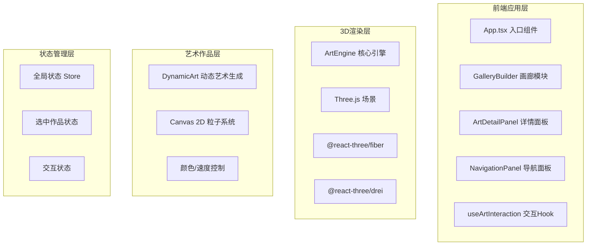

## 1. 架构设计



## 2. 技术说明

- **前端框架**：React 18 + TypeScript
- **构建工具**：Vite
- **3D渲染**：Three.js + @react-three/fiber + @react-three/drei
- **状态管理**：React useState/useContext（轻量级）
- **工具库**：uuid（唯一ID生成）
- **样式方案**：CSS Modules + 内联样式（动画效果）
- **字体**：Google Fonts - Orbitron

## 3. 文件结构

```
src/
├── module-art/
│   ├── core/
│   │   └── ArtEngine.ts          # 核心3D引擎
│   ├── gallery/
│   │   └── GalleryBuilder.ts     # 画廊构建器
│   └── artworks/
│       └── DynamicArt.ts         # 动态艺术生成
├── module-interaction/
│   ├── hooks/
│   │   └── useArtInteraction.ts  # 交互Hook
│   └── ui/
│       ├── ArtDetailPanel.tsx    # 详情面板
│       └── NavigationPanel.tsx   # 导航面板
├── components/
│   └── ArtFrame.tsx              # 艺术画框组件
├── store/
│   └── useGalleryStore.ts        # 状态管理
├── types/
│   └── index.ts                  # 类型定义
├── App.tsx                        # 应用入口
└── main.tsx                       # 渲染入口
```

## 4. 核心模块说明

### 4.1 ArtEngine (核心引擎)
- 初始化Three.js场景、相机、渲染器
- 设置轨道控制器（OrbitControls）
- 管理场景生命周期
- 导出场景对象供其他模块使用

### 4.2 GalleryBuilder (画廊构建)
- 构建环形画廊墙壁（半透明发光材质）
- 创建地面反射镜面
- 生成6个悬浮画框位置（环形均匀分布）
- 管理聚光灯跟随效果

### 4.3 DynamicArt (动态艺术)
- Canvas 2D绘制粒子轨迹
- 随机几何形状变换
- 循环渐变色彩
- 支持颜色主题和速度调节

### 4.4 useArtInteraction (交互Hook)
- 射线检测（Raycaster）碰撞检测
- 点击选中画框
- 悬停高亮效果
- 与UI状态同步

### 4.5 ArtDetailPanel (详情面板)
- 作品信息展示
- 颜色拾取器（5种预设色板）
- 粒子速度滑块
- 重置按钮
- 毛玻璃视觉效果

### 4.6 NavigationPanel (导航面板)
- 汉堡菜单按钮
- 缩略图网格展示
- 点击快速跳转（平滑飞行动画）
- 毛玻璃背景

## 5. 性能优化策略

- **粒子数量限制**：环境粒子最多200个
- **Canvas纹理复用**：每幅作品使用独立Canvas，按需更新
- **LOD策略**：远距离画框降低细节
- **requestAnimationFrame优化**：只在需要时更新
- **内存管理**：及时释放纹理和几何体
- **CSS硬件加速**：transform和opacity动画

## 6. 数据模型

### 6.1 艺术作品类型

```typescript
interface Artwork {
  id: string;
  name: string;
  author: string;
  description: string;
  colorPalette: string[];
  particleSpeed: number;
  position: { x: number; y: number; z: number };
  rotation: { x: number; y: number; z: number };
}
```

### 6.2 画廊状态

```typescript
interface GalleryState {
  selectedArtworkId: string | null;
  isNavigationOpen: boolean;
  isDetailPanelOpen: boolean;
  hoveredArtworkId: string | null;
}
```
