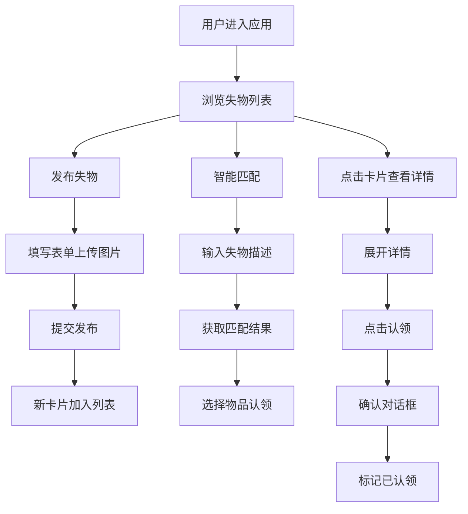

## 1. 产品概述

公共场所失物招领与智能匹配应用，帮助用户快速发布和认领遗失物品。通过智能匹配算法连接失主与拾获者，解决传统失物招领信息零散、认领流程繁琐的问题。

- **目标用户**：在公共场所遗失物品的用户、拾获物品希望归还的用户
- **核心价值**：提高失物找回效率，简化认领流程，减少物品长期无人认领的情况

## 2. 核心功能

### 2.1 用户角色

| 角色 | 注册方式 | 核心权限 |
|------|----------|----------|
| 普通用户 | 无需注册，直接使用 | 发布失物、浏览失物列表、智能匹配认领、筛选查询 |

### 2.2 功能模块

1. **首页/列表页**：失物时间线列表、筛选器、发布入口、匹配入口
2. **发布表单**：物品信息填写、图片上传、提交发布
3. **卡片详情**：物品完整信息展示、认领操作
4. **智能匹配**：描述输入、匹配结果展示、匹配度徽章

### 2.3 页面详情

| 页面名称 | 模块名称 | 功能描述 |
|----------|----------|----------|
| 首页 | 顶部导航栏 | 应用标题、发布按钮、匹配按钮 |
| 首页 | 筛选器区域 | 地点筛选下拉、时间范围筛选下拉 |
| 首页 | 失物列表 | 两列瀑布流卡片、按时间倒序排列、懒加载图片、骨架屏 |
| 首页 | 空状态 | 无结果时的插画提示 |
| 发布弹窗 | 表单区域 | 物品名称、地点选择/输入、时间选择、描述输入、图片上传 |
| 发布弹窗 | 提交按钮 | 提交校验、进度指示、成功反馈 |
| 卡片详情 | 展开视图 | 大图展示、完整描述、地点时间详情 |
| 卡片详情 | 认领按钮 | 认领确认对话框、状态变更 |
| 匹配弹窗 | 描述输入 | 失物特征描述文本框 |
| 匹配弹窗 | 结果列表 | 匹配结果卡片、匹配度百分比、高匹配徽章 |

## 3. 核心流程

### 3.1 发布失物流程
用户点击发布按钮 → 底部弹出表单 → 填写物品信息并上传图片 → 提交后验证 → 成功后新卡片从顶部滑入列表

### 3.2 认领失物流程
用户浏览列表 → 点击卡片展开详情 → 点击认领按钮 → 确认对话框（发光动画）→ 标记为已认领 → 卡片状态更新

### 3.3 智能匹配流程
用户点击匹配按钮 → 输入失物特征描述 → 提交匹配请求 → 展示匹配结果列表 → 用户可直接认领匹配物品

## 4. 用户界面设计

### 4.1 设计风格

- **主色调**：柔和橙黄色 `#FFA726`，用于按钮和重要标签，传递温暖友好的感觉
- **背景色**：米白色 `#FFF8F0`，营造温馨舒适的氛围
- **文字色**：深灰色 `#333333`，保证良好的可读性
- **辅助色**：绿色 `#4CAF50`（已认领状态）、金色 `#FFD700`（高匹配徽章）
- **卡片样式**：圆角 `16px`，柔和阴影，hover 时阴影加深并轻微上移
- **按钮样式**：圆角胶囊形，点击时有回弹动画
- **标签样式**：圆角胶囊，选中时填充主色并微缩放
- **字体**：Noto Sans SC（Google Fonts），温暖的中文字体

### 4.2 页面设计概述

| 页面名称 | 模块名称 | UI 元素 |
|----------|----------|---------|
| 首页 | 导航栏 | 标题文字、发布按钮（主色圆角）、匹配按钮（描边圆角） |
| 首页 | 筛选区 | 地点下拉、时间下拉、胶囊式标签、选中态缩放动画 |
| 首页 | 卡片列表 | 两列瀑布流、圆角卡片、缩略图、地点标签、相对时间、滑入动画 |
| 首页 | 空状态 | 居中插画、提示文字、柔和阴影 |
| 发布弹窗 | 表单 | 底部滑入模态框、表单输入框、图片上传区域、圆环进度指示器 |
| 卡片详情 | 展开视图 | 放大动画、大图、完整描述、认领按钮 |
| 匹配弹窗 | 结果列表 | 匹配度百分比、金色高匹配徽章、渐变进度条 |

### 4.3 响应式

- **设计策略**：桌面端优先，移动端适配
- **桌面端**：两列瀑布流布局，最大宽度限制
- **平板端**：单列布局，卡片宽度自适应
- **移动端**：单列布局，底部导航优化，触摸友好的点击区域
- **触摸优化**：按钮最小高度 44px，间距合理

### 4.4 动画与交互

- **页面加载**：卡片 staggered 渐入动画
- **新发布**：新卡片从顶部滑入，带弹性效果
- **卡片展开**：点击卡片放大展开，平滑过渡
- **筛选切换**：列表淡入淡出过渡
- **Toast 提示**：从右上角滑入，3秒后淡出
- **按钮点击**：回弹缩放动画
- **认领确认**：发光图标脉冲动画
- **图片加载**：骨架屏占位，淡入显示
