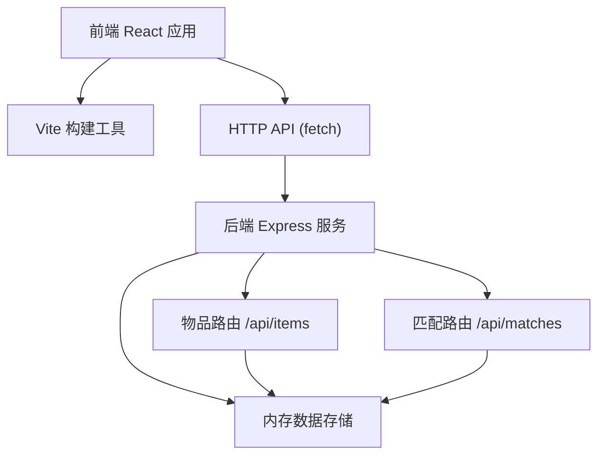
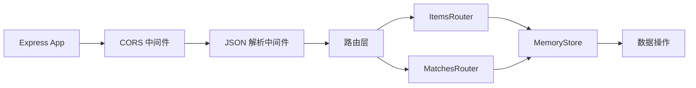
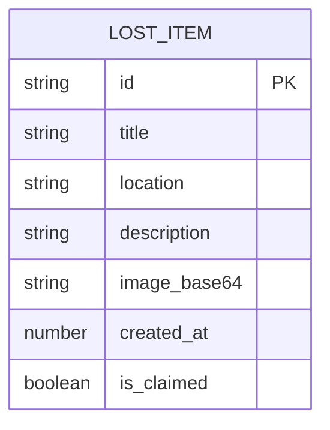

## 1. 架构设计



## 2. 技术描述

- **前端**：React 18 + TypeScript + Vite 5
- **样式方案**：CSS Modules + CSS Variables
- **动画**：CSS Transitions/Animations + Framer Motion（如需复杂动画）
- **后端**：Express 4 + TypeScript
- **数据存储**：内存存储（开发阶段），可扩展为文件持久化
- **构建工具**：Vite（前端）、ts-node（后端开发）
- **代码规范**：TypeScript 严格模式，ESLint

## 3. 目录结构

```
auto75/
├── package.json              # 根目录配置，统一脚本
├── vite.config.js            # Vite 配置
├── tsconfig.json             # TypeScript 配置
├── index.html                # 前端入口 HTML
├── src/                      # 前端源码
│   ├── App.tsx              # 根组件
│   ├── main.tsx             # 入口文件
│   ├── components/           # 组件目录
│   │   ├── ItemForm.tsx     # 发布表单组件
│   │   ├── ItemCard.tsx     # 物品卡片组件
│   │   ├── ItemList.tsx     # 物品列表组件
│   │   ├── FilterBar.tsx    # 筛选栏组件
│   │   ├── MatchModal.tsx   # 匹配弹窗组件
│   │   ├── Toast.tsx        # Toast 提示组件
│   │   └── ErrorBoundary.tsx # 错误边界组件
│   ├── utils/                # 工具函数
│   │   ├── api.ts           # API 封装
│   │   └── time.ts          # 时间格式化
│   ├── types/                # 类型定义
│   │   └── index.ts         # 共享类型
│   └── styles/               # 全局样式
│       └── globals.css
└── server/                   # 后端源码
    ├── index.ts             # 入口文件
    ├── routes/              # 路由模块
    │   ├── items.ts         # 物品路由
    │   └── matches.ts       # 匹配路由
    ├── data/                # 数据存储
    │   └── store.ts         # 内存数据存储
    └── types.ts             # 后端类型
```

## 4. 路由定义（前端）

| 路由 | 用途 |
|------|------|
| / | 首页，展示失物列表和筛选器 |

应用为单页应用，主要通过弹窗/模态框切换不同功能视图。

## 5. API 定义

### 5.1 数据类型

```typescript
interface LostItem {
  id: string;
  title: string;
  location: string;
  description: string;
  image: string; // base64
  createdAt: number;
  isClaimed: boolean;
}

interface MatchResult {
  item: LostItem;
  score: number; // 0-100
  isHighMatch: boolean;
}
```

### 5.2 GET /api/items

查询所有物品，支持筛选。

**Query 参数：**
- `location`?: string - 地点筛选
- `dateFrom`?: number - 开始时间戳
- `dateTo`?: number - 结束时间戳

**响应：**
```json
{
  "items": [/* LostItem 数组，按时间倒序 */]
}
```

### 5.3 POST /api/items

新增物品。

**请求体：**
```json
{
  "title": "物品名称",
  "location": "丢失地点",
  "description": "详细描述",
  "image": "base64图片数据"
}
```

**响应：**
```json
{
  "item": { /* 新创建的 LostItem */ }
}
```

### 5.4 DELETE /api/items/:id

删除（认领）物品。

**响应：**
```json
{
  "success": true,
  "item": { /* 更新后的 LostItem，isClaimed=true */ }
}
```

### 5.5 POST /api/matches

智能匹配。

**请求体：**
```json
{
  "description": "失物特征描述"
}
```

**响应：**
```json
{
  "matches": [
    {
      "item": { /* LostItem */ },
      "score": 85,
      "isHighMatch": true
    }
    // 前5个匹配结果
  ]
}
```

## 6. 服务器架构图



## 7. 数据模型

### 7.1 数据模型定义



### 7.2 匹配算法说明

采用关键词重叠评分算法：
1. 将输入描述和物品标题、描述进行分词
2. 计算共同关键词数量
3. 基于关键词重合度计算匹配百分比
4. 匹配度 > 60% 标记为"高匹配"
5. 返回匹配度最高的前 5 个结果
