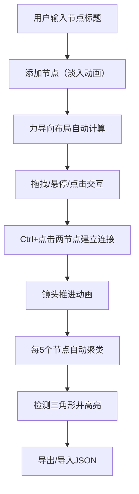

## 1. 产品概述

交互式个人知识图谱是一个基于3D力导向图的知识可视化工具，帮助用户直观地管理和探索自己的知识网络。通过节点和连线的形式展示概念、笔记、灵感之间的关联关系，解决传统思维导图节点过多时布局混乱、难以直观感知知识密度的痛点。

- 核心目标：为知识工作者提供一个视觉化的知识管理工具，让知识关联一目了然
- 目标用户：学生、研究者、内容创作者、程序员等需要管理大量知识点的人群

## 2. 核心功能

### 2.1 功能模块

1. **知识图谱主界面**：力导向3D可视化画布、节点渲染、连线渲染、聚类效果
2. **节点管理**：添加节点、编辑节点、删除节点、颜色标签、节点动画
3. **连接管理**：手动建立节点连接、流动虚线动画、颜色混合、镜头推进
4. **聚类系统**：自动聚类算法、手动重组、三角形高亮、呼吸动画圆环
5. **数据管理**：JSON导出、JSON导入、本地状态管理

### 2.2 页面详情

| 页面名称 | 模块名称 | 功能描述 |
|-----------|-------------|---------------------|
| 主页面 | 左侧边栏 | 节点添加输入框、颜色标签选择器、导入导出按钮、重组按钮 |
| 主页面 | SVG画布 | 力导向布局渲染、节点交互（悬停/点击/拖拽）、连线渲染、三角形高亮、聚类圆环 |
| 主页面 | 节点编辑浮层 | 标题编辑、关联描述、颜色选择、弹性动画 |
| 主页面 | Tooltip | 节点标题、创建时间、半透明悬浮显示 |

## 3. 核心流程

用户添加知识节点，通过Ctrl+点击建立节点之间的关联关系，系统自动进行力导向布局和聚类分析，最终形成可交互的知识网络图。用户可随时导出当前图谱状态，或导入之前保存的图谱继续编辑。

## 4. 用户界面设计

### 4.1 设计风格

- **主色调**：深灰蓝背景（#0d1117）、深灰侧边栏（#1e1e1e）、蓝紫渐变按钮（#667eea → #764ba2）
- **节点颜色**：浅蓝到靛紫渐变默认，支持红/蓝/绿/橙四种标签色
- **圆角**：统一12px
- **阴影**：节点卡片默认阴影 0 4px 15px rgba(0,0,0,0.3)
- **按钮交互**：悬浮时右移0.5px，阴影加深
- **字体**：Google Fonts Inter

### 4.2 页面设计概览

| 页面名称 | 模块名称 | UI元素 |
|-----------|-------------|-------------|
| 主页面 | 侧边栏 | 深灰背景、圆角输入框、渐变按钮、颜色标签、列表布局 |
| 主页面 | 画布 | 极深灰蓝背景、SVG元素、渐变节点、曲线连线、虚线圆环 |
| 主页面 | 节点卡片 | 圆形渐变、浮动效果、弹性动画、Tooltip |
| 主页面 | 编辑浮层 | 半透明背景、圆角面板、表单输入、颜色选择器 |

### 4.3 响应式设计

- 桌面端（≥800px）：左侧固定300px侧边栏，右侧自适应画布
- 移动端（<800px）：侧边栏收为顶部可折叠横条，画布占满全屏

### 4.4 动画效果

- 节点添加：透明到不透明的淡入动画
- 节点悬停：卡片浮起效果
- 编辑浮层：弹性弹出/收回动画
- 建立连接：镜头推进居中动画
- 连线：小圆点组成的流动虚线
- 聚类圆环：微弱呼吸淡入淡出循环
- 力导向：松开鼠标后震荡几下后稳定

## 5. 性能要求

- 30个节点、50条连接时帧率 ≥ 45FPS
- 节点拖拽时帧率 ≥ 30FPS
