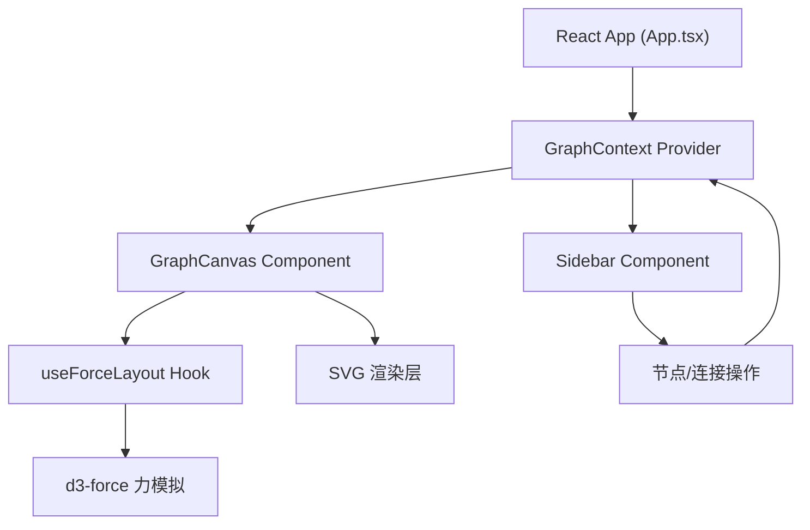

## 1. 架构设计



## 2. 技术选型

- **前端框架**：React 18 + TypeScript
- **构建工具**：Vite
- **力导向布局**：d3-force
- **状态管理**：React Context
- **ID生成**：uuid
- **字体**：Google Fonts Inter

## 3. 项目文件结构

| 文件路径 | 用途说明 |
|----------|----------|
| package.json | 项目依赖和启动脚本 |
| index.html | 入口HTML，引入Inter字体 |
| vite.config.js | Vite构建配置，路径别名@指向src |
| tsconfig.json | TypeScript严格模式配置 |
| src/main.tsx | React应用入口，挂载App组件 |
| src/App.tsx | 整体布局、Context Provider、侧边栏+画布 |
| src/hooks/useForceLayout.ts | d3-force力导向计算封装Hook |
| src/components/Sidebar.tsx | 左侧面板：输入框、导入导出、颜色选择 |
| src/components/GraphCanvas.tsx | SVG画布：节点、连线、聚类、交互 |
| src/context/GraphContext.tsx | 数据类型、CRUD方法、聚类算法 |

## 4. 数据模型

### 4.1 类型定义

```typescript
interface GraphNode {
  id: string;
  title: string;
  description: string;
  color: 'red' | 'blue' | 'green' | 'orange';
  createdAt: number;
  x?: number;
  y?: number;
  vx?: number;
  vy?: number;
  fx?: number | null;
  fy?: number | null;
  cluster?: string;
}

interface GraphLink {
  id: string;
  source: string;
  target: string;
  description?: string;
}

interface GraphCluster {
  id: string;
  nodeIds: string[];
  centerX: number;
  centerY: number;
  radius: number;
}

interface GraphState {
  nodes: GraphNode[];
  links: GraphLink[];
  clusters: GraphCluster[];
  selectedNodeId: string | null;
  connectingFromId: string | null;
}
```

## 5. 核心算法

### 5.1 力导向布局
- 使用 d3-force 的 forceSimulation
- forceManyBody：节点间排斥力
- forceLink：连线弹性力
- forceCenter：中心吸引力
- forceCollide：节点碰撞检测

### 5.2 聚类算法
- 基于连接密度的社区检测
- 每5个新节点触发一次
- 计算节点间的关联紧密度
- 将关联紧密的节点分组形成聚类

### 5.3 三角形检测
- 遍历所有节点三元组
- 检测两两之间是否都存在连接
- 形成三角形高亮区域
