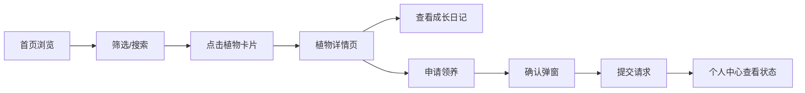

## 1. 产品概述

社区植物领养与交换平台，为植物爱好者提供植物分享、领养和成长记录的一站式服务。
- 解决家庭多余植物闲置问题，促进绿色社区文化建设
- 目标用户：城市家庭园艺爱好者、社区居民、植物新手

## 2. 核心功能

### 2.1 用户角色
| 角色 | 注册方式 | 核心权限 |
|------|----------|----------|
| 普通用户 | 默认登录 | 发布植物、浏览植物、申请领养、管理个人中心 |

### 2.2 功能模块
1. **首页**：植物列表展示、分类筛选、搜索功能
2. **植物详情页**：植物信息展示、成长日记时间线、领养申请
3. **个人中心页**：已发布植物管理、领养请求管理、发布新植物

### 2.3 页面详情
| 页面名称 | 模块名称 | 功能描述 |
|---------|---------|----------|
| 首页 | 导航栏 | Logo展示、搜索框、个人中心入口 |
| 首页 | 筛选标签组 | 按养护难度筛选（全部/容易/中等/困难） |
| 首页 | 植物卡片网格 | 展示所有可领养植物，卡片含图片、名称、难度星级、状态 |
| 植物详情页 | 植物展示区 | 大图展示、名称、拉丁学名、养护难度、光照需求、水肥频次 |
| 植物详情页 | 成长日记时间线 | 按时间倒序展示记录，含日期、描述、可选照片 |
| 植物详情页 | 领养申请按钮 | 提交领养请求，弹出确认弹窗 |
| 个人中心页 | 已发布植物列表 | 横向滑动卡片，支持删除操作 |
| 个人中心页 | 领养请求列表 | 显示申请者、时间、状态，支持状态切换 |
| 个人中心页 | 发布新植物表单 | 填写植物信息、上传照片 |

## 3. 核心流程

用户浏览首页植物列表 → 通过筛选或搜索定位目标植物 → 点击卡片进入详情页 → 查看植物信息和成长日记 → 点击申请领养 → 确认弹窗提交 → 跳转个人中心查看请求状态

## 4. 用户界面设计

### 4.1 设计风格
- 主色调：橄榄绿 #6B8E23，辅色：米色 #F5F5DC，强调色：金色 #DAA520
- 按钮样式：圆角12px，绿色渐变背景，hover时放大微动效
- 字体：Merriweather（标题和正文）
- 布局风格：卡片式设计，固定顶部导航，内容网格布局
- 图标风格：Font Awesome 图标库

### 4.2 页面设计概览
| 页面名称 | 模块名称 | UI元素 |
|---------|---------|---------|
| 首页 | 导航栏 | 白底磨砂渐变效果，滚动时半透明 |
| 首页 | 筛选标签 | 胶囊按钮，选中时绿色渐变+放大 |
| 首页 | 植物卡片 | 圆角12px，阴影悬停效果，渐变色占位图 |
| 植物详情页 | 展示区 | 大图cover模式，半透明深色浮层元信息 |
| 植物详情页 | 时间线 | 垂直时间轴，最新记录微弱溢出阴影 |
| 植物详情页 | 领养按钮 | 绿色渐变，按下黄色闪烁3秒后变灰 |
| 个人中心页 | 横向卡片 | 左右箭头滑动，卡片间距16px，悬停阴影 |
| 个人中心页 | 请求列表 | 状态标签颜色区分（橙/绿/灰） |

### 4.3 响应式设计
- 桌面端：多列网格布局
- 移动端（<768px）：单列布局，卡片宽度满屏，底部tab导航栏
- 触控优化：按钮最小触控面积，合理间距

### 4.4 动效设计
- 路由过渡：进入右向左滑入，离开左向右滑出，300ms
- 卡片动画：搜索结果缩放出现，新增植物底部滑入
- 按钮交互：hover时ease-out 0.3s，点击时ease-in 0.15s
- 弹窗动画：出现时背景模糊遮罩，关闭时缩小淡出
