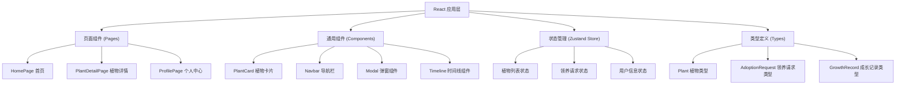
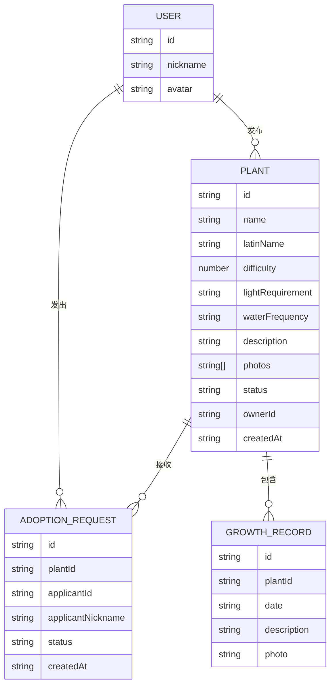

## 1. 架构设计



## 2. 技术说明
- 前端框架：React 18 + TypeScript
- 构建工具：Vite
- 路由管理：react-router-dom
- 状态管理：zustand
- 工具库：uuid
- 样式方案：CSS Modules + 全局CSS变量
- 字体：Google Fonts Merriweather
- 图标：Font Awesome CDN

## 3. 路由定义
| 路由 | 用途 |
|------|------|
| / | 首页 - 展示所有可领养植物 |
| /plant/:id | 植物详情页 - 查看植物信息和成长日记 |
| /profile | 个人中心 - 管理发布和领养请求 |

## 4. 数据模型

### 4.1 数据模型定义


### 4.2 类型定义
```typescript
// Plant - 植物
interface Plant {
  id: string;
  name: string;
  latinName: string;
  difficulty: 1 | 2 | 3 | 4 | 5;
  lightRequirement: 'low' | 'medium' | 'high';
  waterFrequency: 'daily' | 'everyOtherDay' | 'weekly';
  description: string;
  photos: string[];
  status: 'available' | 'adopted';
  ownerId: string;
  createdAt: string;
}

// AdoptionRequest - 领养请求
interface AdoptionRequest {
  id: string;
  plantId: string;
  applicantId: string;
  applicantNickname: string;
  status: 'pending' | 'approved' | 'rejected';
  createdAt: string;
}

// GrowthRecord - 成长记录
interface GrowthRecord {
  id: string;
  plantId: string;
  date: string;
  description: string;
  photo?: string;
}

// User - 用户
interface User {
  id: string;
  nickname: string;
  avatar: string;
}
```

## 5. 项目文件结构
```
d:\P\tasks\auto77/
├── package.json
├── index.html
├── vite.config.js
├── tsconfig.json
└── src/
    ├── types.ts
    ├── store.ts
    ├── App.tsx
    ├── main.tsx
    ├── index.css
    ├── components/
    │   └── PlantCard.tsx
    └── pages/
        ├── HomePage.tsx
        ├── PlantDetailPage.tsx
        └── ProfilePage.tsx
```
