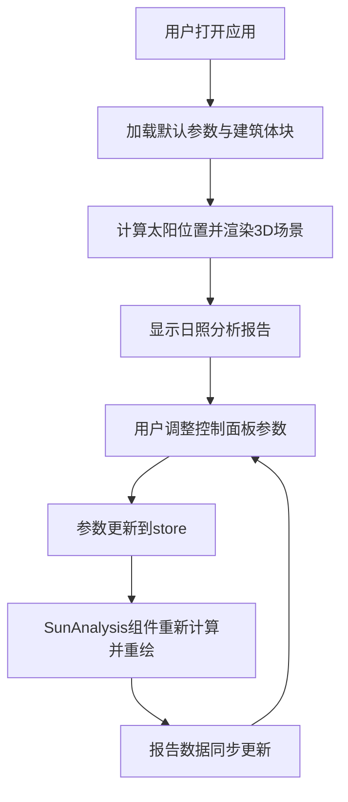

## 1. 产品概述

3D建筑日照分析与阴影模拟应用，为建筑设计师和城市规划人员提供轻量级、实时交互的日照评估工具。用户可加载或自定义建筑体块，实时调整日期、时间和地理位置参数，观察太阳位置变化与阴影效果，并生成简要的日照时长分析报告。

- **核心价值**：填补专业模拟工具过于复杂、收费高昂与快速设计评估需求之间的空白
- **目标用户**：建筑设计师、城市规划师、建筑相关专业学生

## 2. 核心功能

### 2.1 用户角色

| 角色 | 注册方式 | 核心权限 |
|------|----------|----------|
| 普通用户 | 无需注册 | 使用全部日照分析功能，调整所有参数 |

### 2.2 功能模块

1. **3D场景渲染模块**：建筑体块渲染、地面网格、天空盒、方向指示箭头、阴影投射
2. **参数控制面板模块**：日期滑块、时间滑块、经纬度输入、建筑体块选择器
3. **太阳位置计算模块**：基于日期/时间/经纬度计算太阳方位角与仰角
4. **日照分析报告模块**：日出日落时间、总日照时长、当前太阳仰角、仰角进度条
5. **视角交互模块**：鼠标拖拽旋转、滚轮缩放、场景动态视觉效果

### 2.3 页面详情

| 页面名称 | 模块名称 | 功能描述 |
|----------|----------|----------|
| 主页面 | 左侧控制面板 | 日期滑动条（1月1日-12月31日）、时间滑动条（6:00-19:00，步长15分钟）、经纬度输入框（-90到90）、建筑体块选择器（长方体/L形/回字形） |
| 主页面 | 右侧3D场景 | 建筑体块实时渲染、阴影投射与变化、地面参考网格、动态天空盒、方位指示箭头（N/S/E/W） |
| 主页面 | 日照分析报告 | 总日照时长显示（"12小时32分钟"格式）、当前太阳仰角、仰角进度条、低角度光照警示 |

## 3. 核心流程

用户打开应用 → 查看默认建筑体块与日照状态 → 通过控制面板调整参数（日期/时间/经纬度/建筑类型）→ 3D场景实时更新太阳位置与阴影 → 查看日照分析报告 → 可旋转/缩放视角观察不同角度

## 4. 用户界面设计

### 4.1 设计风格

- **主色调**：浅蓝色 #6C8BFF，渐变范围 #4466EE 到 #88AAFF
- **背景色**：深色半透明控制面板 rgba(20, 30, 50, 0.85)，毛玻璃模糊效果 10px
- **建筑材质**：灰白色，背光面加深30%
- **天空盒**：动态渐变（晨昏偏橙红、正午偏蓝白）
- **控件样式**：圆角矩形 border-radius: 8px，胶囊按钮组
- **字体**：Google Fonts Inter
- **整体调性**：专业、科技感、清晰易读

### 4.2 页面设计概览

| 页面名称 | 模块名称 | UI元素 |
|----------|----------|--------|
| 主页面 | 左侧控制面板 | 深色毛玻璃背景、圆角输入控件、渐变色滑块、圆形拖动手柄、胶囊按钮组、格式化日期时间显示 |
| 主页面 | 右侧3D场景 | 动态天空背景、低多边形建筑、半透明阴影、网格地面、方位箭头、流畅视角操控 |
| 主页面 | 日照报告区 | 数据卡片、仰角进度条（0-90度）、低角度橙色闪烁警示 |

### 4.3 响应式设计

- 桌面端优先，采用经典双栏布局（左30%控制面板 + 右70% 3D场景）
- 建筑切换动画：从底部生长到顶部，持续0.8秒，缓出效果
- 参数调整响应时间小于200ms
- 3D场景帧率不低于30fps

### 4.4 3D场景指引

- **环境**：动态渐变天空盒，根据时间变化色调（晨昏橙红、正午蓝白）
- **光照**：单方向平行光模拟太阳光，方向根据太阳方位角和仰角实时计算
- **阴影**：建筑投射清晰多边形阴影，边缘半透明渐变，仰角>30度时阴影强度减弱至50%
- **相机**：OrbitControls 轨道控制，支持拖拽旋转、滚轮缩放
- **地面**：网格参考线，旋转时透明度0.3渐变到0.1
- **方位指示**：N/S/E/W 半透明箭头，固定在场景边缘，始终指向真实方位
- **性能**：10x10x10 场景范围内，更新频率不低于30fps
