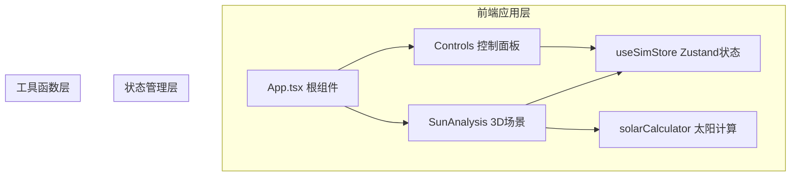

## 1. 架构设计



**数据流向**：用户操作 Controls 组件 → 更新 useSimStore → SunAnalysis 组件订阅 store 变化 → 调用 solarCalculator 重新计算 → 3D 场景重绘

## 2. 技术栈说明

- **前端框架**：React 18 + TypeScript 5
- **构建工具**：Vite 5
- **3D 渲染**：Three.js + @react-three/fiber + @react-three/drei
- **状态管理**：Zustand
- **样式方案**：原生 CSS（CSS Modules），无 Tailwind
- **字体**：Google Fonts Inter

## 3. 项目结构

```
src/
├── main.tsx              # React入口，挂载App组件
├── App.tsx               # 根组件，双栏布局
├── components/
│   ├── SunAnalysis/
│   │   └── SunAnalysis.tsx  # 核心3D场景组件
│   └── Controls/
│       └── Controls.tsx     # 控制面板UI组件
├── utils/
│   └── solarCalculator.ts   # 太阳位置计算模块
├── store/
│   └── useSimStore.ts       # Zustand状态管理
└── styles/
    └── global.css           # 全局样式
```

**文件调用关系**：
- `main.tsx` → 渲染 `App.tsx`
- `App.tsx` → 引入 `Controls.tsx` 和 `SunAnalysis.tsx`，通过 `useSimStore` 共享状态
- `Controls.tsx` → 读写 `useSimStore` 中的状态
- `SunAnalysis.tsx` → 从 `useSimStore` 读取参数，调用 `solarCalculator.ts` 计算太阳位置
- `solarCalculator.ts` → 纯函数模块，接收参数返回计算结果

## 4. 核心模块说明

### 4.1 solarCalculator.ts

**输入参数**：
- `date: Date` - 日期
- `timeHours: number` - 时间（小时，如14.5表示14:30）
- `latitude: number` - 纬度（-90到90）
- `longitude: number` - 经度（-180到180）

**输出结果**：
```typescript
interface SolarResult {
  azimuth: number;       // 太阳方位角（弧度）
  elevation: number;     // 太阳仰角（弧度）
  directionVector: {     // Three.js光源方向向量
    x: number;
    y: number;
    z: number;
  };
  sunriseHours: number;  // 日出时间（小时）
  sunsetHours: number;   // 日落时间（小时）
  daylightDuration: number; // 日照时长（小时）
}
```

**核心算法**：基于简化的太阳位置计算公式，计算太阳赤纬角、时角，进而推导方位角和仰角。

### 4.2 useSimStore.ts

**状态字段**：
- `dayOfYear: number` - 一年中的第几天（1-365）
- `timeHours: number` - 时间（小时，6-19）
- `latitude: number` - 纬度
- `longitude: number` - 经度
- `selectedBuilding: 'box' | 'lshape' | 'courtyard'` - 选中的建筑体块类型

**方法**：
- `setDayOfYear(day: number)`
- `setTimeHours(time: number)`
- `setLatitude(lat: number)`
- `setLongitude(lng: number)`
- `setSelectedBuilding(type: string)`

### 4.3 SunAnalysis.tsx

**功能**：
- 创建 Three.js 场景、相机、渲染器
- 渲染地面网格和动态天空盒
- 根据建筑类型渲染对应体块（带生长动画）
- 添加方向平行光并实时更新方向
- 启用阴影映射
- 渲染方位指示箭头
- 响应 store 参数变化触发重计算

**建筑体块定义**：
- 长方体：6x4x6
- L形：两个长方体组合
- 回字形：四个长方体围合内庭院

### 4.4 Controls.tsx

**功能**：
- 日期滑块（1-365天），显示格式化日期
- 时间滑块（6-19小时，步长0.25即15分钟），显示格式化时间
- 经纬度数字输入框
- 建筑类型切换按钮组（胶囊样式）
- 日照分析报告区域

## 5. 性能优化策略

1. **阴影优化**：使用 PCFSoftShadowMap，控制阴影贴图分辨率
2. **动画优化**：建筑生长动画使用 useFrame 配合 scale 属性
3. **状态订阅优化**：使用 Zustand 的 selector 避免不必要的重渲染
4. **计算缓存**：太阳位置计算在参数不变时复用结果
5. **几何体复用**：建筑体块几何体使用 useMemo 缓存
