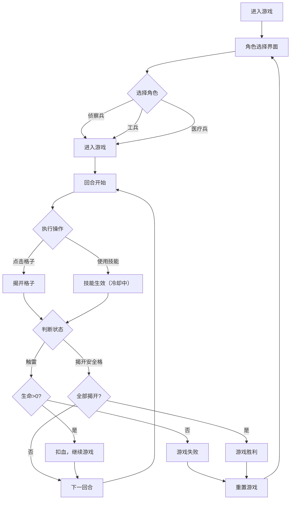

## 1. 产品概述

本项目是一款融合经典扫雷玩法与角色技能系统的回合制策略游戏，旨在解决传统扫雷缺乏策略深度和交互趣味的问题。玩家可选择不同角色（侦察兵、工兵、医疗兵），利用独特技能在16x16网格中排查40枚地雷，通过策略性操作揭开所有安全格子获胜。

- **核心问题**：传统扫雷玩法单调，长时间点击易疲劳，缺乏策略深度
- **目标用户**：喜欢休闲策略游戏的玩家，年龄层广泛
- **市场价值**：创新的玩法融合，提升游戏趣味性和重玩价值

## 2. 核心功能

### 2.1 用户角色

无需注册登录，所有功能对所有玩家开放。

### 2.2 功能模块

1. **角色选择界面**：三个角色卡片扇形排列展示，支持悬停交互
2. **游戏主界面**：16x16网格、统计面板、重置按钮
3. **回合制系统**：每回合一次操作，技能冷却管理
4. **角色技能系统**：侦察兵3x3揭示、工兵标记、医疗兵多生命
5. **胜负反馈系统**：胜利涟漪动画、失败冲击波动画

### 2.3 页面详情

| 页面名称 | 模块名称 | 功能描述 |
|-----------|-------------|---------------------|
| 角色选择页 | 角色卡片 | 三张角色卡片扇形排列，展示头像、技能描述、冷却说明，悬停上浮效果 |
| 角色选择页 | 金属面板背景 | 暗色质感金属面板，突出军事科技风格 |
| 游戏主页面 | 统计面板 | 顶部横条显示生命值、进度环形条、回合数，带动画效果 |
| 游戏主页面 | 游戏网格 | 16x16可点击网格，支持左键揭开、右键标记旗帜 |
| 游戏主页面 | 技能按钮 | 显示当前角色技能状态，冷却时禁用 |
| 游戏主页面 | 重置按钮 | 黄色警示带条纹，按下变红回弹 |
| 通用 | 胜负浮层 | 胜利霓虹绿文字+烟花动画，失败红色文字+抖动效果 |

## 3. 核心流程

用户进入游戏 → 选择角色（侦察兵/工兵/医疗兵）→ 进入16x16网格游戏 → 每回合执行一次操作（点击揭开/使用技能）→ 揭开所有安全格子获胜/触雷生命归零失败 → 点击重置重新开始

## 4. 用户界面设计

### 4.1 设计风格

- **主色调**：深灰 #1a1a2e（背景）、浅灰 #e0e0e0（揭开格子）、红色（地雷/危险）、霓虹绿（胜利）、黄色（警示/重置）
- **辅助色**：蓝色（数字1）、绿色（数字2）、橙色（数字3）
- **字体**：Orbitron（科技感字体），引入Google Fonts
- **按钮风格**：重置按钮采用黄色警示带条纹，按下回弹效果
- **布局风格**：卡片式布局，角色卡片扇形排列，网格居中
- **图标风格**：像素风格角色头像、心形生命值、沙漏回合数、骷髅地雷、旗帜标记

### 4.2 页面设计概述

| 页面名称 | 模块名称 | UI元素 |
|-----------|-------------|-------------|
| 角色选择页 | 角色卡片 | 扇形排列、像素头像、技能描述浮动显示、悬停上浮+阴影动画 |
| 角色选择页 | 背景 | 暗色金属面板质感、碳纤维纹理（CSS小圆点图案） |
| 游戏主页面 | 统计面板 | 半透明磨砂黑背景、心形生命值+弹跳动画、环形进度条+光点填充、沙漏回合数 |
| 游戏主页面 | 游戏网格 | 16x16方格、深灰底色、揭开浅灰、数字彩色发光、旗帜飘动动画、地雷红色骷髅 |
| 游戏主页面 | 胜负浮层 | 半透明背景、胜利涟漪金色光晕逐行亮起、烟花emoji滚动、失败暗红色冲击波扩散、格子燃烧消失、CSS抖动效果 |
| 游戏主页面 | 重置按钮 | 黄色警示带条纹背景、按下变红、回弹动画 |

### 4.3 响应式

- **桌面优先**，移动端自动适配
- 16x16网格在手机上自动缩小格子间距，保持可触控性（最小44x44px触控区域）
- 按钮在移动端增大尺寸
- 使用CSS媒体查询适配不同屏幕尺寸

### 4.4 性能要求

- 点击响应延迟 < 30ms
- 技能动画时长 < 500ms
- 无卡顿或掉帧现象
- 使用CSS transform和opacity属性实现高性能动画
