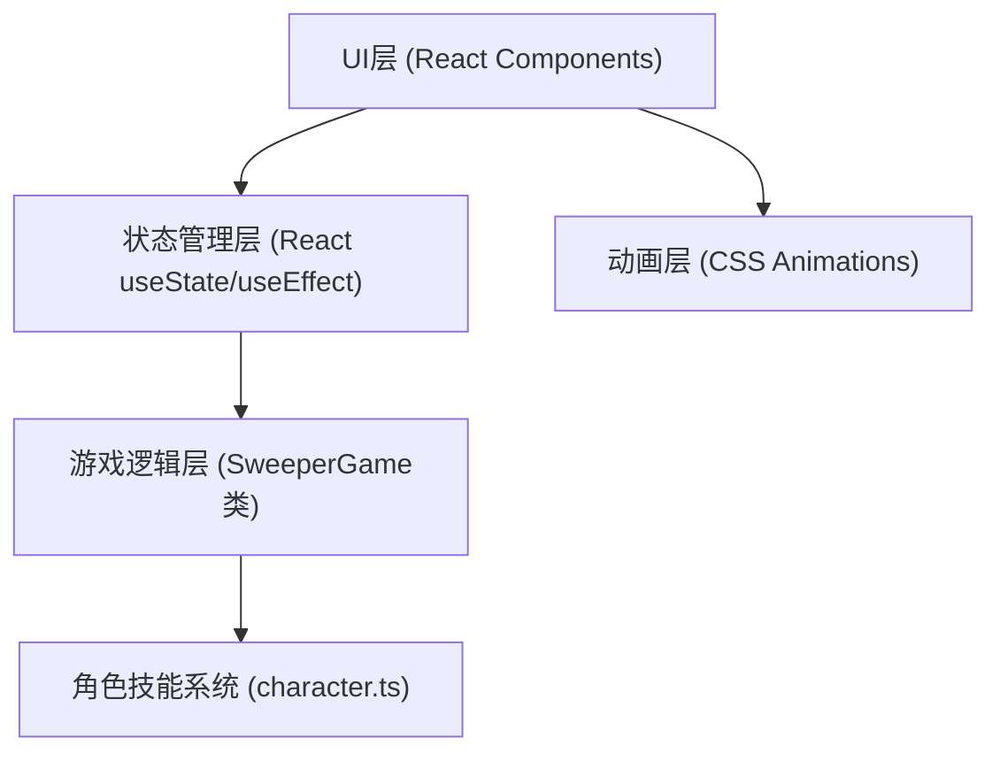

## 1. 架构设计

本项目为纯前端React应用，无需后端服务。架构分为三层：状态管理层、游戏逻辑层、UI渲染层。



## 2. 技术描述

- **前端框架**：React 18 + TypeScript
- **构建工具**：Vite
- **样式方案**：原生CSS（CSS变量、CSS动画）
- **状态管理**：React Hooks (useState, useEffect, useCallback)
- **图标方案**：Emoji + CSS绘制（像素头像、心形、沙漏等）
- **第三方依赖**：react, react-dom, typescript, vite, @types/react, @types/react-dom, uuid

## 3. 项目结构

```
auto79/
├── src/
│   ├── gameLogic.ts      # 核心游戏类SweeperGame
│   ├── character.ts      # 角色定义和技能函数
│   ├── App.tsx           # 主应用组件
│   ├── Grid.tsx          # 网格组件
│   ├── main.tsx          # 入口文件
│   └── index.css         # 全局样式
├── index.html            # HTML入口
├── package.json          # 项目配置
├── vite.config.js        # Vite配置
├── tsconfig.json         # TypeScript配置
└── .trae/documents/      # 项目文档
```

## 4. 核心数据模型

### 4.1 单元格数据结构

```typescript
interface Cell {
  id: string;           // uuid
  row: number;          // 行索引 0-15
  col: number;          // 列索引 0-15
  isMine: boolean;      // 是否是地雷
  isRevealed: boolean;  // 是否已揭开
  isMarked: boolean;    // 是否被旗帜标记
  isSuspected: boolean; // 是否被工兵标记为疑似
  adjacentMines: number;// 周围地雷数
}
```

### 4.2 游戏状态

```typescript
type GameStatus = 'selecting' | 'playing' | 'won' | 'lost';

interface GameState {
  status: GameStatus;
  grid: Cell[][];
  selectedCharacter: Character | null;
  health: number;
  maxHealth: number;
  turn: number;
  skillCooldown: number;
  lastActionWasSkill: boolean;
  revealedCount: number;
  totalSafeCells: number;
}
```

### 4.3 角色定义

```typescript
interface Character {
  id: string;
  name: string;
  skillName: string;
  cooldown: number;
  description: string;
  avatar: string;      // emoji像素头像
  maxHealth: number;
  executeSkill: (game: SweeperGame, row: number, col: number) => SkillResult;
}

interface SkillResult {
  success: boolean;
  message: string;
  cellsAffected: Cell[];
  healthChange?: number;
}
```

## 5. 核心模块说明

### 5.1 SweeperGame 类 (gameLogic.ts)

核心方法：
- `constructor(rows: number, cols: number, mineCount: number)` - 初始化游戏
- `generateMines(excludeRow: number, excludeCol: number): void` - 生成地雷（首次点击安全）
- `getNeighbors(row: number, col: number): Cell[]` - 获取周围8个格子
- `revealCell(row: number, col: number): RevealResult` - 揭开格子（递归揭开空白区域）
- `markCell(row: number, col: number): boolean` - 标记/取消标记旗帜
- `suspectCell(row: number, col: number): boolean` - 工兵疑似标记
- `revealArea(row: number, col: number, size: number): Cell[]` - 侦察兵揭示区域
- `checkWin(): boolean` - 检查胜利条件
- `checkLose(): boolean` - 检查失败条件
- `getRevealedCount(): number` - 获取已揭开格子数

### 5.2 角色技能 (character.ts)

三个角色定义：
1. **侦察兵 (Scout)**：
   - 技能：揭示3x3范围所有格子
   - 冷却：3回合
   - 生命值：1
   
2. **工兵 (Sapper)**：
   - 技能：标记疑似地雷（红色旋转虚线框）
   - 冷却：0（每回合可用）
   - 生命值：1
   - 效果：标记错误扣1血

3. **医疗兵 (Medic)**：
   - 技能：被动 - 3点生命值
   - 冷却：-
   - 生命值：3
   - 效果：触雷仅扣血，不归零不结束

### 5.3 App.tsx 主组件

状态管理：
- `gameStatus` - 游戏阶段（选择角色/游戏中/胜利/失败）
- `selectedCharacter` - 选中的角色
- `gameInstance` - SweeperGame实例
- `health` - 当前生命值
- `turn` - 当前回合数
- `skillCooldown` - 技能剩余冷却
- `lastActionWasSkill` - 上一回合是否使用技能（禁止连续使用）

主要回调：
- `handleCharacterSelect(character)` - 选择角色开始游戏
- `handleCellClick(row, col)` - 左键点击格子
- `handleCellRightClick(row, col)` - 右键标记旗帜
- `handleSkillUse(row, col)` - 使用角色技能
- `handleReset()` - 重置游戏

### 5.4 Grid.tsx 网格组件

Props：
- `grid: Cell[][]` - 16x16网格数据
- `onCellClick: (row, col) => void` - 左键点击回调
- `onCellRightClick: (row, col) => void` - 右键点击回调
- `disabled: boolean` - 是否禁用交互
- `gameStatus: GameStatus` - 游戏状态（用于动画）

单元格渲染逻辑：
- 未揭开：深灰色，悬停高亮
- 已揭开：浅灰色，显示数字/地雷
- 标记旗帜：半透明红色飘动旗帜
- 疑似标记：旋转红色虚线外框
- 数字颜色：1=蓝、2=绿、3=橙，带发光效果

## 6. CSS动画实现

### 6.1 关键帧动画

```css
/* 旗帜飘动 */
@keyframes flag-wave {
  0%, 100% { transform: rotate(-5deg); }
  50% { transform: rotate(5deg); }
}

/* 疑似标记旋转虚线 */
@keyframes dash-rotate {
  to { stroke-dashoffset: -20; }
}

/* 生命值弹跳 */
@keyframes heart-bounce {
  0%, 100% { transform: scale(1); }
  50% { transform: scale(1.3); }
}

/* 胜利涟漪 */
@keyframes ripple-glow {
  0% { box-shadow: 0 0 0 0 rgba(255, 215, 0, 0.7); }
  100% { box-shadow: 0 0 20px 10px rgba(255, 215, 0, 0); }
}

/* 失败冲击波 */
@keyframes shockwave {
  0% { transform: scale(0); opacity: 1; }
  100% { transform: scale(3); opacity: 0; }
}

/* 格子燃烧消失 */
@keyframes burn-away {
  0% { background: #ff4444; transform: scale(1); }
  50% { background: #ff8800; transform: scale(1.1); }
  100% { background: transparent; transform: scale(0); opacity: 0; }
}

/* 抖动效果 */
@keyframes shake {
  0%, 100% { transform: translateX(0); }
  10%, 30%, 50%, 70%, 90% { transform: translateX(-5px); }
  20%, 40%, 60%, 80% { transform: translateX(5px); }
}

/* 卡片上浮 */
@keyframes card-float {
  to { transform: translateY(-8px); }
}
```

### 6.2 性能优化

- 所有动画使用 `transform` 和 `opacity` 属性，触发GPU加速
- 避免 `width`/`height`/`top`/`left` 等触发重排的属性动画
- 使用 `will-change` 提示浏览器优化
- 网格使用 CSS Grid 布局，避免频繁重排

## 7. 移动端适配

```css
/* 移动端响应式 */
@media (max-width: 768px) {
  .grid-container {
    gap: 2px;
  }
  
  .cell {
    width: 44px;
    height: 44px;
    min-width: 44px;
    min-height: 44px;
  }
  
  .reset-button {
    padding: 16px 32px;
    font-size: 18px;
  }
}

@media (max-width: 480px) {
  .cell {
    width: 38px;
    height: 38px;
    min-width: 38px;
    min-height: 38px;
    font-size: 14px;
  }
}
```

## 8. 性能指标实现方案

- **点击响应 < 30ms**：使用 `useCallback` 缓存事件处理函数，避免不必要的重渲染
- **技能动画 < 500ms**：所有动画时长控制在 200-400ms，使用 CSS 动画而非 JS 动画
- **无卡顿**：
  - 揭开空白区域的递归逻辑在 requestIdleCallback 中执行
  - 使用 React.memo 优化 Grid 组件渲染
  - 16x16 网格批量更新，使用 `unstable_batchedUpdates`
