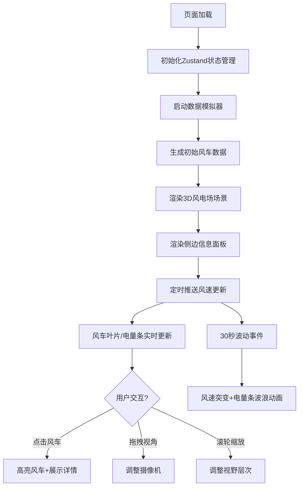

## 1. 产品概述

3D风电场实时运行监控面板，提供鸟瞰视角的风电场景观化监控体验。用户可直观观察风车集群的发电状态、风速分布和设备健康度，实现风电场运维数据的三维可视化呈现。

- 主要目的：为风电场运维人员提供直观、沉浸式的实时监控界面，提升运维效率和决策速度
- 目标用户：风电场运维管理人员、能源监控分析师

## 2. 核心功能

### 2.1 功能模块

1. **3D风电场场景**：网格化布局的风车集群、动态天空背景、可交互摄像机控制
2. **单个风车组件**：旋转叶片、塔筒、机舱状态指示灯、发电电量条
3. **侧边信息面板**：风速分布折线图、总发电量统计、健康状态统计、风车详情浮层
4. **数据模拟引擎**：24小时周期风速模拟、随机波动事件、实时数据推送

### 2.2 页面详情

| 页面名称 | 模块名称 | 功能描述 |
|-----------|-------------|---------------------|
| 主监控面板 | 3D风电场场景 | 网格化布局20+风车，支持鼠标拖拽旋转、右键平移、滚轮缩放，动态天空渐变 |
| 主监控面板 | 风车组件 | 叶片随风速实时旋转（带平滑缓动），健康状态指示灯，半透明渐变电量条，选中时高亮和仪表盘动画 |
| 主监控面板 | 侧边信息面板 | 毛玻璃效果面板，风速折线图（渐变色+tooltip），实时总发电量数字跳动，健康/故障数量统计，选中风车详情 |
| 主监控面板 | 数据模拟模块 | 每分钟更新风速数据，每30秒触发10秒风速波动事件，电量条波浪抖动动画 |

## 3. 核心流程

用户打开页面 → 加载3D风电场场景和侧边面板 → 数据模拟器启动并推送实时数据 → 风车叶片和电量条实时更新 → 用户可点击风车查看详情或操作视角 → 每30秒触发风速波动事件产生视觉动效

## 4. 用户界面设计

### 4.1 设计风格
- 主色调：电光蓝 #00d4ff（悬停 #66e0ff）
- 背景色：深蓝灰 #1a1a2e
- 风车塔筒：银灰色，叶片边缘半透明蓝色光晕
- 电量条渐变：底部蓝色 → 顶部橙红色
- 健康状态：绿色光点（正常）/ 红色闪烁光点（故障）
- 字体：Google Fonts - Inter
- 视觉风格：科技感暗色主题 + 毛玻璃效果

### 4.2 页面设计概览

| 页面名称 | 模块名称 | UI元素 |
|-----------|-------------|-------------|
| 主监控面板 | 3D场景区域 | 网格化风车集群、草地地面、动态渐变天空、阴影投射、LOD远距离简化 |
| 主监控面板 | 侧边面板(350px) | 毛玻璃背景(rgba(255,255,255,0.1) + blur 12px)、总发电量数字、健康统计、风速折线图 |
| 主监控面板 | 风车组件 | 塔筒(银灰)、叶片(带蓝色光晕)、机舱状态灯、半透明电量条、选中仪表盘动画 |
| 主监控面板 | 交互元素 | 按钮缩放回弹动画(scale 0.95→1.0)、悬停高亮、tooltip提示 |

### 4.3 响应式设计
- 桌面端：3D场景占据左侧，侧边面板固定右侧350px
- 移动端：单列布局，3D场景全屏，侧边面板改为底部浮层或可滑动抽屉
- 视口变化时自动调整风车亮度和颜色

### 4.4 3D场景指引
- 环境：深蓝灰背景，动态渐变天空盒（日出浅蓝→正午深蓝缓慢过渡）
- 光照：环境光 + 方向光，支持阴影投射
- 摄像机：默认俯视30度，OrbitControls支持环绕旋转/平移/缩放
- 性能：60FPS目标，30+风车时启用LOD（800单位外简化几何体）
- 动画：叶片旋转缓动、电量条波浪抖动、选中仪表盘填充动画、天空颜色过渡
