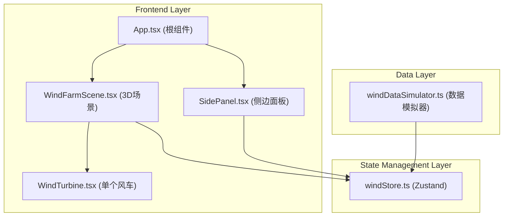

## 1. 架构设计



## 2. 技术说明

- 前端框架：React 18 + TypeScript
- 构建工具：Vite
- 3D渲染：Three.js + @react-three/fiber + @react-three/drei
- 状态管理：Zustand
- 唯一标识：uuid
- 样式方案：原生CSS（无Tailwind，按需定制样式）
- 字体：Google Fonts - Inter

## 3. 项目结构

```
.
├── package.json
├── index.html
├── vite.config.js
├── tsconfig.json
└── src/
    ├── App.tsx              # 根组件，组合3D场景和侧边面板
    ├── store/
    │   └── windStore.ts     # Zustand状态管理
    ├── scene/
    │   ├── WindFarmScene.tsx # 3D场景渲染
    │   └── WindTurbine.tsx   # 单个风车组件
    ├── ui/
    │   └── SidePanel.tsx     # 侧边信息面板
    └── utils/
        └── windDataSimulator.ts # 数据模拟引擎
```

## 4. 数据模型

### 4.1 风车数据类型

```typescript
interface WindTurbineData {
  id: string;
  index: number;
  position: { x: number; z: number };
  windSpeed: number;       // m/s, 0-25
  powerOutput: number;     // 0-100 百分比
  healthStatus: 'healthy' | 'faulty';
  rotationSpeed: number;   // 当前叶片转速
  targetRotationSpeed: number; // 目标转速（用于缓动）
}
```

### 4.2 Store状态

```typescript
interface WindStore {
  turbines: WindTurbineData[];
  selectedTurbineId: string | null;
  animationTimestamp: number;
  totalPowerOutput: number;
  healthyCount: number;
  faultyCount: number;
  isWindFluctuation: boolean;
  selectTurbine: (id: string | null) => void;
  updateTurbines: (data: WindTurbineData[]) => void;
  setWindFluctuation: (active: boolean) => void;
}
```

## 5. 关键技术实现

### 5.1 叶片转速映射
- 0-5 m/s：每帧0.5°（静止/极慢）
- 5-15 m/s：线性增长
- 15+ m/s：每帧10°（最大）
- 使用lerp平滑缓动过渡

### 5.2 LOD策略
- 距离<800单位：高精度模型（完整塔筒+机舱+3叶片）
- 距离≥800单位：低多边形简化版本

### 5.3 数据更新机制
- 基础更新：每分钟一次
- 波动事件：每30秒触发，持续10秒
- Store通过订阅模式接收数据推送

### 5.4 视觉效果
- 电量条：垂直半透明发光柱，使用shaderMaterial实现蓝→橙红渐变
- 状态灯：健康用绿色emissive，故障用红色闪烁动画
- 天空盒：使用Color节点实现动态渐变过渡
- 毛玻璃：CSS backdrop-filter: blur(12px) + rgba背景
