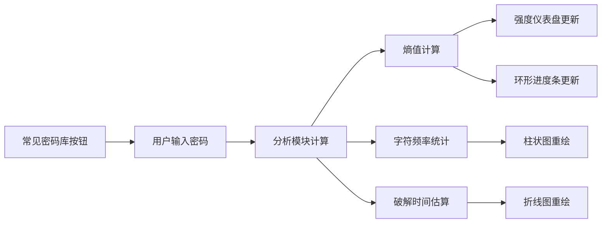

## 1. 产品概述

密码强度可视化分析仪是一款交互式密码安全评估工具，通过直观的动态图表帮助用户实时了解密码的安全强度。主要解决用户在设置密码时难以直观判断密码安全性的问题，目标用户包括普通网民、开发者和安全意识较强的个人用户。产品通过将抽象的密码安全指标转化为可视化的动态图表，让用户一眼就能看出自己密码的弱点所在。

## 2. 核心功能

### 2.1 用户角色

| 角色 | 注册方式 | 核心权限 |
|------|----------|----------|
| 普通用户 | 无需注册 | 使用所有分析功能，查看密码强度报告 |

### 2.2 功能模块

1. **主分析面板**：密码输入框、常见密码库按钮、实时强度仪表盘
2. **字符维度分析**：四个环形进度条展示大小写字母、数字、特殊字符、长度的达标情况
3. **字符频率分析**：柱状图展示每个字符的出现频率
4. **破解时间估算**：时序折线图模拟不同攻击方式下的暴力破解时间
5. **交互功能**：图表拖拽排序、悬停提示、动画过渡效果

### 2.3 页面详情

| 页面名称 | 模块名称 | 功能描述 |
|---------|----------|----------|
| 主分析页 | 密码输入模块 | 支持实时输入密码，左侧有常见密码库按钮，输入时带卡片翻转动画 |
| 主分析页 | 强度仪表盘 | Canvas绘制的动态仪表盘，从红色到绿色渐变，显示"弱/中/强/极强" |
| 主分析页 | 维度环形进度条 | 四个Canvas环形进度条，带旋转光点，速度与熵值成反比 |
| 主分析页 | 字符频率柱状图 | Chart.js绘制，蓝紫渐变，悬停显示精确数值，支持拖拽排序 |
| 主分析页 | 破解时间折线图 | Chart.js绘制，Y轴对数刻度，带流动渐变阴影动画，支持拖拽排序 |

## 3. 核心流程

用户在密码输入框中输入密码 → 系统实时计算熵值、字符频率、破解时间 → 所有可视化组件同步更新 → 用户可点击常见密码库按钮查看示例 → 用户可拖拽图表调整布局

## 4. 用户界面设计

### 4.1 设计风格

- **主色调**：霓虹蓝青 #00d4ff、珊瑚粉 #ff6b6b
- **背景色**：深色主题 #1e1e2e
- **卡片风格**：柔光毛玻璃效果（backdrop-filter: blur）
- **按钮风格**：圆角设计，hover时有发光效果，0.3秒缓动过渡
- **字体**：使用现代无衬线字体，标题加粗，数据展示使用等宽字体
- **布局风格**：卡片式布局，不对称网格，元素间有重叠和层次感
- **动效风格**：所有交互元素0.3秒缓动过渡，图表有平滑动画，旋转光点有流动感

### 4.2 页面设计概述

| 页面名称 | 模块名称 | UI元素 |
|---------|----------|--------|
| 主分析页 | 密码输入模块 | 左侧霓虹蓝青按钮、圆角输入框、卡片翻转进入动画、柔光阴影 |
| 主分析页 | 强度仪表盘 | 大尺寸Canvas仪表盘、红-橙-黄-绿渐变圆弧、中心文字、发光效果 |
| 主分析页 | 维度环形进度条 | 四个小Canvas环形、旋转光点、百分比数字、霓虹色调 |
| 主分析页 | 字符频率柱状图 | 蓝紫渐变柱子、悬停弹窗、对数Y轴、可拖拽边框 |
| 主分析页 | 破解时间折线图 | 流动渐变阴影、对数刻度、多种攻击类型标签、可拖拽边框 |

### 4.3 响应性

- 桌面端优先设计，支持1280px及以上分辨率
- 图表区域支持自适应宽度，拖拽排序时实时调整
- 移动端自动调整为单列布局，图表堆叠显示
- 所有交互元素支持触摸操作

### 4.4 性能要求

- 每次按键输入到图表完全重绘不超过50ms
- 仪表盘和环形进度条使用Canvas渲染
- 高频更新时保持60fps动画流畅度
- 内存占用控制在合理范围，避免内存泄漏
