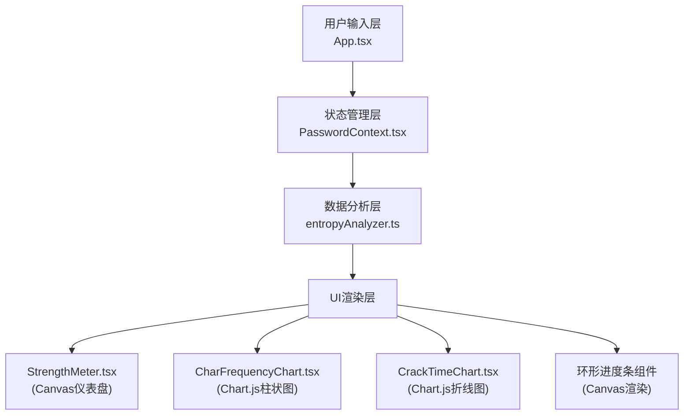

## 1. 架构设计



## 2. 技术描述

- **前端框架**：React@18 + TypeScript@5
- **构建工具**：Vite@5
- **图表库**：Chart.js@4 + react-chartjs-2@5
- **状态管理**：React Context API
- **渲染技术**：Canvas 2D API（仪表盘、环形进度条）、Chart.js（柱状图、折线图）
- **样式方案**：原生CSS + CSS变量 + CSS动画
- **工具库**：uuid@9（唯一标识生成）
- **后端**：无（纯前端应用）
- **数据库**：无（内置常见密码列表）

## 3. 模块划分

### 3.1 数据分析模块 (src/analyzers/)
- **entropyAnalyzer.ts**：纯函数模块，无副作用
  - `calculateEntropy(password: string): number` - 计算密码熵值
  - `getCharFrequency(password: string): CharFrequency[]` - 统计字符频率
  - `estimateCrackTime(entropy: number): CrackTimeEstimate` - 估算破解时间
  - `getStrengthLevel(entropy: number): StrengthLevel` - 获取强度等级
  - `getDimensionScores(password: string): DimensionScores` - 获取四维评分

### 3.2 状态管理模块 (src/context/)
- **PasswordContext.tsx**：React Context
  - 接收密码字符串
  - 调用分析模块
  - 缓存分析结果
  - 向UI组件提供数据

### 3.3 UI组件模块 (src/components/)
- **StrengthMeter.tsx**：Canvas仪表盘组件
  - 绘制渐变圆弧
  - 中心强度文字
  - 动画过渡效果
- **CharFrequencyChart.tsx**：字符频率柱状图
  - Chart.js柱状图
  - 蓝紫渐变柱子
  - 悬停提示
  - 拖拽排序支持
- **CrackTimeChart.tsx**：破解时间折线图
  - Chart.js折线图
  - 对数Y轴
  - 流动渐变阴影动画
  - 拖拽排序支持
- **DimensionRings.tsx**：四维环形进度条（内嵌于App.tsx或独立组件）
  - 四个Canvas环形进度条
  - 旋转光点动画
  - 速度与熵值成反比

### 3.4 类型定义 (src/types.ts)
- `PasswordResult`：完整分析结果接口
- `CharFrequency`：字符频率接口
- `CrackTimeEstimate`：破解时间估算接口
- `DimensionScores`：四维评分接口
- `StrengthLevel`：强度等级枚举

## 4. 路由定义

| 路由 | 用途 |
|------|------|
| / | 主分析页面 |

## 5. 核心数据结构

### 5.1 类型定义

```typescript
// 强度等级
type StrengthLevel = 'weak' | 'medium' | 'strong' | 'very-strong';

// 四维评分
interface DimensionScores {
  uppercase: number;      // 0-100
  lowercase: number;      // 0-100
  numbers: number;        // 0-100
  specialChars: number;   // 0-100
  length: number;         // 0-100
}

// 字符频率
interface CharFrequency {
  char: string;
  count: number;
  percentage: number;
}

// 破解时间估算
interface CrackTimeEstimate {
  attackType: string;
  timeSeconds: number;
  formattedTime: string;
}

// 完整分析结果
interface PasswordResult {
  password: string;
  entropy: number;
  strengthLevel: StrengthLevel;
  strengthText: string;
  dimensionScores: DimensionScores;
  charFrequencies: CharFrequency[];
  crackTimes: CrackTimeEstimate[];
  calculatedAt: number;
}
```

### 5.2 内置常见密码列表

```typescript
const COMMON_PASSWORDS = [
  '123456', 'password', '12345678', 'qwerty', '123456789',
  '12345', '1234', '111111', '1234567', 'dragon',
  'P@ssw0rd', 'Admin123!', 'Welcome@2024', 'Qwerty123!',
  'MyP@ssw0rd2024', 'Str0ng!Pass#2024', 'C0rr3ctH0rs3BatteryStaple!'
];
```

## 6. 性能优化策略

1. **计算缓存**：使用useMemo缓存分析结果，避免重复计算
2. **requestAnimationFrame**：Canvas动画使用RAF确保流畅
3. **批量更新**：多个图表更新合并为单次渲染周期
4. **Canvas离屏渲染**：复杂图形预先绘制到离屏Canvas
5. **节流处理**：高频输入时使用节流确保50ms响应目标
6. **资源清理**：组件卸载时取消动画帧、清理事件监听

## 7. 文件结构

```
auto81/
├── package.json
├── index.html
├── vite.config.js
├── tsconfig.json
└── src/
    ├── types.ts
    ├── App.tsx
    ├── main.tsx
    ├── context/
    │   └── PasswordContext.tsx
    ├── analyzers/
    │   └── entropyAnalyzer.ts
    └── components/
        ├── StrengthMeter.tsx
        ├── CharFrequencyChart.tsx
        └── CrackTimeChart.tsx
```
