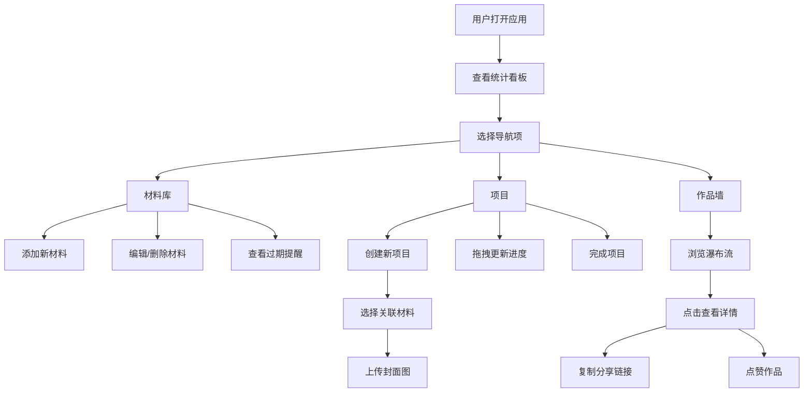

## 1. 产品概述

手工爱好者个人手工艺管理应用，帮助编织、模型制作、木工等爱好者追踪材料库存、记录制作进度并分享作品展示。

- 解决问题：手工材料（毛线、木材、颜料等）容易过期或重复购买、制作过程缺乏系统记录、无法在社区中展示成果
- 目标用户：手工艺爱好者、手工创作者
- 产品价值：打造个人手工创作全流程管理与展示平台

## 2. 核心功能

### 2.1 用户角色

| 角色 | 注册方式 | 核心权限 |
|------|----------|----------|
| 普通用户 | 本地使用（无需注册） | 管理材料库、创建项目、浏览作品墙、查看统计 |

### 2.2 功能模块

1. **材料库页面**：材料卡片网格、添加/编辑/删除材料、有效期提醒、数量进度条
2. **项目页面**：项目时间线、创建项目、进度拖拽更新、关联材料自动扣减
3. **作品墙页面**：瀑布流布局、作品详情模态框、分享链接复制、点赞功能
4. **统计页面**：总材料数、进行中项目、本月完成数数据看板

### 2.3 页面详情

| 页面名称 | 模块名称 | 功能描述 |
|----------|----------|----------|
| 材料库 | 材料卡片网格 | 卡片网格展示材料，左上角类型彩色圆点，底部数量进度条，点击编辑/删除 |
| 材料库 | 有效期提醒 | 7天内过期材料右上角脉动红色感叹号，点击标记已提醒 |
| 材料库 | 材料表单浮层 | 添加/编辑材料：名称、类型、数量、单位、购买日期、有效期 |
| 项目 | 时间线列表 | 圆形缩略图、项目名称、状态标签（灰色/蓝色/绿色）、横向进度条 |
| 项目 | 进度拖拽更新 | 拖拽进度条滑块，顶部数字气泡跟随显示进度值 |
| 项目 | 项目创建表单 | 项目名称、预估耗时、关联材料多选、封面图上传（拖拽+加载动画） |
| 作品墙 | 瀑布流布局 | Pinterest风格瀑布流，壁纸风格作品卡片 |
| 作品墙 | 作品详情模态框 | 底部滑入动画，大图展示、项目描述、材料清单 |
| 作品墙 | 分享与点赞 | 复制链接（已复制反馈）、爱心点赞动画+波纹扩散 |
| 统计 | 数据看板 | 三个数据卡片：总材料数、进行中项目、本月完成数 |

## 3. 核心流程

## 4. 用户界面设计

### 4.1 设计风格

- **主色调**：暖米白 (#F5F0E8)
- **辅助色**：淡紫 (#B8A9C9)、淡橙 (#E8C8A0)、淡绿 (#A8D0A8)
- **材料类型色**：纺织类淡紫、木材类淡橙、颜料类淡蓝
- **字体**：Google Fonts - Quicksand（圆润亲和无衬线）
- **按钮风格**：圆角矩形，按压回弹效果（scale 0.95 → 1）
- **布局风格**：顶部固定导航 + 左侧可折叠侧边栏 + 右侧主内容区
- **图标风格**：Font Awesome 图标库

### 4.2 页面设计概述

| 页面名称 | 模块名称 | UI 元素与动画 |
|----------|----------|--------------|
| 全局布局 | 顶部导航栏 | 半透明毛玻璃效果，应用名称，圆形用户头像 |
| 全局布局 | 侧边栏 | 可折叠，四项导航，悬停背景色动画 |
| 全局布局 | 页面切换 | 内容区淡入淡出 300ms |
| 全局布局 | 卡片加载 | 底部向上淡入，每张延迟 50ms |
| 材料库 | 卡片 | 类型彩色圆点、数量进度条（绿→红渐变）、过期感叹号脉动 |
| 项目 | 时间线 | 圆形缩略图、状态标签色、进度拖拽气泡跟随 |
| 项目 | 封面上传 | 半透明展开层、拖拽区、圆环旋转加载动画 |
| 作品墙 | 作品卡片 | 壁纸风格背景（模糊封面图）、按钮悬停透明→白渐变 |
| 作品墙 | 模态框 | 底部滑入过渡动画 |
| 作品墙 | 点赞 | 心形白→红填充 + 向外扩散波纹 |
| 统计 | 数据卡片 | 薄荷绿/淡紫/暖橙底色、图标动画（旋转/发光）、悬停上浮3px加深阴影 |

### 4.3 响应式设计

- **桌面端（>768px）**：完整左侧边栏 + 主内容区
- **平板端（≤768px）**：侧边栏收起为底部标签导航栏
- **手机端（≤480px）**：统计卡片转为 2 列网格布局

### 4.4 性能要求

- 材料列表（1000条）加载渲染 ≤ 100ms
- 首次内容绘制（FCP）≤ 1 秒
