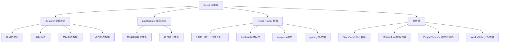
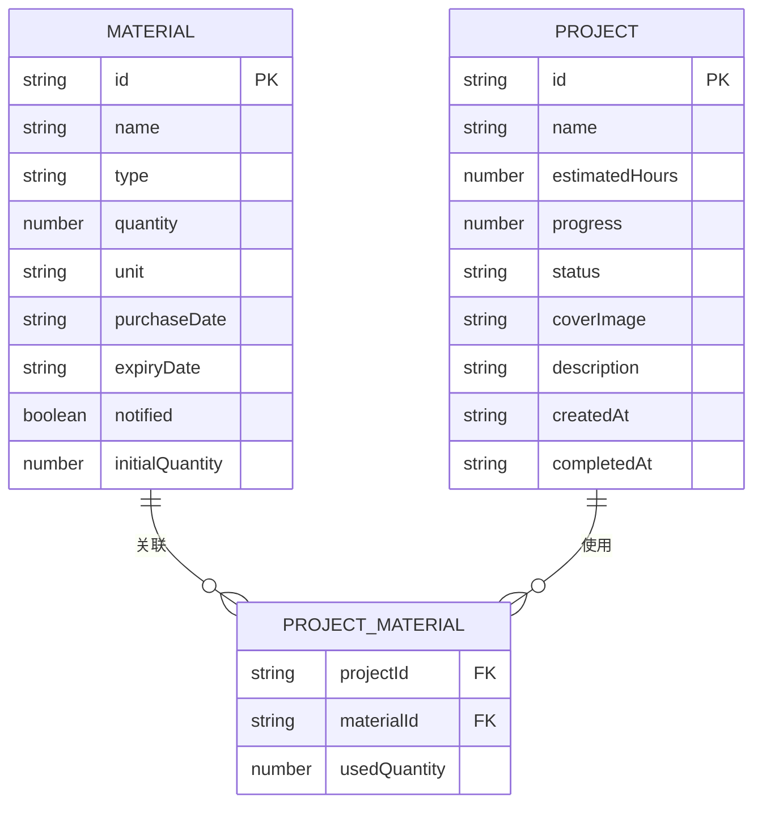

## 1. 架构设计



## 2. 技术描述

- **前端框架**：React 18 + TypeScript
- **构建工具**：Vite（支持路径别名 @ → src）
- **状态管理**：
  - Zustand：全局状态（侧边栏、导航标签、材料和项目数据）
  - useReducer：组件级复杂状态（表单编辑、进度更新）
- **路由**：React Router DOM
- **日期处理**：date-fns
- **唯一ID**：uuid
- **样式**：原生 CSS（CSS Variables 主题系统，不使用 Tailwind）
- **图标**：Font Awesome CDN
- **字体**：Google Fonts - Quicksand

## 3. 路由定义

| 路由 | 用途 |
|------|------|
| / | 首页：统计看板 + 快捷入口 |
| /materials | 材料库存管理页面 |
| /projects | 项目时间线管理页面 |
| /gallery | 作品展示墙页面 |

## 4. 数据模型

### 4.1 数据模型定义



### 4.2 TypeScript 类型定义

```typescript
type MaterialType = 'textile' | 'wood' | 'paint' | 'other';

interface Material {
  id: string;
  name: string;
  type: MaterialType;
  quantity: number;
  initialQuantity: number;
  unit: string;
  purchaseDate: string;
  expiryDate: string;
  notified: boolean;
}

type ProjectStatus = 'pending' | 'in-progress' | 'completed';

interface ProjectMaterial {
  materialId: string;
  usedQuantity: number;
}

interface Project {
  id: string;
  name: string;
  estimatedHours: number;
  progress: number;
  status: ProjectStatus;
  coverImage: string;
  description: string;
  materials: ProjectMaterial[];
  createdAt: string;
  completedAt: string | null;
}

type NavTab = 'home' | 'materials' | 'projects' | 'gallery';

interface AppState {
  sidebarCollapsed: boolean;
  activeTab: NavTab;
  materials: Material[];
  projects: Project[];
}
```

## 5. 项目文件结构

```
src/
├── App.tsx              # 根组件，路由配置，布局容器
├── main.tsx             # 应用入口
├── index.css            # 全局样式，CSS变量，动画
├── store.ts             # Zustand store 定义
├── types.ts             # TypeScript 类型定义
├── utils/
│   └── mockData.ts      # Mock数据生成（1000条材料）
└── components/
    ├── Layout.tsx       # 布局组件（导航栏+侧边栏+主内容）
    ├── StatsPanel.tsx   # 统计看板
    ├── MaterialList.tsx # 材料列表管理
    ├── ProjectTimeline.tsx # 项目时间线
    └── WorksGallery.tsx # 作品展示墙
```

## 6. 关键实现要点

### 6.1 性能优化
- 材料卡片使用 `React.memo` 包裹避免不必要重渲染
- 1000条材料数据可考虑虚拟滚动（如需要），初期使用 CSS `contain: layout paint`
- 进度条拖拽使用原生 Pointer Events + RAF 节流
- Mock数据使用工厂函数预生成，不阻塞首屏

### 6.2 动画实现
- 卡片入场：`@keyframes slideUp` + `animation-delay` 递增
- 进度气泡：CSS transform 跟随滑块位置计算
- 模态框：`@keyframes slideUpModal` 底部滑入
- 点赞波纹：伪元素 + `@keyframes ripple` 缩放扩散
- 过期感叹号：`@keyframes pulse` 透明度循环

### 6.3 响应式断点
```css
@media (max-width: 768px) { /* 平板：侧边栏转底栏 */ }
@media (max-width: 480px) { /* 手机：统计卡片2列 */ }
```
