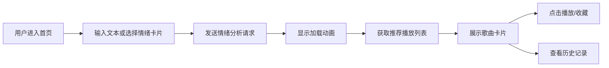

## 1. 产品概述

MoodTune - 基于用户情绪状态的个性化音乐推荐Web应用。通过情绪标签选择或文本输入分析用户心情，智能推荐符合当前情绪的音乐播放列表，帮助用户通过音乐调节情绪状态。

- 主要目的：根据用户实时情绪提供个性化音乐推荐，打造沉浸式音乐体验
- 目标用户：希望通过音乐调节心情的音乐爱好者
- 市场价值：连接情绪与音乐的智能桥梁，填补情绪音乐推荐的空白市场

## 2. 核心功能

### 2.1 功能模块

1. **情绪选择首页**：动态渐变背景、文本情绪输入、情绪卡片选择、加载动画
2. **播放列表页**：打字机动画标题、歌曲瀑布流展示、歌曲预览播放、收藏功能
3. **迷你播放器**：固定底部播放器、播放控制、进度条、音量控制
4. **情绪历史记录**：时间线展示、情绪筛选、历史回看、清空记录
5. **后端API服务**：情绪预测、音乐推荐接口、数据管理

### 2.2 页面详情

| 页面名称 | 模块名称 | 功能描述 |
|-----------|-------------|---------------------|
| 情绪选择首页 | 动态背景 | 根据时间变化的渐变色（清晨淡蓝到橙黄、夜晚深紫到墨蓝） |
| 情绪选择首页 | 文本输入框 | 支持用户输入文本描述情绪 |
| 情绪选择首页 | 情绪卡片 | 6个圆形情绪按钮（快乐、悲伤、放松、焦虑、兴奋、平静），带弹性缩放动画 |
| 情绪选择首页 | 加载动画 | 选择情绪后显示圆形加载动画，2秒后跳转 |
| 播放列表页 | 情绪标题 | 打字机动画展示当前情绪 |
| 播放列表页 | 歌曲卡片 | 瀑布流网格，圆形封面旋转动画、渐变色标题、收藏按钮 |
| 播放列表页 | 歌曲播放 | 点击卡片播放预览，边缘光晕动画同步音乐波动 |
| 迷你播放器 | 播放控制 | 播放/暂停、上一首、下一首按钮，带悬停和点击动画 |
| 迷你播放器 | 进度显示 | 圆角进度条，小圆点指示器 |
| 迷你播放器 | 音量控制 | 0-100音量滑块，颜色从绿到红渐变 |
| 情绪历史页 | 时间线 | 情绪记录列表，emoji+颜色圆点、歌曲数量、相对时间 |
| 情绪历史页 | 筛选功能 | 按情绪标签筛选记录 |
| 情绪历史页 | 清空历史 | 带确认弹窗的清空功能 |

## 3. 核心流程

用户打开应用 → 选择情绪方式（文本输入/卡片点击）→ 后端情绪分析 → 加载动画 → 生成播放列表 → 浏览/播放歌曲 → 收藏歌曲 → 查看历史记录

## 4. 用户界面设计

### 4.1 设计风格

- **主色调**：跟随情绪动态变化
  - 快乐：柠檬黄 → 珊瑚橙渐变
  - 悲伤：雾霾蓝 → 淡紫渐变
  - 放松：薄荷绿 → 天空蓝渐变
  - 焦虑：淡柠檬黄 → 浅灰渐变
  - 兴奋：亮红 → 亮橙渐变
- **整体风格**：毛玻璃设计，backdrop-filter: blur(10px)，半透明白色细边框
- **按钮风格**：圆角按钮，hover变亮，点击收缩，transition: all 0.3s cubic-bezier(.4,0,.2,1)
- **字体**：Poppins（Google Fonts）
- **图标**：Font Awesome
- **布局风格**：卡片式布局，瀑布流网格
- **动画**：fade-in-up页面切换，弹性缩放，打字机效果

### 4.2 页面设计概述

| 页面名称 | 模块名称 | UI元素 |
|-----------|-------------|-------------|
| 首页 | 动态背景 | 时间感知渐变色、颗粒感纹理 |
| 首页 | 情绪卡片 | 圆形按钮、emoji图标、大写标签、弹性动画 |
| 首页 | 加载动画 | 透明到实心圆形动画 |
| 播放列表页 | 标题区 | 打字机动画、大字号情绪标题 |
| 播放列表页 | 歌曲卡片 | 圆形封面旋转、渐变色文字省略、收藏心形按钮 |
| 播放器 | 控制区 | 旋转封面、进度条圆点、音量渐变滑块 |
| 历史页 | 时间线 | 垂直时间线、颜色圆点、emoji、相对时间 |
| 历史页 | 弹窗 | 模糊背景、滑动出现动画 |

### 4.3 响应式设计

- **桌面端（>768px）**：瀑布流歌曲卡片网格、侧边栏导航、底部固定播放器
- **移动端（<768px）**：单列歌曲列表、底部导航栏、全宽播放器条
