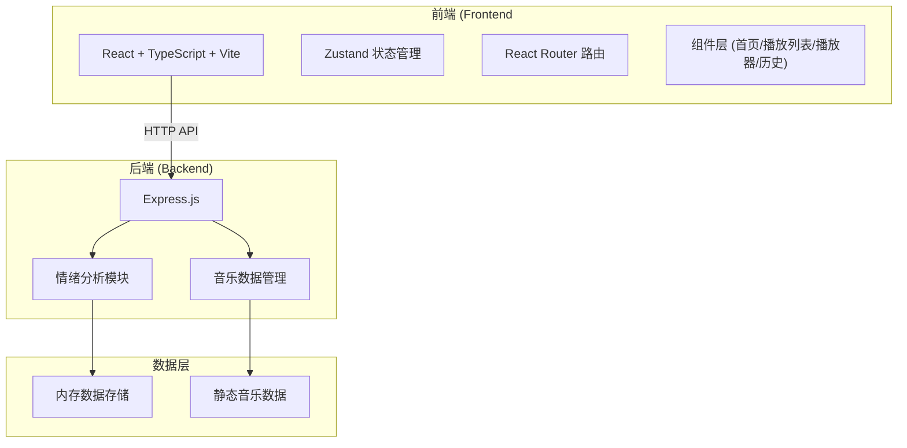
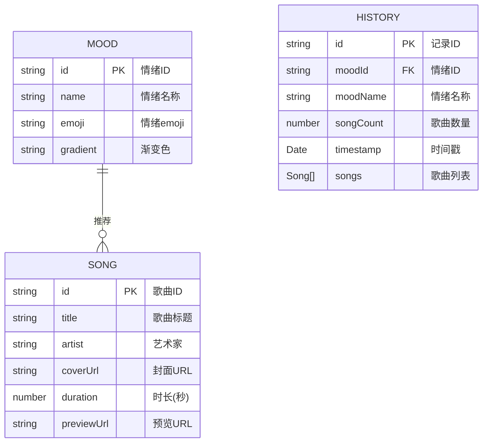

## 1. 架构设计



## 2. 技术描述

- **前端**: React@18 + TypeScript + Vite
- **状态管理**: Zustand
- **路由**: React Router DOM
- **样式**: 原生CSS（毛玻璃效果、动画）
- **后端**: Express@4 + TypeScript
- **HTTP客户端**: Fetch API
- **图标**: Font Awesome + Lucide React
- **字体**: Google Fonts (Poppins)
- **音频**: HTML5 Audio API
- **数据存储**: 内存对象（静态数据）

## 3. 项目结构

```
.
├── package.json              # 根目录配置
├── index.html              # 入口HTML
├── vite.config.js           # Vite配置
├── tsconfig.json          # TypeScript配置
├── frontend/
│   └── src/
│       ├── components/
│       │   ├── App.tsx              # 主应用组件
│       │   ├── WelcomePage.tsx       # 情绪选择首页
│       │   ├── PlaylistPage.tsx     # 播放列表页
│       │   ├── Player.tsx           # 迷你播放器
│       │   ├── HistoryPage.tsx      # 历史记录页
│       │   ├── MoodCard.tsx        # 情绪卡片组件
│       │   ├── SongCard.tsx         # 歌曲卡片组件
│       │   └── Sidebar.tsx         # 侧边栏导航
│       ├── store/
│       │   └── moodStore.ts       # Zustand状态管理
│       ├── types/
│       │   └── index.ts          # 类型定义
│       └── utils/
│           └── api.ts             # API请求工具
└── backend/
    └── src/
        ├── server.ts              # Express服务器
        └── data/
            └── moodSongs.ts         # 音乐数据
```

## 3. 路由定义

| 路由 | 目的 |
|-------|---------|
| `/` | 情绪选择首页 |
| `/playlist` | 播放列表页 |
| `/history` | 情绪历史记录页 |

## 4. API 定义

### 4.1 获取情绪列表
- **GET** `/api/moods`
- **响应**:
```typescript
interface Mood {
  id: string;
  name: string;
  label: string;
  emoji: string;
  gradient: string;
}
```

### 4.2 情绪预测分析
- **POST** `/api/predict-mood`
- **请求体**:
```typescript
interface PredictMoodRequest {
  text?: string;
  mood?: string;
}
```
- **响应**:
```typescript
interface PredictMoodResponse {
  emotion: string;
  confidence: number;
}
```

### 4.3 获取推荐播放列表
- **POST** `/api/recommend`
- **请求体**:
```typescript
interface RecommendRequest {
  mood: string;
}
```
- **响应**:
```typescript
interface Song {
  id: string;
  title: string;
  artist: string;
  coverUrl: string;
  duration: number;
  previewUrl: string;
}
type RecommendResponse = Song[];
```

## 5. 数据模型

### 5.1 情绪数据模型


