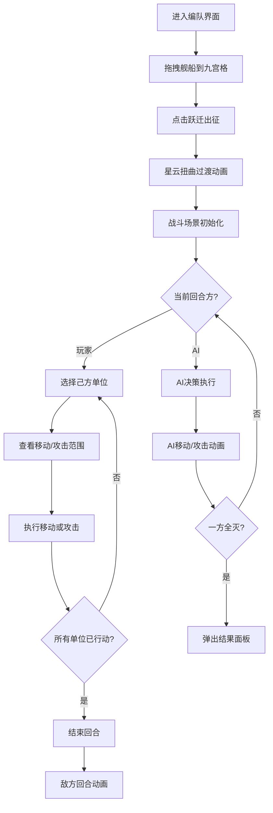

## 1. 产品概述

战术回合制太空舰队对战游戏——在六边形网格星图上，玩家指挥由不同舰种组成的星际舰队与AI对手进行回合制策略对战。每艘战舰拥有独立的护盾、装甲、武器系统和特殊技能，解决传统回合制战棋游戏中单位同质化严重、缺乏深度战术搭配的问题。

- 目标用户：策略游戏爱好者、科幻题材粉丝、回合制战棋玩家
- 核心价值：通过舰种差异化设计（护卫舰/巡洋舰/战列舰）和地形系统（星云/小行星带/空间站），提供有深度的战术决策体验

## 2. 核心功能

### 2.1 功能模块

1. **舰队编队界面**：左侧舰船列表、右侧九宫格编队面板、跃迁出征按钮
2. **战斗场景**：六边形网格星图、地形系统、单位操控、回合制战斗
3. **战斗HUD**：回合信息、舰队总览、选中单位面板、回合切换动画

### 2.2 页面详情

| 页面名称 | 模块名称 | 功能描述 |
|----------|----------|----------|
| 舰队编队界面 | 舰船列表 | 左侧列出所有可用舰船类型（护卫舰火力低速度快、巡洋舰均衡、战列舰火力高速度慢），每艘舰船显示为带动态引擎粒子尾焰的等距3D小图标，粒子颜色蓝色(己方)/红色(敌方) |
| 舰队编队界面 | 九宫格编队面板 | 右侧3x3编队面板，拖拽舰船卡片到面板中排列阵型，拖拽时有光晕追踪效果，松开时卡片从缩放0.5弹回1.0并带点击声波纹扩散动画 |
| 舰队编队界面 | 跃迁出征按钮 | 编队完成后点击"跃迁出征"按钮，触发星云扭曲折叠动画过渡到战斗场景 |
| 战斗场景 | 六边形网格星图 | 暗色太空背景上的六边形网格，网格上随机分布星云(减速区域，紫色半透明漩涡动画)、小行星带(经过造成10点伤害，红色闪光裂痕)、空间站(占领后每回合回复15点护盾，蓝色全息光环) |
| 战斗场景 | 单位操控 | 选中己方单位时底座亮起白色光环，可移动范围浅蓝色高亮，可攻击范围红色半透明圆环，攻击时射出阵营色脉冲光束，击中时有爆炸粒子特效和屏幕震动 |
| 战斗场景 | 回合切换 | 顶部中央出现巨大"敌方回合"文字，伴随镜头拉远动画 |
| 战斗场景 | 胜利面板 | 背景缓慢旋转星云，中央战机残骸消散粒子特效 |
| 战斗HUD | 回合信息 | 显示当前回合数、当前行动方 |
| 战斗HUD | 舰队总览 | 双方舰队存活状态概览 |
| 战斗HUD | 选中单位面板 | 选中单位时显示详细属性（护盾/装甲/武器/技能） |

## 3. 核心流程

1. 玩家进入舰队编队界面，从左侧舰船列表中选择舰船拖拽到右侧九宫格面板
2. 编队完成后点击"跃迁出征"按钮，星云扭曲动画过渡
3. 进入战斗场景，六边形网格星图显示双方舰队和地形
4. 玩家回合：选择己方单位→查看移动/攻击范围→移动或攻击→执行动画
5. 所有己方单位行动完毕或玩家结束回合→切换至敌方回合
6. AI回合：AI自动执行移动和攻击决策，带镜头拉远动画
7. 回合切换回玩家→重复步骤4-6
8. 一方舰队全灭→弹出胜利/失败面板

## 4. 用户界面设计

### 4.1 设计风格

- 主色调：暗色太空黑（#0a0e17）配荧光蓝（#00d4ff）和橙红色（#ff4d2a）点缀
- 按钮风格：无边框发光按钮，悬停时呼吸光效和轻微放大动画
- 字体：Orbitron（Google Fonts），无衬线字体加发光描边
- 布局风格：全屏沉浸式，编队界面左右分栏，战斗场景居中网格+浮动HUD
- 图标风格：等距3D舰船图标，带动态粒子尾焰

### 4.2 页面设计概览

| 页面名称 | 模块名称 | UI元素 |
|----------|----------|--------|
| 舰队编队界面 | 舰船列表 | 左侧面板，暗色半透明背景，舰船卡片纵向排列，每张卡片含等距3D图标+引擎粒子尾焰(蓝/红)，卡片悬停时微放大 |
| 舰队编队界面 | 九宫格编队面板 | 右侧3x3网格，暗色边框格位，拖拽时光晕追踪效果，放置时0.5→1.0弹性缩放+波纹扩散 |
| 舰队编队界面 | 跃迁出征按钮 | 底部居中，荧光蓝发光按钮，悬停呼吸光效+放大 |
| 战斗场景 | 六边形网格 | 居中全屏，暗色网格线，星云格紫色半透明漩涡动画，小行星格红色闪光裂痕，空间站格蓝色旋转全息光环 |
| 战斗场景 | 单位交互 | 选中白色光环底座，移动范围浅蓝高亮，攻击范围红色半透明圆环，攻击脉冲光束+爆炸粒子+屏幕震动 |
| 战斗场景 | 回合切换 | 顶部中央巨大"敌方回合"文字淡入淡出，镜头拉远动画 |
| 战斗场景 | 胜利面板 | 全屏遮罩，缓慢旋转星云背景，中央残骸粒子特效 |
| 战斗HUD | 回合信息栏 | 顶部居中，回合数+行动方标识，荧光蓝/橙红配色 |
| 战斗HUD | 舰队总览 | 左右两侧浮动面板，显示双方存活舰船缩略图 |
| 战斗HUD | 选中单位面板 | 底部居中弹出，显示护盾/装甲/武器/技能属性条 |

### 4.3 响应式设计

- 桌面端优先，最低支持1280x720分辨率
- 战斗场景自动适配窗口大小，六边形网格缩放适配
- HUD元素固定定位，不随网格缩放

### 4.4 性能目标

- 战斗场景粒子特效和网格动画保持60fps
- 每秒计算一次舰队状态
- Pixi.js渲染层与React UI层分离，避免不必要的重渲染
