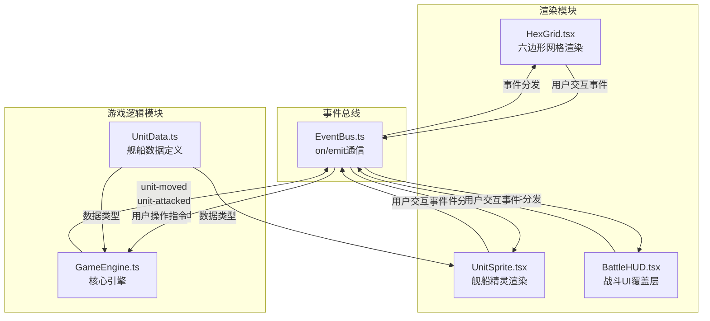

## 1. 架构设计



## 2. 技术说明

- 前端框架：React 18 + TypeScript
- 游戏渲染：Pixi.js 7 + @pixi/react
- 构建工具：Vite
- 状态管理：事件总线（EventBus）连接渲染层与逻辑层，逻辑层使用GameEngine管理状态
- 初始化工具：vite-init (react-ts模板)
- 无后端：纯前端游戏，AI逻辑在客户端计算

## 3. 文件结构

| 文件路径 | 用途 |
|----------|------|
| package.json | 项目依赖和启动脚本 |
| index.html | 入口页面，全屏canvas容器，引入Orbitron字体 |
| vite.config.js | Vite构建配置，启用esModuleInterop |
| tsconfig.json | TypeScript严格模式配置 |
| src/main.tsx | React应用入口 |
| src/App.tsx | 应用根组件，管理编队/战斗场景切换 |
| src/game/GameEngine.ts | 游戏核心引擎，管理回合状态、舰队数据、六边形网格逻辑 |
| src/game/UnitData.ts | 舰船数据接口定义，六边形坐标转换工具 |
| src/rendering/HexGrid.tsx | 六边形网格渲染组件 |
| src/rendering/UnitSprite.tsx | 舰船精灵渲染组件 |
| src/rendering/BattleHUD.tsx | 战斗HUD覆盖层组件 |
| src/rendering/EventBus.ts | 事件总线，连接渲染和逻辑模块 |
| src/rendering/FleetBuilder.tsx | 舰队编队界面组件 |
| src/rendering/Particles.tsx | 粒子特效工具（引擎尾焰、爆炸、波纹等） |

## 4. 核心数据模型

### 4.1 舰船数据接口

```typescript
interface UnitData {
  id: string;
  type: 'frigate' | 'cruiser' | 'battleship';
  faction: 'player' | 'enemy';
  shield: number;
  maxShield: number;
  armor: number;
  maxArmor: number;
  weapons: Weapon[];
  skills: Skill[];
  speed: number;
  gridPos: { q: number; r: number };
  hasActed: boolean;
}

interface Weapon {
  name: string;
  damage: number;
  range: number;
  type: 'kinetic' | 'laser' | 'missile';
}

interface Skill {
  name: string;
  description: string;
  cooldown: number;
  currentCooldown: number;
}
```

### 4.2 六边形坐标系统

采用轴向坐标系（axial coordinates），q和r两个轴：
- 像素坐标转换：x = size * (√3 * q + √3/2 * r), y = size * (3/2 * r)
- 距离计算：max(|q1-q2|, |r1-r2|, |(q1+q1)-(q2+r2)|)

### 4.3 地形类型

```typescript
type TerrainType = 'empty' | 'nebula' | 'asteroid' | 'station';

interface HexCell {
  q: number;
  r: number;
  terrain: TerrainType;
  occupant: string | null;
}
```

## 5. 事件通信协议

| 事件名称 | 数据载荷 | 触发场景 |
|----------|----------|----------|
| unit-moved | { unitId, from, to } | 单位移动完成 |
| unit-attacked | { attackerId, targetId, damage, weaponType } | 单位攻击执行 |
| unit-selected | { unitId } | 玩家选中单位 |
| turn-changed | { turn, faction } | 回合切换 |
| unit-destroyed | { unitId } | 单位被摧毁 |
| game-over | { winner } | 游戏结束 |
| terrain-interacted | { unitId, terrain, effect } | 单位与地形交互 |
| move-range-calculated | { unitId, cells: HexCell[] } | 移动范围计算完成 |
| attack-range-calculated | { unitId, cells: HexCell[] } | 攻击范围计算完成 |
