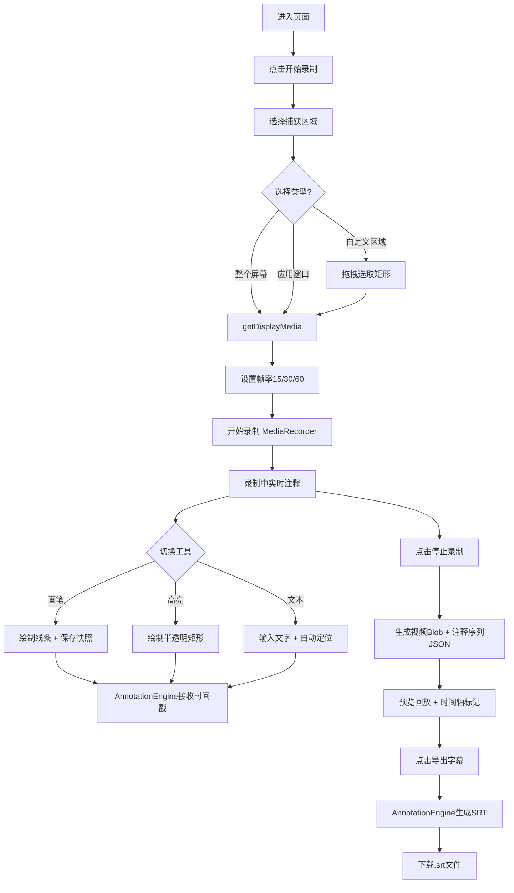

## 1. 产品概述
轻量级网页录屏与实时注释工具，专为在线教育讲师设计，支持选择屏幕区域录制、实时画笔/高亮/文本注释，并自动生成带时间戳的SRT字幕文件，大幅降低后期剪辑工作量。

- **目标用户**：在线教育讲师、课程录制者、教程创作者
- **核心价值**：零安装、即开即用的录屏+注释一体化解决方案，录制时即可完成注释标记，自动导出SRT字幕

## 2. 核心功能

### 2.1 用户角色
| 角色 | 注册方式 | 核心权限 |
|------|----------|----------|
| 普通用户 | 无需注册，浏览器直接使用 | 屏幕录制、实时注释、字幕导出、视频预览 |

### 2.2 功能模块
1. **录制控制模块**：屏幕/窗口/区域选择、帧率设置(15/30/60fps)、开始/停止录制
2. **画布注释模块**：画笔工具(3/6/10px+色板)、高亮工具(半透明矩形+透明度调节)、文本工具(自动定位)
3. **预览与时间轴模块**：视频回放、注释同步显示、时间轴标记点跳转、预览窗口缩放拖拽
4. **字幕导出模块**：SRT格式转换、毫秒级时间戳、注释内容格式化、文件下载

### 2.3 页面详情
| 页面名称 | 模块名称 | 功能描述 |
|----------|----------|----------|
| 主录制界面 | 录制控制栏 | 底部毛玻璃固定栏，包含开始/停止/帧率选择按钮，悬停上浮按压下沉动画 |
| 主录制界面 | 屏幕选择弹窗 | 选择整个屏幕/应用窗口/自定义矩形区域，蓝色虚线框+缩放手柄 |
| 主录制界面 | 画布注释层 | 覆盖录制区域，接收鼠标/触摸事件绘制画笔/高亮/文本，延迟<50ms |
| 主录制界面 | 实时预览窗口 | 右侧显示叠加注释后的效果，支持50%-200%缩放与拖拽，位置保存至localStorage |
| 主录制界面 | 工具面板 | 画笔/高亮/文本切换，色板从底部滑入(0.3s ease-out)，毛玻璃背景 |
| 预览回放界面 | 视频播放器 | 播放带注释的录制视频 |
| 预览回放界面 | 时间轴 | 渐变进度条显示时长，注释标记点(亮色小圆点+点击波纹扩散) |
| 预览回放界面 | 字幕导出按钮 | 转换注释序列为标准SRT格式并下载 |

## 3. 核心流程
用户进入页面 → 点击"开始录制" → 选择捕获区域(全屏/窗口/自定义矩形) → 设置帧率 → 确认开始录制 → 录制过程中切换工具进行注释(画笔/高亮/文本) → 点击"停止录制" → 预览视频并在时间轴查看注释标记 → 点击"导出字幕"下载SRT文件

## 4. 用户界面设计

### 4.1 设计风格
- **主色调**：深紫蓝背景 #1a1a2e，次要区域 #16213e
- **强调色**：电光蓝 #0f3460、亮橙色 #e94560
- **字体**：Inter（Google Fonts引入），系统无衬线字体fallback
- **按钮风格**：圆角矩形，悬停上浮(translateY(-1px))，按压下沉(translateY(1px))，0.2s ease-in-out过渡
- **毛玻璃效果**：`backdrop-filter: blur(12px)` + 半透明背景 `rgba(26, 26, 46, 0.75)`
- **所有交互元素**：`transition: all 0.2s ease-in-out`

### 4.2 页面设计概述
| 页面名称 | 模块名称 | UI元素 |
|----------|----------|----------|
| 主录制界面 | 背景 | #1a1a2e纯色，细微径向渐变营造深度 |
| 主录制界面 | 录制控制栏 | 底部固定，毛玻璃效果，圆角按钮，录制中脉冲红点动画 |
| 主录制界面 | 工具面板 | 左上角/侧边，图标按钮组，色板滑出动画(0.3s ease-out) |
| 主录制界面 | 预览窗口 | 右侧可拖拽面板，缩放滑块50%-200%，边框微光效果 |
| 主录制界面 | 选中区域框 | 蓝色虚线边框 #0f3460，四角缩放手柄，dashed动画 |
| 预览回放界面 | 时间轴 | 渐变进度条(#0f3460 → #e94560)，注释标记圆点，点击波纹扩散 |
| 预览回放界面 | 色板展开 | 毛玻璃背景，从底部滑入，颜色圆圈悬停放大 |

### 4.3 响应式设计
- 桌面优先设计，最小分辨率 1024x768
- 宽屏保持合理留白（左右各约5%边距）
- 预览窗口可拖拽调整大小，位置自动保存至 localStorage
- 触摸设备支持手势绘制注释

### 4.4 性能与动画
- 录制预览帧率 ≥ 25fps
- 注释渲染延迟 ≤ 100ms
- SRT时间戳精度：毫秒级（±5ms误差）
- 色板滑出：0.3s ease-out 从底部向上
- 按钮悬停：translateY(-1px) + 阴影增强
- 时间轴标记点点击：scale + opacity 波纹扩散
