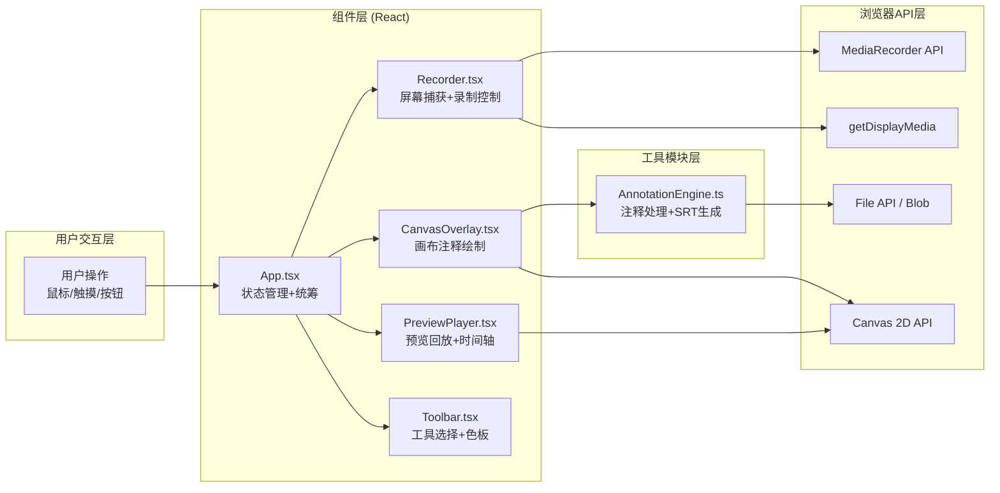

## 1. 架构设计



## 2. 技术说明
- **前端框架**：React@18 + TypeScript@5
- **构建工具**：Vite@5
- **状态管理**：React useState/useRef + Context（轻量场景，无需zustand）
- **样式方案**：原生CSS（CSS Modules风格，内联样式+CSS变量）
- **核心API**：MediaRecorder、getDisplayMedia、Canvas 2D、Blob、FileSaver
- **第三方依赖**：uuid（注释ID生成）、file-saver（文件下载）
- **无后端**：纯前端应用，所有数据本地处理

## 3. 目录结构与文件职责
```
d:\P\tasks\auto85\
├── package.json               # 项目依赖与脚本 (react, react-dom, typescript, vite, uuid, file-saver)
├── index.html                 # 入口HTML，引入Google Fonts Inter字体
├── vite.config.js             # Vite配置，React插件+严格模式
├── tsconfig.json              # TypeScript严格模式配置
└── src/
    ├── main.tsx               # React入口，渲染App组件
    ├── App.tsx                # 主应用组件：状态管理、录制/预览模式切换、导出控制
    ├── App.css                # 全局样式：CSS变量、深色主题、布局
    ├── components/
    │   ├── Recorder.tsx       # 录制控制：getDisplayMedia捕获、MediaRecorder录制、区域选择UI
    │   ├── CanvasOverlay.tsx  # 画布注释层：画笔/高亮/文本绘制、每帧快照保存
    │   ├── PreviewPlayer.tsx  # 预览播放器：视频回放、注释同步、时间轴标记
    │   ├── Toolbar.tsx        # 工具栏：工具切换、色板展开、参数调节
    │   └── RegionSelector.tsx # 区域选择器：矩形拖拽、缩放手柄、蓝色虚线框
    ├── utils/
    │   └── AnnotationEngine.ts # 注释引擎：SRT生成、时间戳格式化、文件导出
    ├── types/
    │   └── index.ts           # 类型定义：Annotation, Tool, RecordingState等
    └── hooks/
        └── useLocalStorage.ts  # 自定义Hook：localStorage持久化
```

### 文件间调用关系与数据流向：
```
用户操作
  ↓
[Toolbar.tsx] → 工具选择事件 → [App.tsx] → 当前工具状态 → [CanvasOverlay.tsx]
[Recorder.tsx] → 开始/停止事件 → [App.tsx] → 录制状态 → 全部子组件
[CanvasOverlay.tsx] → 注释快照(带时间戳) → [App.tsx] → 注释序列数组 → [AnnotationEngine.ts]
[PreviewPlayer.tsx] → 跳转/播放事件 → [App.tsx] → 当前播放时间 → [CanvasOverlay.tsx]
[AnnotationEngine.ts] → SRT内容 → [App.tsx] → 触发下载
```

## 4. 数据模型定义

### 4.1 核心类型
```typescript
// 工具类型
type ToolType = 'brush' | 'highlight' | 'text' | 'none';

// 画笔/高亮点
interface Point {
  x: number;
  y: number;
}

// 基础注释
interface BaseAnnotation {
  id: string;           // uuid
  type: ToolType;
  timestamp: number;    // 开始时间(ms)
  endTime: number;      // 结束时间(ms)
  color: string;
}

// 画笔注释
interface BrushAnnotation extends BaseAnnotation {
  type: 'brush';
  size: 3 | 6 | 10;
  points: Point[];
}

// 高亮注释
interface HighlightAnnotation extends BaseAnnotation {
  type: 'highlight';
  rect: { x: number; y: number; width: number; height: number };
  opacity: number; // 0.1 - 0.8
}

// 文本注释
interface TextAnnotation extends BaseAnnotation {
  type: 'text';
  content: string;
  position: Point;
  fontSize: number;
}

type Annotation = BrushAnnotation | HighlightAnnotation | TextAnnotation;

// 录制状态
interface RecordingState {
  isRecording: boolean;
  isPaused: boolean;
  startTime: number;
  duration: number; // ms
  fps: 15 | 30 | 60;
  region: { x: number; y: number; width: number; height: number } | null;
}

// 工具设置
interface ToolSettings {
  currentTool: ToolType;
  brushSize: 3 | 6 | 10;
  color: string;
  highlightOpacity: number;
}
```

### 4.2 预设色板
```typescript
const COLOR_PALETTE = [
  '#e94560', // 亮橙红
  '#f39c12', // 橙黄
  '#f1c40f', // 黄
  '#2ecc71', // 绿
  '#3498db', // 蓝
  '#9b59b6', // 紫
  '#e74c3c', // 红
  '#ffffff', // 白
];
```

## 5. 关键模块实现要点

### 5.1 Recorder.tsx - 屏幕录制
- 使用 `navigator.mediaDevices.getDisplayMedia({ video: true, audio: false })` 获取屏幕流
- `MediaRecorder` 录制，mimeType 优先 `'video/webm;codecs=vp9'`
- 自定义区域通过 Canvas `drawImage(video, sx, sy, sw, sh, ...)` 裁剪实现
- 帧率通过 MediaRecorder `videoBitsPerSecond` 和 track constraints 控制
- 数据流：获取流 → 可选裁剪 → MediaRecorder → ondataavailable → Blob[] → 最终 videoBlob

### 5.2 CanvasOverlay.tsx - 实时注释
- 两个 Canvas 层：底层显示视频画面，顶层绘制注释（透明背景）
- 使用 `requestAnimationFrame` 驱动渲染，保证帧率
- 每帧绘制时：先清空注释层，再根据当前时间筛选可见注释并重绘
- 路径绘制：监听 pointerdown/pointermove/pointerup，累积 points 数组
- 性能优化：离屏 Canvas 缓存已完成的注释，减少每帧重绘量

### 5.3 AnnotationEngine.ts - SRT生成
- SRT 时间格式：`HH:MM:SS,mmm`（毫秒用逗号分隔）
- 每个注释生成一个 SRT 条目，内容格式：
  - 画笔：`画笔 {颜色} {大小}px 起始坐标({x1},{y1}) 结束坐标({x2},{y2})`
  - 高亮：`高亮 {颜色} 区域({x},{y},{w}x{h}) 透明度{opacity}`
  - 文本：`文本 {内容} 位置({x},{y})`
- 使用 file-saver 的 `saveAs(blob, filename)` 触发下载

### 5.4 预览窗口与时间轴
- 视频元素 + Canvas 叠加层同步播放
- `timeupdate` 事件驱动当前时间，筛选该时间点可见的注释并重绘
- 时间轴进度条使用线性渐变 `linear-gradient(90deg, #0f3460, #e94560)`
- 注释标记点：根据 `annotation.timestamp / totalDuration` 计算 left 百分比
- 点击标记点：设置 `video.currentTime = annotation.timestamp / 1000`，同时触发 CSS 波纹动画

## 6. 性能约束保障措施
| 约束 | 实现方案 |
|------|----------|
| 预览帧率 ≥ 25fps | requestAnimationFrame 渲染，Canvas分层绘制，离屏缓存静态注释 |
| 注释延迟 ≤ 100ms | pointer 事件直接操作 Canvas 绘制（不经过 React 状态），防抖节流优化 |
| SRT 精度 ±5ms | 使用 `performance.now()` 记录时间戳，相对录制 startTime 计算偏移 |
| 内存控制 | 注释 points 数组抽样压缩，MediaRecorder timeslice 分片存储 |
