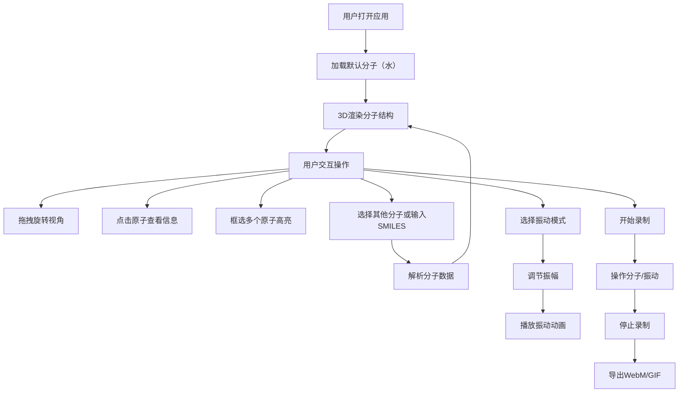

## 1. 产品概述

分子结构3D可视化教学应用，解决化学教学中3D分子结构展示依赖专业软件、学生难以直观理解空间构型和分子振动模式的问题。

- 核心目标：为化学教育提供直观、互动的分子结构展示工具，帮助学生理解分子空间构型和振动模式
- 目标用户：化学教师、学生、化学爱好者
- 市场价值：降低化学3D结构学习门槛，提供无需安装专业软件即可使用的Web端可视化工具

## 2. 核心功能

### 2.1 用户角色
| 角色 | 注册方式 | 核心权限 |
|------|----------|----------|
| 普通用户 | 无需注册，直接访问 | 浏览分子结构、交互操作、振动模拟、录制导出 |

### 2.2 功能模块
1. **主显示区域**：3D分子渲染、实时交互、振动动画
2. **控制面板**：分子选择、SMILES输入、振动模式控制、录制导出
3. **原子信息卡片**：点击原子显示详细信息
4. **动画录制系统**：录制并导出WebM/GIF格式动画

### 2.3 页面详情
| 页面名称 | 模块名称 | 功能描述 |
|----------|----------|----------|
| 主页面 | 3D分子渲染区 | 展示分子3D结构，支持拖拽旋转、缩放、点击选中等交互 |
| 主页面 | 分子加载模块 | 从预置列表选择分子（水、二氧化碳、苯环、DNA双螺旋片段）或通过SMILES字符串加载自定义分子 |
| 主页面 | 振动模拟模块 | 选择振动模式（对称伸缩、弯曲振动等），调节振幅，播放振动动画 |
| 主页面 | 录制导出模块 | 录制动画序列，导出为WebM或GIF格式 |
| 主页面 | 控制面板 | 整合所有控制选项，支持折叠收起 |

## 3. 核心流程

## 4. 用户界面设计

### 4.1 设计风格
- **主题色**：深色主题，背景从#0a0e27渐变为#1a1a3e
- **强调色**：霓虹蓝渐变（#00d4ff到#7b2ff7）
- **原子颜色**：遵循CPK标准配色方案
- **按钮风格**：霓虹蓝渐变按钮，带柔和阴影，悬停上浮效果，点击缩放回弹动画（scale 0.95→1.0）
- **字体**：等宽字体JetBrains Mono用于原子标签和提示框
- **卡片风格**：半透明白色卡片（背景rgba(255,255,255,0.08)），毛玻璃效果
- **动画过渡**：所有交互0.3s ease平滑过渡

### 4.2 页面设计概述
| 页面名称 | 模块名称 | UI元素 |
|----------|----------|----------|
| 主页面 | 3D渲染区 | 占70%宽度，黑色渐变背景，分子居中显示，缓慢自旋，支持鼠标/触摸交互 |
| 主页面 | 控制面板 | 占30%宽度，半透明卡片，包含分子选择下拉、SMILES输入框、振动模式选择、振幅滑块、录制按钮 |
| 主页面 | 原子信息卡片 | 毛玻璃效果，显示元素符号、三维坐标、键连原子列表 |
| 主页面 | 录制指示器 | 顶部红色圆点闪烁动画 |
| 主页面 | 折叠按钮 | 控制面板收起/展开按钮 |

### 4.3 响应式设计
- **桌面端（>768px）**：左侧70%主显示区，右侧30%控制面板
- **移动端（≤768px）**：控制面板自动折叠到底部，可滑动展开
- **触摸优化**：支持双指缩放、拖拽旋转

### 4.4 3D场景设计
- **环境**：深色渐变背景，从深蓝到紫色，营造科技感
- **光照**：环境光 + 方向光 + 点光源，确保分子立体感
- **相机**：透视相机，初始距离适中，可通过缩放调整
- **交互**：OrbitControls支持拖拽旋转、滚轮缩放、平移
- **后处理**：轻微抗锯齿，半透明材质效果
- **性能**：保持60FPS，原子数≤100时无卡顿
- **动画**：分子加载时从光点放大旋转进入，振动模式下原子周期性形变，背景色随能量变化
