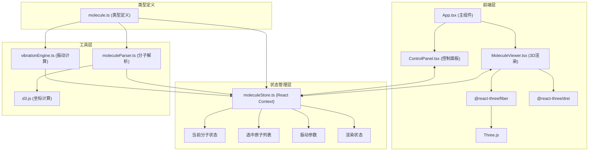
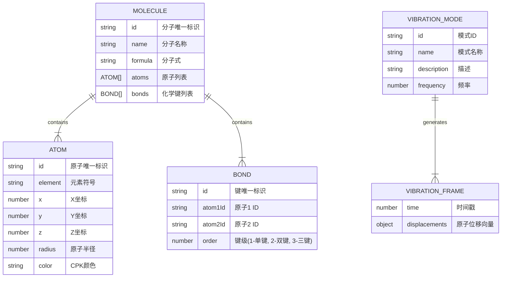

## 1. 架构设计



## 2. 技术描述

- **前端框架**: React 18 + TypeScript
- **构建工具**: Vite 5
- **3D渲染**: Three.js + @react-three/fiber + @react-three/drei
- **数据计算**: d3.js
- **状态管理**: React Context
- **样式**: Sass + CSS Modules
- **图标**: lucide-react
- **录制导出**: MediaRecorder API

## 3. 路由定义

| 路由 | 用途 |
|------|------|
| / | 主页面，包含3D分子展示和控制面板 |

## 4. 数据模型

### 4.1 数据模型定义



### 4.2 核心类型定义

```typescript
// Atom - 原子接口
interface Atom {
  id: string;
  element: string;
  x: number;
  y: number;
  z: number;
  radius: number;
  color: string;
}

// Bond - 化学键接口
interface Bond {
  id: string;
  atom1Id: string;
  atom2Id: string;
  order: number;
}

// Molecule - 分子接口
interface Molecule {
  id: string;
  name: string;
  formula: string;
  atoms: Atom[];
  bonds: Bond[];
}

// VibrationMode - 振动模式接口
interface VibrationMode {
  id: string;
  name: string;
  description: string;
  frequency: number;
}

// VibrationFrame - 振动帧接口
interface VibrationFrame {
  time: number;
  displacements: Record<string, { x: number; y: number; z: number }>;
}

// MoleculeStoreState - 全局状态接口
interface MoleculeStoreState {
  currentMolecule: Molecule | null;
  selectedAtoms: string[];
  vibrationMode: VibrationMode | null;
  vibrationAmplitude: number;
  isVibrating: boolean;
  isRecording: boolean;
  isPanelCollapsed: boolean;
  atomInfoCard: { atomId: string; position: { x: number; y: number } } | null;
}
```

## 5. 预置分子数据

应用内置以下分子的3D坐标数据：

| 分子名称 | SMILES | 分子式 | 原子数 |
|----------|--------|--------|--------|
| 水 | O | H2O | 3 |
| 二氧化碳 | O=C=O | CO2 | 3 |
| 苯 | c1ccccc1 | C6H6 | 12 |
| DNA双螺旋片段 | - | - | ~60 |

## 6. CPK原子颜色标准

| 元素 | 颜色 | 半径 |
|------|------|------|
| H | #FFFFFF | 0.32 |
| C | #909090 | 0.75 |
| N | #3050F8 | 0.71 |
| O | #FF0D0D | 0.68 |
| F | #90E050 | 0.57 |
| P | #FF8000 | 1.06 |
| S | #FFFF30 | 1.02 |
| Cl | #1FF01F | 0.99 |

## 7. 项目文件结构

```
d:\P\tasks\auto86/
├── package.json
├── index.html
├── vite.config.js
├── tsconfig.json
├── src/
│   ├── types/
│   │   └── molecule.ts          # 类型定义
│   ├── utils/
│   │   ├── moleculeParser.ts    # 分子解析模块
│   │   └── vibrationEngine.ts   # 振动计算模块
│   ├── store/
│   │   └── moleculeStore.ts     # 状态管理
│   ├── components/
│   │   ├── MoleculeViewer.tsx   # 3D渲染组件
│   │   └── ControlPanel.tsx     # 控制面板组件
│   ├── data/
│   │   └── presetMolecules.ts   # 预置分子数据
│   ├── styles/
│   │   ├── globals.scss         # 全局样式
│   │   └── variables.scss       # 样式变量
│   ├── App.tsx                  # 主组件
│   └── main.tsx                 # 入口文件
```

## 8. 性能优化策略

1. **InstancedMesh**: 对于大量原子使用实例化网格渲染
2. **Frustum Culling**: 视锥体剔除不可见对象
3. **WebWorker**: 将分子解析和振动计算移至WebWorker
4. **requestAnimationFrame**: 使用R3F内置的帧循环
5. **对象池**: 复用Three.js对象避免频繁GC
6. **LOD**: 根据距离切换原子模型细节级别
