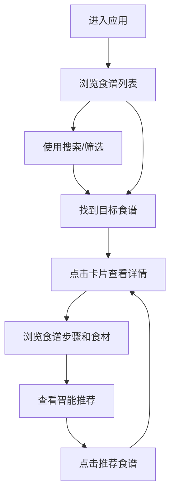

## 1. 产品概述

烹饪食谱收藏与智能推荐系统是一个面向美食爱好者的Web应用，让用户能够在统一的平台上收藏和浏览来自不同来源的食谱，并根据手头现有食材和口味偏好自动获得智能推荐。

- 主要用途：集中管理食谱收藏、浏览食谱详情、基于食材和口味的智能推荐
- 目标用户：美食爱好者、家庭厨师、烹饪初学者

## 2. 核心功能

### 2.1 功能模块
1. **食谱列表页**：卡片式布局展示所有收藏食谱，包含搜索和筛选功能
2. **食谱详情页**：展示完整食谱信息，包含步骤、食材、评论和智能推荐区域

### 2.2 页面详情
| 页面名称 | 模块名称 | 功能描述 |
|-----------|-------------|---------------------|
| 列表页 | 顶部导航栏 | 半透明毛玻璃效果，包含Logo和搜索栏 |
| 列表页 | 搜索栏 | 实时搜索，下拉建议列表匹配食材和菜名 |
| 列表页 | 食谱卡片网格 | 响应式卡片网格，卡片展示图片、名称、时间、难度和标签 |
| 列表页 | 卡片交互 | 悬停显示半透明遮罩和"查看详情"按钮，点击平滑过渡动画 |
| 详情页 | 食谱信息 | 大图、名称、时间、难度、标签、食材清单、步骤列表、评论区 |
| 详情页 | 智能推荐区域 | 基于当前食谱食材和标签推荐3-5个相似食谱，水平滑动淡入淡出切换 |

## 3. 核心流程

用户进入应用 → 在列表页浏览食谱卡片 → 使用搜索栏筛选食谱 → 点击卡片查看详情 → 在详情页查看完整食谱信息和评论 → 浏览智能推荐区域发现相似食谱 → 点击推荐卡片跳转到对应详情页

## 4. 用户界面设计

### 4.1 设计风格
- **主色调**：淡米色背景 (#FFF8F0)，深棕文字 (#3E2723)，橙红色强调色 (#E65100)
- **按钮风格**：圆角按钮，柔和阴影，悬停时有轻微上浮和颜色加深效果
- **字体**：Noto Serif SC（Google Fonts），衬线体体现美食文化感
- **布局风格**：卡片式布局，顶部导航，响应式网格
- **图标风格**：Font Awesome 图标

### 4.2 页面设计概述
| 页面名称 | 模块名称 | UI元素 |
|-----------|-------------|-------------|
| 列表页 | 顶部导航栏 | 半透明毛玻璃backdrop-filter，Logo，搜索栏 |
| 列表页 | 食谱卡片 | 圆角16px，柔和阴影，图片顶部，信息底部，悬停遮罩动画 |
| 列表页 | 搜索下拉建议 | 淡入动画，高亮匹配文字，键盘可操作 |
| 详情页 | 食谱展示 | 大图展示，信息分层，步骤有序列表，食材标签式展示 |
| 详情页 | 推荐区域 | 横向滚动卡片，水平滑动淡入淡出过渡，略小卡片尺寸 |

### 4.3 响应式
- 桌面端：3-4列卡片网格，详情页双栏布局
- 平板端：2列卡片网格
- 移动端：单列布局，触摸优化，底部导航或顶部搜索
