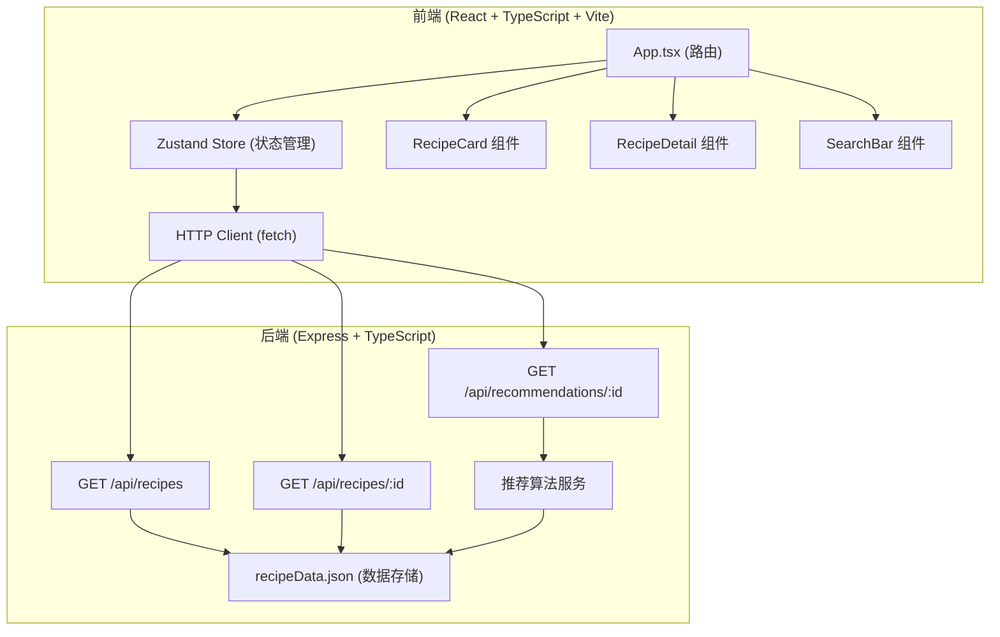
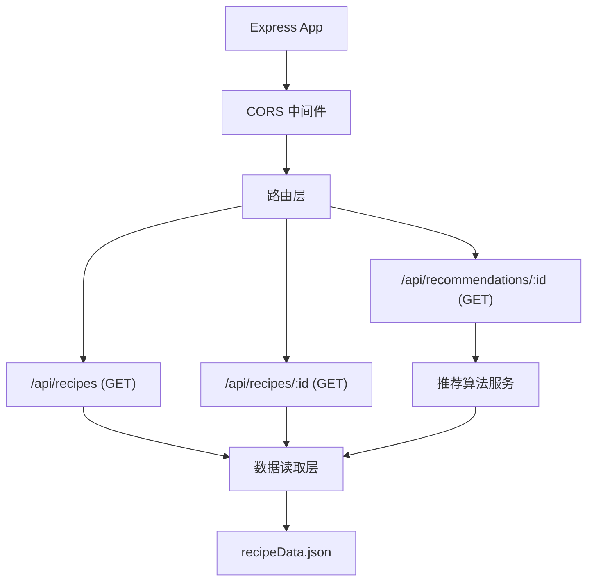
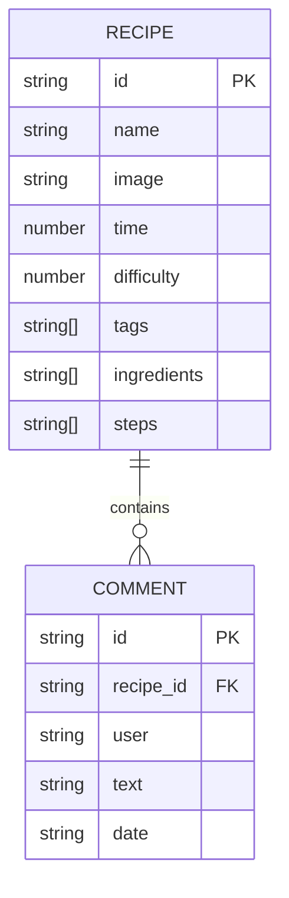

## 1. 架构设计



## 2. 技术描述

- **前端**：React@18 + TypeScript@5 + Vite@5 + React Router@6 + Zustand@4
- **样式方案**：原生 CSS + CSS 变量实现暖色调主题（不使用 Tailwind CSS）
- **初始化工具**：Vite
- **后端**：Express@4 + TypeScript@5
- **数据存储**：JSON 文件 (recipeData.json)，内存读取
- **字体**：Google Fonts - Noto Serif SC
- **图标**：Font Awesome 6 CDN

## 3. 路由定义

| 路由 | 用途 |
|-------|---------|
| / | 食谱列表页，展示所有收藏食谱和搜索功能 |
| /recipe/:id | 食谱详情页，展示完整食谱信息和智能推荐 |

## 4. API 定义

### 4.1 TypeScript 类型定义

```typescript
interface Recipe {
  id: string;
  name: string;
  image: string;
  time: number;
  difficulty: 1 | 2 | 3 | 4 | 5;
  tags: string[];
  ingredients: string[];
  steps: string[];
  comments: Comment[];
}

interface Comment {
  id: string;
  user: string;
  text: string;
  date: string;
}
```

### 4.2 接口定义

| 方法 | 路径 | 描述 | 请求 | 响应 |
|------|------|------|------|------|
| GET | /api/recipes | 获取所有食谱 | 无 | Recipe[] |
| GET | /api/recipes/:id | 获取单个食谱详情 | id (path param) | Recipe |
| GET | /api/recommendations/:id | 获取推荐食谱 | id (path param) | Recipe[] (3-5个) |

### 4.3 推荐算法

基于以下因素计算相似度分数：
1. **共同食材数量** (权重 0.5)：两个食谱共享的食材越多，分数越高
2. **共同标签数量** (权重 0.3)：两个食谱共享的口味/菜系标签越多，分数越高
3. **难度接近度** (权重 0.2)：难度星级越接近，分数越高

最终排序后取前 3-5 个食谱作为推荐结果。

## 5. 服务器架构图



## 6. 数据模型

### 6.1 数据模型定义



### 6.2 JSON 数据结构

预置 12 道食谱数据，包含：
- id: UUID 格式
- name: 菜肴中文名称
- image: 图片 URL
- time: 烹饪时间（分钟）
- difficulty: 1-5 星级
- tags: 菜系/口味标签（如"川菜"、"低卡"、"家常菜"）
- ingredients: 食材列表
- steps: 烹饪步骤列表
- comments: 用户评论列表
