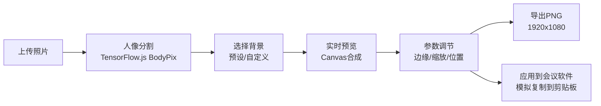

## 1. 产品概述

虚拟会议背景生成与编辑器是一款面向远程办公用户的Web应用，让用户能够上传个人照片，通过AI人像抠图技术替换不同风格的虚拟背景，生成专业的会议场景图片。解决远程会议中背景杂乱、缺乏专业性的痛点，为用户提供快速、美观的背景定制方案。

- **目标用户**：远程办公人员、在线教育工作者、视频内容创作者
- **核心价值**：一键生成专业会议背景，无需专业摄影棚或复杂的后期处理
- **市场定位**：轻量级在线工具，专注于会议背景快速生成与编辑

## 2. 核心功能

### 2.1 功能模块

1. **主画布编辑器**：图片上传、实时预览、合成效果展示
2. **背景选择面板**：预设背景模板、自定义颜色、上传背景图片
3. **参数调节面板**：边缘柔化、人像缩放、位置偏移
4. **导出功能**：高清PNG导出、一键应用到会议软件

### 2.2 页面详情

| 页面名称 | 模块名称 | 功能描述 |
|-----------|-------------|---------------------|
| 主编辑页 | 画布区域 | 显示原图预览、背景替换效果、深灰网格辅助线 |
| 主编辑页 | 上传区域 | 支持拖拽/点击上传JPG/PNG，文件限制5MB，波浪进度条动画 |
| 主编辑页 | 背景选择Tab | 5种预设模板卡片、自定义颜色选择器、背景图片上传 |
| 主编辑页 | 参数调节Tab | 边缘柔化滑块、人像缩放滑块、位置偏移拖拽 |
| 主编辑页 | 工具栏 | 导出按钮（扫描线动画）、应用到会议软件按钮 |

## 3. 核心流程

用户上传照片 → 自动进行人像分割抠图 → 选择/自定义背景 → 实时预览合成效果 → 调节参数优化效果 → 导出高清图片或应用到会议软件

## 4. 用户界面设计

### 4.1 设计风格

- **设计理念**：现代科技感、专业简约、沉浸式暗色主题
- **主色调**：背景 `#1a1a2e`，卡片 `#16213e`，强调色 `#e94560`
- **字体**：Google Fonts 的 Inter 字体（用户指定），标题 600 字重，正文 400 字重
- **布局**：左侧画布区（70%）+ 右侧控制面板（30%），移动端自适应
- **按钮风格**：圆角 8px，悬停颜色加深 + 缩放 1.05 倍，点击有回弹效果
- **动画风格**：平滑过渡（0.3-0.5s），弹性缓动函数，Tab 切换水平滑动

### 4.2 页面设计概述

| 页面名称 | 模块名称 | UI 元素 |
|-----------|-------------|-------------|
| 主编辑页 | 画布区域 | 深灰网格背景、居中图片、合成 Canvas、扫描线动画层 |
| 主编辑页 | 背景卡片 | 缩略图网格、悬停放大 1.1 倍、阴影加深、选中边框高亮 |
| 主编辑页 | 颜色选择器 | 环形色环 + 亮度滑块、实时预览、动态光影粒子效果 |
| 主编辑页 | 滑块控件 | 数值实时反馈、弹性动画、进度条渐变 |
| 主编辑页 | Tab 切换 | 水平滑动动画、底部滑块指示器 |

### 4.3 响应式设计

- **桌面端**（≥768px）：左右布局，画布 70%，控制面板 30%
- **移动端**（<768px）：上下布局，画布自适应满宽，控制面板折叠到下方
- **触摸优化**：滑块和按钮增大点击区域，支持触摸拖拽调整位置

## 5. 性能指标

- **人像分割推理时间**：≤ 2 秒（GPU 加速）
- **背景替换帧率**：≥ 30 FPS
- **参数调节响应**：实时无卡顿
- **导出分辨率**：1920 × 1080 PNG 格式
