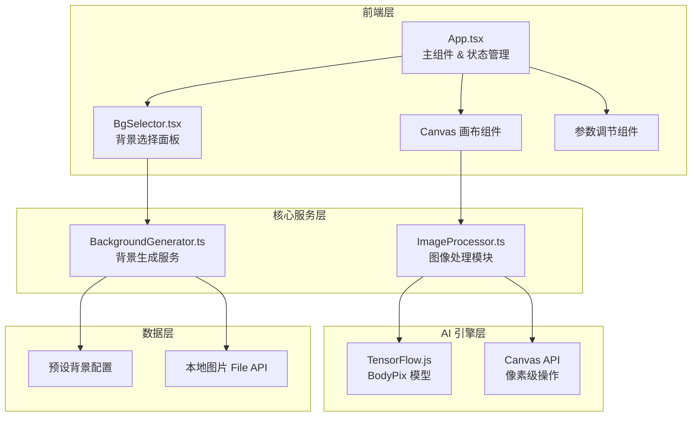

## 1. 架构设计



## 2. 技术描述

- **前端框架**：React 18 + TypeScript + Vite
- **AI 引擎**：@tensorflow/tfjs + @tensorflow-models/body-pix（人像分割）
- **图像处理**：Canvas API 像素级合成
- **状态管理**：React useState/useReducer 局部状态管理
- **样式方案**：CSS Modules + CSS Variables，自定义动画
- **工具库**：canvas（Node.js canvas polyfill）、uuid（唯一标识生成）

## 3. 文件结构

```
auto88/
├── package.json          # 依赖配置
├── index.html            # 入口 HTML，引入 Inter 字体
├── vite.config.js        # Vite 构建配置
├── tsconfig.json         # TypeScript 严格模式配置
└── src/
    ├── App.tsx           # 主组件：路由、状态、画布 + 工具栏
    ├── BgSelector.tsx    # 背景选择面板组件
    ├── ImageProcessor.ts # 人像分割 + 背景替换核心算法
    └── BackgroundGenerator.ts # AI 背景生成模拟服务
```

## 4. 核心模块设计

### 4.1 ImageProcessor.ts 核心接口

```typescript
interface SegmentationResult {
  mask: Uint8ClampedArray;
  width: number;
  height: number;
}

interface ProcessOptions {
  edgeSoftness: number;      // 0-100 边缘柔化
  personScale: number;       // 0.8-1.5 人像缩放
  personOffset: { x: number; y: number };  // 位置偏移
}

class ImageProcessor {
  async loadModel(): Promise<void>;
  async segmentPerson(image: HTMLImageElement): Promise<SegmentationResult>;
  compositeImage(
    personImg: HTMLImageElement,
    background: HTMLImageElement | string,
    segmentation: SegmentationResult,
    options: ProcessOptions
  ): ImageData;
  async exportToPNG(canvas: HTMLCanvasElement, resolution: { width: number; height: number }): Promise<Blob>;
}
```

### 4.2 BackgroundGenerator.ts 核心接口

```typescript
type BackgroundStyle = 'gradient' | 'office' | 'beach' | 'starry' | 'geometric';

interface BackgroundTemplate {
  id: string;
  name: string;
  style: BackgroundStyle;
  thumbnail: string;
  getImage(): Promise<HTMLImageElement>;
}

class BackgroundGenerator {
  getPresetTemplates(): BackgroundTemplate[];
  generateByStyle(style: BackgroundStyle, width: number, height: number): Promise<HTMLImageElement>;
  generateFromColor(color: string, width: number, height: number): Promise<HTMLImageElement>;
  generateFromUpload(file: File): Promise<HTMLImageElement>;
}
```

## 5. 性能优化策略

1. **模型加速**：BodyPix 自动检测 WebGL 后端，启用 GPU 加速
2. **缓存机制**：分割结果缓存，参数调节时无需重新推理
3. **离屏 Canvas**：使用 OffscreenCanvas 进行后台合成
4. **节流防抖**：滑块拖动使用 requestAnimationFrame 节流
5. **分层渲染**：背景层和人像层分离，独立更新

## 6. 关键技术实现点

### 6.1 人像分割算法
- 使用 BodyPix 的 `ResNet50` 架构，输出精度 `16`
- 分割阈值 `0.5`，可通过边缘柔化参数调整
- 后处理：高斯模糊实现边缘柔化效果

### 6.2 背景替换合成
- 基于 alpha 通道的像素级混合
- `source-over` + `destination-in` 合成模式
- 支持动态光影粒子叠加层

### 6.3 导出功能
- Canvas 缩放到 1920x1080 分辨率
- 扫描线动画使用 CSS 线性渐变 + `@keyframes`
- 使用 `canvas.toBlob()` 生成 PNG，`URL.createObjectURL()` 触发下载
