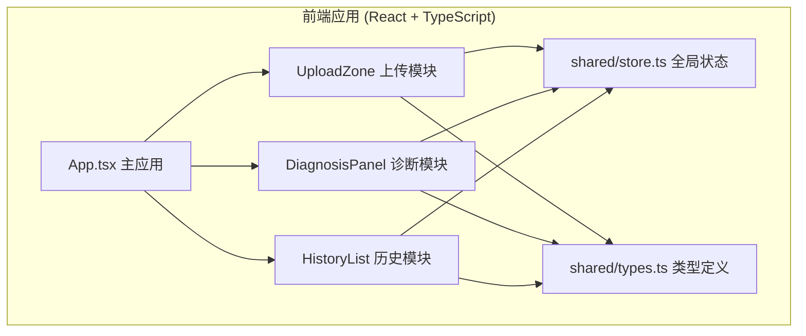
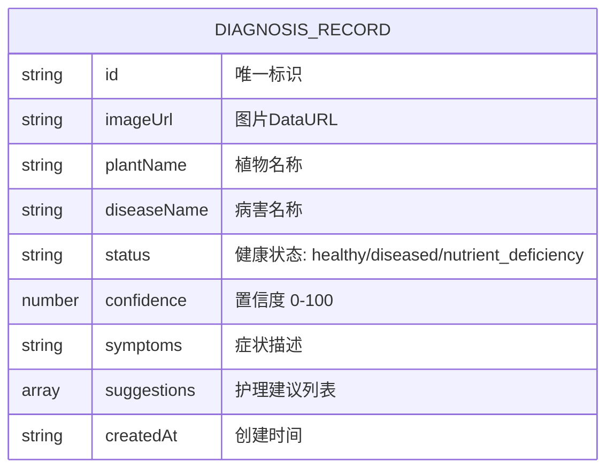

## 1. 架构设计



## 2. 技术说明
- 前端：React@18 + TypeScript + Vite
- 初始化工具：Vite
- 样式：CSS + CSS Variables（自定义主题）
- 状态管理：useReducer + Context API（按用户要求，不使用zustand）
- 后端：无（纯前端应用，诊断逻辑模拟）
- 数据存储：localStorage 持久化历史记录

## 3. 路由定义
| 路由 | 用途 |
|-------|---------|
| / | 主页（上传+诊断） |
| /history | 历史记录页 |
| /detail/:id | 诊断结果详情页 |

## 4. 数据模型

### 4.1 数据模型定义


### 4.2 TypeScript 类型定义
```typescript
// 诊断状态枚举
export type DiagnosisStatus = 'healthy' | 'diseased' | 'nutrient_deficiency';

// 护理建议
export interface CareSuggestion {
  id: string;
  title: string;
  description: string;
  icon: string;
}

// 诊断记录
export interface DiagnosisRecord {
  id: string;
  imageUrl: string;
  plantName: string;
  diseaseName: string;
  status: DiagnosisStatus;
  confidence: number;
  symptoms: string;
  suggestions: CareSuggestion[];
  createdAt: string;
}

// 应用状态
export interface AppState {
  records: DiagnosisRecord[];
  currentRecord: DiagnosisRecord | null;
  isDiagnosing: boolean;
  currentImage: string | null;
}
```

## 5. 文件结构
```
src/
├── main.tsx              # 应用入口
├── App.tsx               # 主应用组件（路由+布局）
├── upload/
│   └── UploadZone.tsx    # 上传模块
├── diagnosis/
│   └── DiagnosisPanel.tsx # 诊断模块
├── history/
│   └── HistoryList.tsx   # 历史模块
└── shared/
    ├── types.ts          # 类型定义
    └── store.ts          # 全局状态管理
```
