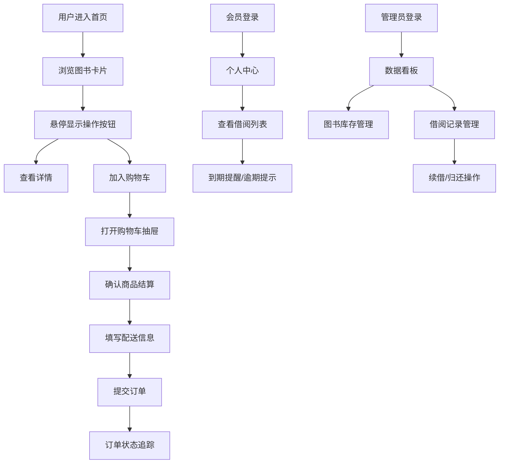

## 1. 产品概述

本产品是面向小型独立书店和图书馆的一体化管理应用，旨在解决传统书店图书库存混乱、会员借阅无系统记录、无法在线浏览和下单的痛点。通过集成图书管理、会员借阅、线上销售和数据统计四大核心模块，帮助书店实现数字化运营转型。

- 核心目标用户：小型独立书店经营者、图书馆管理员、书店会员及线上购书读者
- 市场价值：填补中小书店低成本数字化管理工具的空白，提供一体化解决方案

## 2. 核心功能

### 2.1 用户角色

| 角色 | 注册方式 | 核心权限 |
|------|----------|----------|
| 普通用户 | 手机号/邮箱注册 | 浏览图书、加入购物车、在线下单、查看订单、借阅图书 |
| 管理员 | 预设账号登录 | 图书CRUD管理、会员借阅管理、数据统计看板、订单管理 |

### 2.2 功能模块

1. **图书管理模块**：图书信息增删改查、卡片式网格展示、库存状态徽章、详情页动画过渡
2. **会员借阅管理**：会员注册登录、个人借阅列表、逾期提醒、管理员借阅面板
3. **线上销售与购物车**：购物车抽屉、商品管理、结算流程、订单状态追踪、订单历史时间线
4. **数据统计看板**：核心指标展示（总图书数、总会员数、本月销售额）、销售趋势折线图、分类分布饼图
5. **搜索与过滤**：实时搜索建议、分类筛选、价格区间筛选、库存状态筛选

### 2.3 页面详情

| 页面名称 | 模块名称 | 功能描述 |
|---------|----------|----------|
| 首页/图书列表 | 图书卡片网格 | 展示所有图书卡片，含库存徽章、悬停效果、详情与购物车按钮 |
| 图书详情 | 图书信息展示 | 完整图书信息展示、从中心扩散的圆形动画过渡 |
| 购物车 | 侧边抽屉 | 右侧滑入式购物车、商品列表、总价计算、结算入口 |
| 结算页面 | 订单提交 | 配送地址填写、支付方式选择、订单生成 |
| 订单详情 | 状态追踪 | 步骤条显示订单状态、每个步骤渐变动画 |
| 订单历史 | 时间线展示 | 所有订单时间线展示、可展开查看商品和物流信息 |
| 个人中心 | 借阅列表 | 当前借阅图书、应还日期提醒、逾期滞纳金显示 |
| 登录/注册 | 会员认证 | 表单验证、登录注册切换 |
| 管理仪表盘 | 数据统计 | 核心指标卡片、折线图、饼图、数字滚动动画 |
| 借阅管理 | 管理员面板 | 借阅记录表格、会员搜索、续借/归还操作、归还动画 |
| 图书管理 | 管理员面板 | 图书增删改查表单、列表管理 |

## 3. 核心流程

### 3.1 用户购书流程
用户浏览首页图书 → 悬停查看操作按钮 → 点击加入购物车 → 打开购物车抽屉 → 确认商品 → 点击结算 → 填写配送信息 → 选择支付方式 → 提交订单 → 查看订单状态

### 3.2 会员借阅流程
会员登录 → 进入个人中心 → 查看借阅列表 → 到期前3天显示橙色闹钟提醒 → 逾期显示红色并计算滞纳金 → 管理员端办理续借或归还

### 3.3 管理员运营流程
管理员登录 → 仪表盘查看核心数据 → 图书管理模块维护库存 → 借阅管理模块处理会员借阅 → 搜索会员借阅记录 → 点击续借/归还操作

## 4. 用户界面设计

### 4.1 设计风格
- **主色调**：焦糖色 (#C67B3D)，营造书店温暖书香氛围
- **背景色**：米白色 (#FDF8F0)，柔和护眼
- **强调色**：橄榄绿 (#5A7D3C)，用于按钮和重要操作
- **库存状态色**：绿色（充足）、黄色（紧张）、红色（缺货）
- **按钮样式**：圆角12px，悬停时颜色渐变过渡0.3s，点击涟漪效果
- **字体**：Google Fonts Lora 衬线字体，搭配 Font Awesome 图标
- **布局**：卡片式设计，圆角12px，轻微阴影，最大宽度1200px居中
- **导航栏**：固定顶部，毛玻璃半透明效果（backdrop-filter: blur(10px)）
- **动效**：卡片加载逐条淡入、悬停放大遮罩、圆形扩散过渡、脉动闹钟、数字滚动、折线图节点悬停提示

### 4.2 页面设计概述

| 页面名称 | 模块名称 | UI元素 |
|---------|----------|--------|
| 首页 | 搜索栏 | 实时搜索建议下拉、模糊匹配高亮、防抖300ms |
| 首页 | 图书卡片 | 网格布局（大屏3-4列/中屏2列/小屏1列）、库存徽章、悬停放大遮罩、操作按钮 |
| 首页 | 筛选胶囊 | 左侧分类胶囊、选中填充色弹跳动效 |
| 购物车 | 侧边抽屉 | 右侧滑入、商品缩略图、数量增减、总价、结算按钮 |
| 订单详情 | 步骤条 | 4个状态节点、灰色渐变蓝色、勾选图标淡入 |
| 订单历史 | 时间线 | 垂直时间线、可展开卡片、商品列表物流信息 |
| 借阅列表 | 借阅卡片 | 书名、借阅日期、应还日期、脉动闹钟图标、滞纳金 |
| 仪表盘 | 指标卡片 | 大号数字、渐变色环形进度条、0到目标值滚动动画 |
| 仪表盘 | 折线图 | 7天销售趋势、圆点节点、悬停精确值 |
| 仪表盘 | 饼图 | 分类分布、扇区突出效果、百分比显示 |

### 4.3 响应式设计
- **桌面端（>1024px）**：图书网格3-4列，侧边筛选栏，完整仪表盘布局
- **平板端（768-1024px）**：图书网格2列，筛选栏可折叠，仪表盘两列布局
- **移动端（<768px）**：图书网格1列，筛选胶囊横向滚动，仪表盘单列堆叠
- 所有触控元素最小44x44px，确保触摸友好

### 4.4 性能要求
- 页面初始加载 < 2秒（代码分割、懒加载）
- 搜索响应 < 300ms（防抖处理）
- 翻页过滤 < 500ms
- 图片懒加载、骨架屏加载状态
