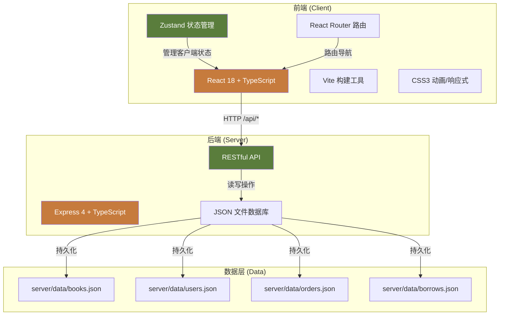
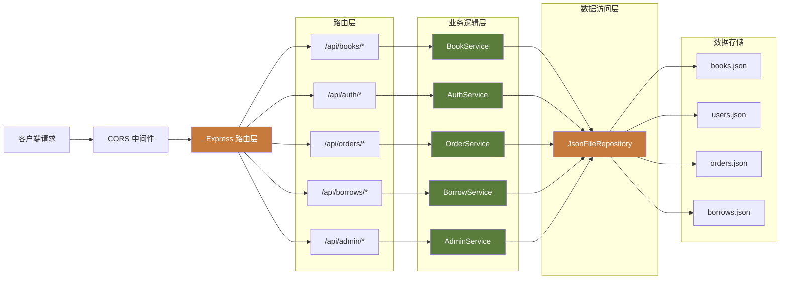
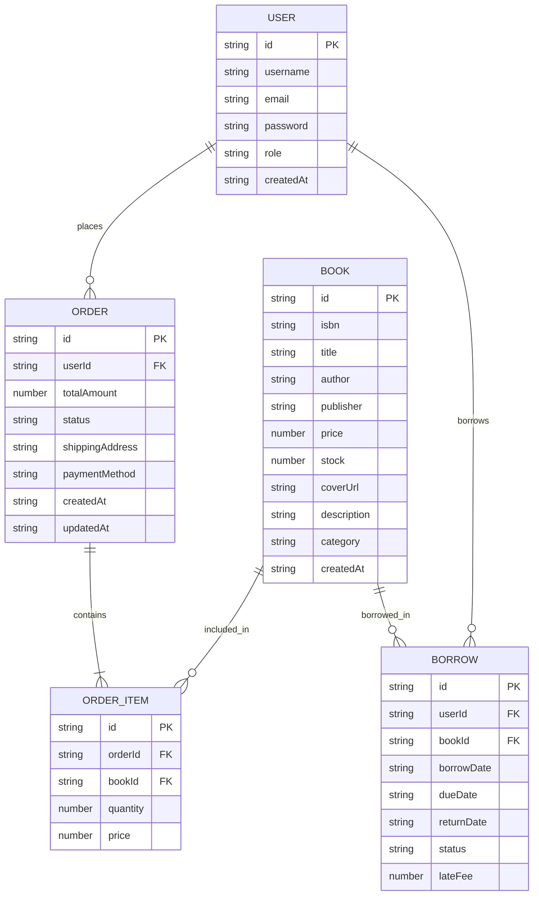

## 1. 架构设计



## 2. 技术描述

- **前端**：React 18 + TypeScript + Vite 6 + React Router DOM + Zustand
- **后端**：Express 4 + TypeScript + CORS + UUID
- **数据库**：轻量级 JSON 文件存储（server/data/ 目录）
- **构建工具**：Vite 6（代码分割、HMR、代理转发）
- **状态管理**：Zustand（轻量级、简洁的 React 状态管理）
- **样式方案**：原生 CSS3 + CSS 变量 + 响应式媒体查询
- **图标**：Font Awesome 6 CDN
- **字体**：Google Fonts Lora

## 3. 路由定义

| 路由路径 | 页面组件 | 用途描述 |
|----------|----------|----------|
| `/` | BookList | 首页/图书列表页 |
| `/book/:id` | BookDetail | 图书详情页 |
| `/cart` | Cart | 购物车/结算页 |
| `/orders` | OrderHistory | 订单历史页 |
| `/order/:id` | OrderDetail | 订单详情页 |
| `/profile` | Profile | 个人中心/借阅列表 |
| `/login` | Login | 登录页 |
| `/register` | Register | 注册页 |
| `/admin/dashboard` | AdminDashboard | 管理仪表盘 |
| `/admin/books` | AdminBooks | 图书管理页 |
| `/admin/borrows` | AdminBorrows | 借阅管理页 |

## 4. API 定义

### 4.1 TypeScript 类型定义

```typescript
// 图书类型
interface Book {
  id: string;
  isbn: string;
  title: string;
  author: string;
  publisher: string;
  price: number;
  stock: number;
  coverUrl: string;
  description: string;
  category: string;
  createdAt: string;
}

// 用户类型
interface User {
  id: string;
  username: string;
  email: string;
  password: string;
  role: 'user' | 'admin';
  createdAt: string;
}

// 购物车项
interface CartItem {
  bookId: string;
  book: Book;
  quantity: number;
}

// 订单类型
interface Order {
  id: string;
  userId: string;
  items: CartItem[];
  totalAmount: number;
  status: 'pending' | 'paid' | 'shipping' | 'delivered';
  shippingAddress: {
    name: string;
    phone: string;
    address: string;
  };
  paymentMethod: string;
  createdAt: string;
  updatedAt: string;
}

// 借阅类型
interface Borrow {
  id: string;
  userId: string;
  bookId: string;
  book: Book;
  borrowDate: string;
  dueDate: string;
  returnDate?: string;
  status: 'borrowed' | 'returned' | 'overdue';
  lateFee: number;
}

// 通用响应
interface ApiResponse<T> {
  success: boolean;
  data?: T;
  error?: string;
}
```

### 4.2 API 接口列表

| 方法 | 路径 | 描述 | 请求体 | 响应 |
|------|------|------|--------|------|
| GET | `/api/books` | 获取所有图书 | - | `Book[]` |
| GET | `/api/books/:id` | 获取单本图书 | - | `Book` |
| GET | `/api/books/search?q=` | 搜索图书 | query | `Book[]` |
| POST | `/api/books` | 新增图书（管理员） | `Book` | `Book` |
| PUT | `/api/books/:id` | 更新图书（管理员） | `Partial<Book>` | `Book` |
| DELETE | `/api/books/:id` | 删除图书（管理员） | - | `{success: boolean}` |
| POST | `/api/auth/register` | 用户注册 | `{username, email, password}` | `{user, token}` |
| POST | `/api/auth/login` | 用户登录 | `{email, password}` | `{user, token}` |
| GET | `/api/orders` | 获取用户订单列表 | - | `Order[]` |
| GET | `/api/orders/:id` | 获取订单详情 | - | `Order` |
| POST | `/api/orders` | 提交订单 | `{items, address, paymentMethod}` | `Order` |
| PUT | `/api/orders/:id/status` | 更新订单状态 | `{status}` | `Order` |
| GET | `/api/borrows` | 获取用户借阅列表 | - | `Borrow[]` |
| GET | `/api/admin/borrows` | 获取所有借阅（管理员） | - | `Borrow[]` |
| POST | `/api/borrows` | 创建借阅（管理员） | `{userId, bookId}` | `Borrow` |
| PUT | `/api/borrows/:id/renew` | 续借（管理员） | - | `Borrow` |
| PUT | `/api/borrows/:id/return` | 归还（管理员） | - | `Borrow` |
| GET | `/api/admin/stats` | 获取统计数据 | - | `{totalBooks, totalUsers, monthlySales, salesTrend, categoryDistribution}` |

## 5. 服务器架构图



## 6. 数据模型

### 6.1 ER 图



### 6.2 JSON 数据文件结构

**books.json**（至少15本示例图书）
```json
[
  {
    "id": "uuid-1",
    "isbn": "978-7-5442-7087-7",
    "title": "百年孤独",
    "author": "加西亚·马尔克斯",
    "publisher": "南海出版公司",
    "price": 45.00,
    "stock": 15,
    "coverUrl": "https://...",
    "description": "魔幻现实主义文学代表作...",
    "category": "文学",
    "createdAt": "2024-01-01T00:00:00.000Z"
  }
]
```

**users.json**（包含管理员和普通用户）
```json
[
  {
    "id": "admin-uuid",
    "username": "admin",
    "email": "admin@bookstore.com",
    "password": "admin123",
    "role": "admin",
    "createdAt": "2024-01-01T00:00:00.000Z"
  }
]
```

**orders.json**、**borrows.json** 初始为空数组

## 7. 项目文件结构

```
auto97/
├── package.json              # 项目依赖和脚本
├── index.html                # HTML 入口
├── tsconfig.json             # TypeScript 配置（路径别名 @）
├── vite.config.ts            # Vite 配置（代理 /api -> :3001）
├── src/
│   ├── App.tsx               # 根组件，路由定义，全局布局
│   ├── main.tsx              # 应用入口
│   ├── api.ts                # API 请求封装
│   ├── store.ts              # Zustand 全局状态
│   ├── types.ts              # 类型定义
│   ├── components/           # 可复用组件
│   │   ├── BookCard.tsx
│   │   ├── CartDrawer.tsx
│   │   ├── Navbar.tsx
│   │   ├── OrderSteps.tsx
│   │   └── StatCard.tsx
│   └── pages/                # 页面组件
│       ├── BookList.tsx
│       ├── BookDetail.tsx
│       ├── Cart.tsx
│       ├── OrderHistory.tsx
│       ├── OrderDetail.tsx
│       ├── Profile.tsx
│       ├── Login.tsx
│       ├── Register.tsx
│       ├── AdminDashboard.tsx
│       ├── AdminBooks.tsx
│       └── AdminBorrows.tsx
└── server/
    ├── index.ts              # Express 入口，端口 3001
    ├── routes/               # 路由定义
    ├── services/             # 业务逻辑
    ├── utils/                # 工具函数（JSON读写等）
    └── data/                 # JSON 数据文件
        ├── books.json
        ├── users.json
        ├── orders.json
        └── borrows.json
```

## 8. 性能优化策略

1. **代码分割**：Vite 自动进行路由级代码分割
2. **懒加载**：图片使用 `loading="lazy"`，组件按需加载
3. **防抖处理**：搜索输入使用 300ms 防抖
4. **状态优化**：Zustand 细粒度状态订阅，避免不必要重渲染
5. **缓存策略**：API 响应添加适当缓存头
6. **CSS 优化**：使用 CSS 变量、避免深层嵌套，关键 CSS 内联
7. **骨架屏**：数据加载时显示骨架屏，提升感知性能
