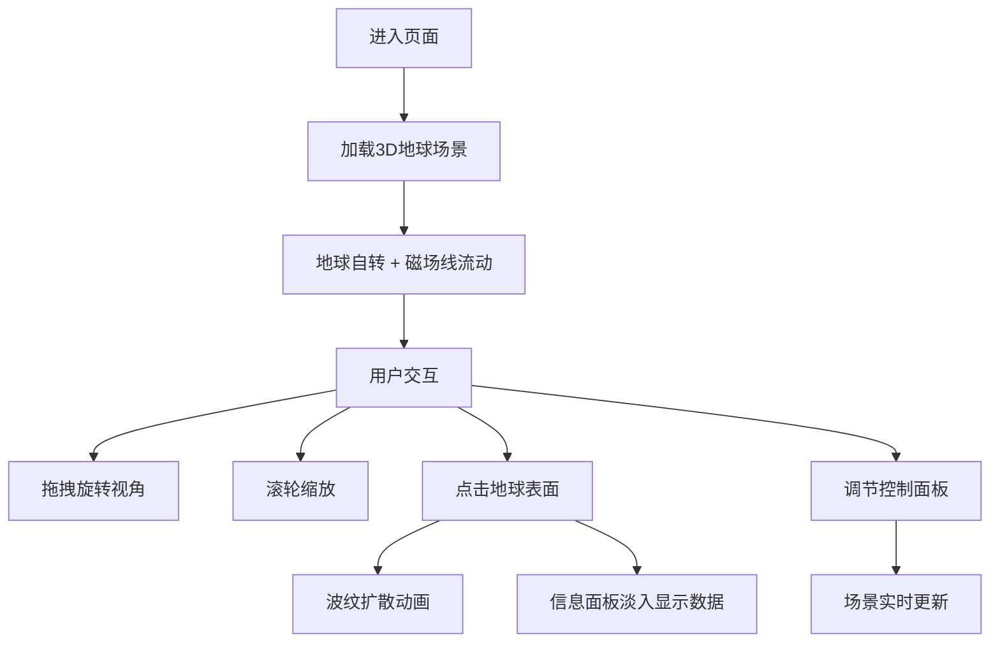

## 1. 产品概述

地球磁场3D实时可视化与模拟器，基于国际地磁参考场（IGRF）公式，在浏览器中以三维交互式方式展示地球磁场的分布与变化。用户可直观观察磁场线、磁力箭矢和热力图，探索不同经纬度和深度的磁场特性，并模拟磁场反转等极端地磁事件。

- 面向科普教育、地理物理爱好者及学生群体
- 提供沉浸式、交互式的地磁场学习体验

## 2. 核心功能

### 2.1 功能模块
1. **3D地球场景**: 高分辨率地球纹理、动态云层视差效果、地磁场线可视化
2. **交互控制系统**: 鼠标拖拽旋转、滚轮缩放、点击探测
3. **信息展示面板**: 点击位置的经纬度、磁场强度、倾角等数据
4. **参数控制面板**: 磁场强度缩放、热力图开关、箭矢网格开关、面板折叠
5. **磁场数据计算**: 基于简化IGRF模型的地磁场实时计算

### 2.2 页面详情
| 页面名称 | 模块名称 | 功能描述 |
|---------|---------|----------|
| 主页面 | 3D地球场景 | 旋转地球、动态云层、流动磁场线、热力图覆盖、箭矢网格 |
| 主页面 | 信息面板 | 点击地球后弹出，显示地理位置与磁场数据，毛玻璃效果 |
| 主页面 | 控制面板 | 左侧滑出面板，包含滑块、开关等参数调节控件 |

## 3. 核心流程

用户进入页面 → 自动加载3D地球与磁场场景 → 地球缓慢自转 → 用户拖拽旋转视角/滚轮缩放 → 点击地球表面任意点 → 波纹扩散动画 + 信息面板淡入显示 → 用户调节左侧控制面板参数 → 场景实时响应参数变化

## 4. 用户界面设计

### 4.1 设计风格
- **主题色调**: 深空蓝黑色背景（#0a0e1a），配合冷色调科技感
- **强调色**: 磁场强度从蓝色（#0066ff）渐变到红色（#ff3366）
- **UI控件**: 极简圆形与细线风格，半透明毛玻璃效果
- **字体**: Nunito，现代无衬线字体，轻盈优雅
- **整体氛围**: 深邃太空感，科技感，沉浸式体验

### 4.2 页面设计概述
| 页面名称 | 模块名称 | UI元素 |
|---------|---------|--------|
| 主页面 | 3D场景 | 居中地球、发光效果、星空背景、磁场线流光 |
| 主页面 | 信息面板 | 右上角悬浮、毛玻璃背景、淡入动画、数据排版 |
| 主页面 | 控制面板 | 左侧滑出、圆形折叠按钮、滑块、开关控件 |

### 4.3 响应性
- 桌面端优先设计
- 控制面板可折叠以适应不同屏幕宽度
- 3D场景自适应视口大小

### 4.4 3D场景指导
- **环境**: 深空背景，微弱星空，营造宇宙氛围
- **光照**: 环境光 + 方向光模拟太阳光，地球边缘有大气辉光
- **相机**: 透视相机，初始距离适中，支持OrbitControls交互
- **动画**: 地球缓慢自转、云层差速旋转、磁场线光点流动
- **后处理**: 轻微辉光效果增强科技感
- **性能**: 60FPS流畅运行，磁场线和热力图更新≥30Hz
