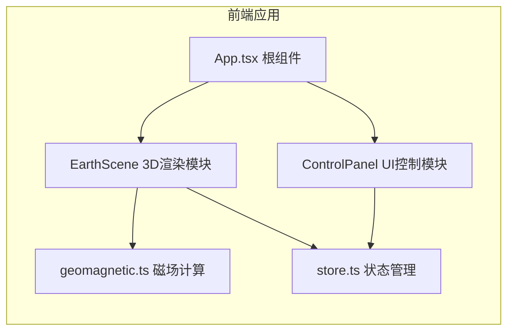

## 1. 架构设计



## 2. 技术描述

- **前端框架**: React 18 + TypeScript
- **构建工具**: Vite
- **3D渲染**: Three.js + @react-three/fiber + @react-three/drei
- **状态管理**: Zustand
- **样式方案**: 原生CSS + CSS变量

## 3. 项目结构

| 文件/目录 | 说明 |
|----------|------|
| package.json | 项目依赖与脚本 |
| index.html | 入口HTML |
| vite.config.js | Vite构建配置 |
| tsconfig.json | TypeScript配置 |
| src/main.tsx | React入口文件 |
| src/App.tsx | 根组件，组装场景与UI |
| src/components/EarthScene.tsx | 3D场景组件（地球、磁场线、热力图、箭矢） |
| src/components/ControlPanel.tsx | 左侧控制面板组件 |
| src/utils/geomagnetic.ts | 地磁场计算模块（简化IGRF） |
| src/utils/store.ts | Zustand状态管理 |

## 4. 核心数据模型

### 4.1 磁场数据接口
```typescript
interface MagneticFieldData {
  intensity: number;      // 磁场强度 (nT)
  inclination: number;    // 磁倾角 (度)
  declination: number;    // 磁偏角 (度)
  direction: {            // 磁场方向向量
    x: number;
    y: number;
    z: number;
  };
}
```

### 4.2 应用状态
```typescript
interface AppState {
  intensityScale: number;       // 磁场强度缩放因子 0.5-2.0
  showHeatmap: boolean;         // 是否显示热力图
  showArrowGrid: boolean;       // 是否显示箭矢网格
  panelCollapsed: boolean;      // 控制面板是否折叠
  selectedPoint: {
    lat: number;
    lon: number;
    intensity: number;
    inclination: number;
  } | null;                     // 当前选中的点
}
```

## 5. 地磁场计算方案

基于简化的国际地磁参考场（IGRF）模型：
- 使用球谐函数展开的低阶近似
- 根据经纬度和海拔计算磁场三分量（北向、东向、垂直向）
- 推导总强度、倾角和偏角
- 支持磁场反转模拟（翻转主偶极子方向）

## 6. 性能优化策略

- **磁场线**: 使用BufferGeometry + 自定义Shader实现流动光点效果
- **热力图**: 使用Canvas纹理动态生成，低频更新
- **箭矢网格**: 实例化渲染（InstancedMesh），减少Draw Call
- **计算优化**: 磁场计算结果缓存，避免重复计算
- **帧率控制**: 动画循环使用requestAnimationFrame，60FPS目标
