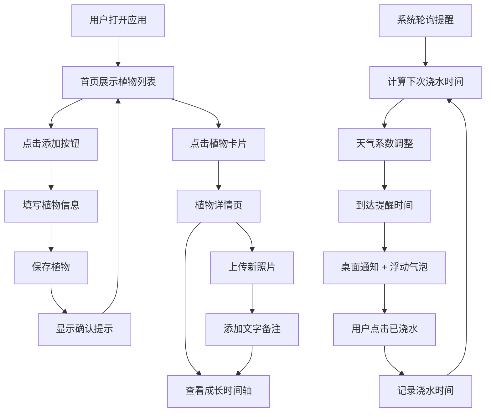

## 1. 产品概述

智能植物浇水提醒与成长记录应用，帮助用户管理盆栽植物，通过智能算法结合天气数据提供个性化浇水提醒，并记录植物成长历程。

- 目标用户：家庭盆栽爱好者、办公室绿植养护者
- 核心价值：智能提醒减少植物枯死风险，成长记录见证植物生命历程

## 2. 核心功能

### 2.1 功能模块

1. **首页（植物列表）**：响应式网格展示、天气横幅、植物卡片、添加按钮
2. **植物详情页**：图片画廊、生长时间轴、浇水历史、编辑功能
3. **植物添加/编辑**：表单输入、照片上传、浇水频率设置、光照需求

### 2.2 页面详情

| 页面名称 | 模块名称 | 功能描述 |
|-----------|-------------|---------------------|
| 首页 | 天气横幅 | 显示当前城市天气、浇水适宜度、植物统计 |
| 首页 | 植物卡片网格 | 响应式展示植物卡片，含光照图标、浇水进度条 |
| 首页 | 悬浮添加按钮 | 点击展开添加表单面板 |
| 植物详情 | 植物信息区 | 展示植物照片、名称、品种、基本信息 |
| 植物详情 | 成长时间轴 | 纵向时间轴记录浇水、换盆、施肥等操作 |
| 植物详情 | 图片画廊 | 展示植物成长照片，支持放大查看 |
| 添加/编辑表单 | 表单面板 | 卡片式布局，包含名称、品种、频率、光照、照片等字段 |
| 全局 | 提醒通知 | 桌面通知 + 页面浮动气泡，支持一键标记已浇水 |

## 3. 核心流程

### 3.1 用户添加植物流程
用户点击悬浮添加按钮 → 展开表单面板 → 填写植物信息并上传照片 → 点击保存 → 显示确认提示 → 植物卡片出现在网格中

### 3.2 智能提醒流程
系统每60秒轮询 → 计算植物下次浇水时间 → 结合天气系数调整 → 达到提醒时间 → 发送桌面通知 + 显示浮动气泡 → 用户点击标记已浇水 → 记录浇水时间 → 重新计算下次提醒

### 3.3 成长记录流程
用户进入植物详情 → 查看时间轴记录 → 上传新照片并添加备注 → 记录出现在时间轴中 → 点击照片可放大查看

## 4. 用户界面设计

### 4.1 设计风格
- **主色调**：深绿色 #2d6a4f
- **辅助色**：浅绿色 #95d5b2、土壤棕 #a98467
- **按钮风格**：圆角8px，轻微阴影，点击水波扩散动画
- **字体**：系统无衬线字体
- **卡片风格**：圆角8px，box-shadow，悬停上浮效果
- **整体风格**：自然系、清新、有机感

### 4.2 页面设计概览

| 页面名称 | 模块名称 | UI元素 |
|-----------|-------------|-------------|
| 首页 | 天气横幅 | 深绿到浅绿渐变背景，天气图标，浇水适宜度表情，统计数字 |
| 首页 | 植物卡片 | 卡片布局，光照图标（太阳/云朵/月亮），渐变进度条，水滴浮动动画，悬停上浮 |
| 首页 | 添加按钮 | 圆形绿色按钮，白色加号，固定在右下角 |
| 植物详情 | 时间轴 | 浅绿到浅棕垂直渐变背景，左侧图标（水滴/花盆/肥料），照片缩略图 |
| 添加表单 | 表单面板 | 卡片式布局，内阴影输入框，绿色保存按钮，透明取消按钮 |

### 4.3 响应式设计
- 桌面端（≥1200px）：4列网格
- 平板端（768px-1199px）：3列网格
- 手机端（<768px）：2列网格
- 所有交互元素支持触控操作

### 4.4 动画效果
- 页面切换：淡入淡出 300ms
- 卡片悬停：轻微上浮 + 阴影加深
- 按钮点击：水波扩散效果
- 水滴动画：进度条末端水滴上下浮动
- 确认提示：右下角绿色渐变圆形，2.5秒后消失
- 提醒气泡：红色渐变，水滴动画
