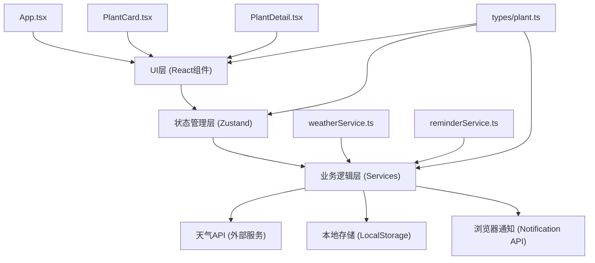

## 1. 架构设计



## 2. 技术描述

- **前端框架**：React 18 + TypeScript
- **构建工具**：Vite
- **状态管理**：Zustand
- **HTTP请求**：Axios
- **日期处理**：date-fns
- **唯一ID**：uuid
- **数据持久化**：LocalStorage
- **样式方案**：CSS Modules + CSS Variables

## 3. 项目文件结构

```
src/
├── types/
│   └── plant.ts          # 植物和提醒的数据类型定义
├── services/
│   ├── weatherService.ts # 天气API服务
│   └── reminderService.ts # 提醒计算服务
├── components/
│   ├── PlantCard.tsx     # 植物卡片组件
│   └── PlantDetail.tsx   # 植物详情组件
├── store/
│   └── usePlantStore.ts  # Zustand状态管理
├── hooks/
│   └── useReminder.ts    # 提醒轮询Hook
├── styles/
│   └── variables.css     # CSS变量
├── App.tsx               # 主应用组件
└── main.tsx              # 入口文件
```

## 4. 数据模型

### 4.1 数据类型定义

```typescript
// 光照需求类型
type LightRequirement = 'shade' | 'indirect' | 'sunny';

// 浇水频率类型
type WateringFrequency = 'daily' | 'every2days' | 'weekly' | 'custom';

// 记录类型
type RecordType = 'water' | 'repot' | 'fertilize' | 'photo';

// 植物照片
interface PlantPhoto {
  id: string;
  url: string;
  date: string;
  note?: string;
}

// 成长记录
interface GrowthRecord {
  id: string;
  type: RecordType;
  date: string;
  note?: string;
  photoUrl?: string;
}

// 植物
interface Plant {
  id: string;
  name: string;
  species?: string;
  wateringFrequency: WateringFrequency;
  customDays?: number;
  lightRequirement: LightRequirement;
  photos: PlantPhoto[];
  growthRecords: GrowthRecord[];
  lastWateredAt?: string;
  nextWateringAt?: string;
  createdAt: string;
}

// 天气数据
interface WeatherData {
  city: string;
  temperature: number;
  condition: 'sunny' | 'cloudy' | 'rainy' | 'snowy';
  precipitation: number; // 降水量 mm
  humidity: number;
  timestamp: number;
}

// 提醒
interface Reminder {
  plantId: string;
  remindAt: string;
  isActive: boolean;
}
```

## 5. 服务接口定义

### 5.1 weatherService

```typescript
interface WeatherService {
  getWeather(city: string): Promise<WeatherData>;
  getWateringCoefficient(weather: WeatherData): number;
  clearCache(): void;
}
```

- 20分钟缓存机制
- 将天气状况转换为浇水系数
- 晴天：系数 > 1（提前浇水）
- 雨天：系数 < 1（推迟浇水）

### 5.2 reminderService

```typescript
interface ReminderService {
  calculateNextWatering(plant: Plant, weatherCoefficient: number): Date;
  registerReminder(plant: Plant, callback: () => void): string;
  cancelReminder(reminderId: string): void;
  checkReminders(plants: Plant[]): Plant[];
}
```

- 基于浇水频率、上次浇水时间和天气系数计算下次提醒时间
- 注册和取消提醒
- 60秒轮询检查

## 6. 性能优化

- **初始渲染**：50株植物初始渲染 ≤ 800ms
- **天气缓存**：20分钟缓存，避免频繁API请求
- **提醒轮询**：60秒间隔，使用requestAnimationFrame优化
- **图片优化**：照片压缩存储，缩略图展示
- **懒加载**：详情页图片按需加载
